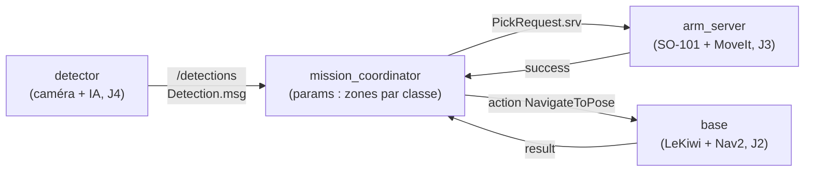

import { Aside, Steps } from "@astrojs/starlight/components";

Le projet final met bout à bout tout ce que vous avez construit pendant la semaine :
un **système autonome complet** qui détecte, saisit et transporte un objet.

<Aside type="note" title="Le scénario">
La **caméra** détecte un objet et sa classe (vision, Jour 4) → le **SO-101** le saisit
(manipulation, Jour 3) → le **LeKiwi** le transporte vers une **zone de dépôt liée à sa
classe** (navigation, Jour 2) → dépôt. Un pipeline ROS 2 complet :
**perception → décision → action**.
</Aside>

## Les trois sous-systèmes

<Steps>

1. **Perception** — la caméra identifie un **objet** et sa **classe** (couleur, label,
   forme…). Une IA de vision (Jour 4) distingue **3 à 6 classes**. Sortie : la classe + la
   pose de l'objet.

2. **Manipulation** — le **SO-101** (Jour 3) saisit l'objet à la pose détectée et le
   dépose sur le robot mobile (ou une position connue).

3. **Navigation** — le **LeKiwi** (Jour 2) se déplace jusqu'à l'objet, le prend en charge,
   puis le transporte jusqu'au **point de dépôt associé à la classe** détectée.

</Steps>

## Architecture cible

Tout le système est orchestré par un nœud central, le `mission_coordinator`, qui relie
les trois sous-systèmes via des **topics**, **services** et **actions** :

<Aside type="tip" title="Vous avez déjà construit ce graphe">
Au **Jour 1**, vous avez monté **exactement ce graphe** avec des nœuds **factices**
(détections en dur, pick simulé, navigation bidon). Le projet final consiste à remplacer
chaque nœud factice par le vrai sous-système des Jours 2 à 4 — sans changer les interfaces.
</Aside>

## Les interfaces à respecter

Pour que les sous-systèmes s'assemblent sans réécriture, les **interfaces sont figées**
(voir [le contrat des briques](https://github.com/EtienneSchmitz/ros2_course/blob/main/plan/briques-j1-pour-j5.md)) :

| Interface | Forme | Producteur → consommateur |
| --- | --- | --- |
| `/detections` (`Detection.msg`) | `string class_id` + `geometry_msgs/Pose pose` | detector (J4) → coordinator |
| `PickRequest.srv` | requête `Pose target` → réponse `bool success` | coordinator → arm (J3) |
| `NavigateToPose` (action Nav2) | goal `PoseStamped` | coordinator → base (J2) |

## Démarrer

<Steps>

1. **Repartez de votre package du Jour 1.** Vous y avez déjà les interfaces (`Detection.msg`,
   `PickRequest.srv`), le `mission_coordinator` paramétré et `mission.launch.py`.

2. **Remplacez les nœuds factices, un par un**, par les vrais sous-systèmes :
   - le `detector` factice → la perception du Jour 4 ;
   - le `arm_server` factice → le pick MoveIt 2 du Jour 3 ;
   - le serveur de navigation bidon → Nav2 sur le LeKiwi (Jour 2).

3. **Validez le pipeline complet**, puis soignez la robustesse (reprises, cas d'échec).

</Steps>

<Aside type="caution">
Travaillez **par interface**, pas par robot : tant que chaque sous-système publie/consomme
les bons messages, vous pouvez les brancher dans n'importe quel ordre et tester isolément.
</Aside>

## Livrables & évaluation

Soutenance, rapport et grille de notation sont détaillés dans la page suivante :
[Déroulé & livrables](/integration/02-deroule-livrables/).
