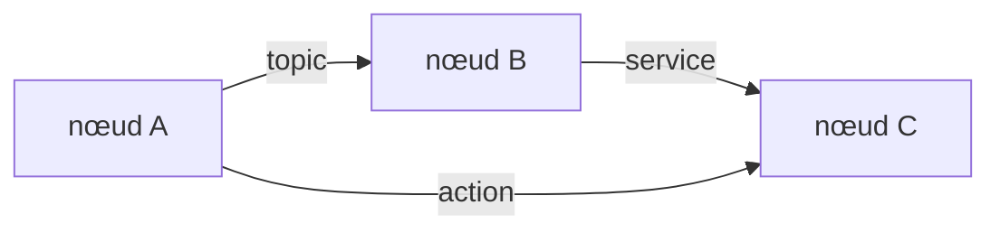

import { Aside } from "@astrojs/starlight/components";

Dans cette première partie, vous découvrez **ce qu'est ROS 2** et ses **concepts
fondamentaux**, en les manipulant tout de suite avec `turtlesim` — un petit simulateur
qui sert de bac à sable. La partie suivante réutilisera ces concepts pour construire la
première brique du projet final.

<Aside type="note" title="Objectifs">
- Comprendre l'architecture de ROS 2 (graphe de nœuds, DDS).
- Manipuler les 5 briques de communication : **nodes, topics, services, actions, paramètres**.
- Être à l'aise avec la **CLI `ros2`** et les **launch files**.
</Aside>

## 1. Qu'est-ce que ROS 2 ?

**ROS 2** (Robot Operating System 2) n'est pas un système d'exploitation, mais un
**framework** (un middleware + des outils) pour écrire des logiciels de robotique. Il
fournit :

- un **modèle de communication** standard entre programmes (le *graphe* de nœuds) ;
- des **outils** (visualisation, simulation, enregistrement, débogage) ;
- un immense **écosystème** de paquets réutilisables (Nav2, MoveIt 2, ros2_control…).

Plutôt que de tout réécrire, on **assemble** des nœuds qui communiquent — exactement ce
que vous ferez toute la semaine.

<Aside type="tip" title="ROS 1 → ROS 2">
ROS 2 a été ré-architecturé sur **DDS** (un standard industriel de communication temps
réel) : plus de nœud maître unique (`roscore`), découverte décentralisée, support
multi-plateforme et temps réel. Cette session utilise la distribution **Kilted** (2025).
</Aside>

## 2. L'architecture : le graphe ROS 2

Un système ROS 2 est un **graphe** : des **nœuds** (processus) qui s'échangent des données
via des **topics**, **services** et **actions**. La couche réseau (RMW → DDS) gère la
découverte automatique : un nœud qui démarre trouve seul les autres.



<Aside type="caution" title="ROS_DOMAIN_ID">
Sur un réseau partagé (salle de cours !), tous les ROS 2 se découvrent par défaut. Pour
**isoler** votre robot des autres, fixez un identifiant de domaine :

```bash
export ROS_DOMAIN_ID=42   # choisissez un nombre par binôme
```

Ajoutez-le à votre `~/.bashrc` (à côté des `source` ROS / workspace de
l'[installation](/installation/01-ubuntu/#sourcer-ros-et-le-workspace)) pour qu'il
s'applique à **chaque** terminal — sinon il faut le ré-exporter à chaque ouverture :

```bash
echo "export ROS_DOMAIN_ID=42" >> ~/.bashrc
source ~/.bashrc
```

</Aside>

## 3. Bac à sable : turtlesim

`turtlesim` est un mini-simulateur (une tortue dans une fenêtre) qui sert de bac à sable
pour voir les concepts en action. Plutôt que de réécrire les commandes ici, vous suivez
les **tutoriels officiels ROS 2** (à jour, distribution Kilted) : chaque brique ci-dessous
renvoie au tutoriel correspondant, à faire en pratique.

➜ **Pratique** : [Using turtlesim, ros2, and rqt](https://docs.ros.org/en/kilted/Tutorials/Beginner-CLI-Tools/Introducing-Turtlesim/Introducing-Turtlesim.html)
— installer, lancer la tortue et la déplacer au clavier.

## 4. Les nœuds

Un **nœud** est un programme ROS 2 qui fait **une** tâche (lire un capteur, piloter un
moteur…). Un système ROS 2 est un assemblage de nœuds qui communiquent ; `turtlesim_node`
et `turtle_teleop_key` en sont deux.

➜ **Pratique** : [Understanding nodes](https://docs.ros.org/en/kilted/Tutorials/Beginner-CLI-Tools/Understanding-ROS2-Nodes/Understanding-ROS2-Nodes.html)
(`ros2 node list`, `ros2 node info`).

## 5. Les topics & messages

Un **topic** est un canal nommé en **publication / abonnement** (pub/sub) : un nœud
*publie* des **messages** typés, d'autres s'y *abonnent*. C'est **anonyme** et
**asynchrone** — idéal pour des flux continus (positions, images, vitesses).

➜ **Pratique** : [Understanding topics](https://docs.ros.org/en/kilted/Tutorials/Beginner-CLI-Tools/Understanding-ROS2-Topics/Understanding-ROS2-Topics.html)
(`ros2 topic echo /turtle1/pose`, `ros2 topic pub /turtle1/cmd_vel …`).

<Aside type="tip" title="Vérifiez votre compréhension">
1. Combien de nœuds peuvent publier / s'abonner à un même topic ?
2. La communication par topic est-elle synchrone (on attend une réponse) ?
3. Comment connaître le **type** de message d'un topic ?

<details class="quiz-answers">
<summary>Afficher les réponses</summary>

1. Autant qu'on veut, dans les deux sens (N publishers, N subscribers) — c'est anonyme.
2. Non : c'est **asynchrone**, on publie sans attendre de réponse.
3. `ros2 topic info /turtle1/cmd_vel` (ou `ros2 topic type …`).

</details>
</Aside>

## 6. Les services

Un **service** est un appel **requête / réponse** (comme une fonction distante) :
**synchrone**, ponctuel. Utile pour une action brève qui renvoie un résultat
(« remets la tortue à zéro », « calcule X », « fais apparaître une 2e tortue »).

➜ **Pratique** : [Understanding services](https://docs.ros.org/en/kilted/Tutorials/Beginner-CLI-Tools/Understanding-ROS2-Services/Understanding-ROS2-Services.html)
(`ros2 service call /clear …`, `/spawn …`).

## 7. Les actions

Une **action** est faite pour les tâches **longues** : requête + **feedback** continu +
résultat final, et **annulable**. C'est la brique que Nav2 utilise pour « aller à une
pose » (Jour 2).

➜ **Pratique** : [Understanding actions](https://docs.ros.org/en/kilted/Tutorials/Beginner-CLI-Tools/Understanding-ROS2-Actions/Understanding-ROS2-Actions.html)
(`ros2 action send_goal /turtle1/rotate_absolute …`).

<Aside type="tip" title="Topic vs service vs action ?">
- **Topic** : flux continu, anonyme, asynchrone (capteurs, commandes).
- **Service** : requête/réponse courte, synchrone (interrogation ponctuelle).
- **Action** : tâche longue avec feedback et annulation (navigation, pick).
</Aside>

## 8. Les paramètres

Les **paramètres** configurent un nœud au lancement (sans recompiler) : couleurs,
fréquences, seuils… Sur `turtlesim`, la couleur de fond est un paramètre.

➜ **Pratique** : [Understanding parameters](https://docs.ros.org/en/kilted/Tutorials/Beginner-CLI-Tools/Understanding-ROS2-Parameters/Understanding-ROS2-Parameters.html)
(`ros2 param get/set /turtlesim background_b`).

## 9. Les launch files

Lancer chaque nœud à la main devient vite pénible. Un **launch file** démarre plusieurs
nœuds (avec leurs paramètres) d'une seule commande — vous en avez déjà utilisé pour le
SO-101 et le LeKiwi, et vous en écrirez un dans la partie suivante.

➜ **Pratique** : [Launching nodes](https://docs.ros.org/en/kilted/Tutorials/Beginner-CLI-Tools/Launching-Multiple-Nodes/Launching-Multiple-Nodes.html)
(`ros2 launch …`).

## 10. Inspecter le graphe

`rqt_graph` affiche le graphe nœuds / topics en direct — votre meilleur outil pour
comprendre « qui parle à qui ». Il est présenté dans le tutoriel **topics** ci-dessus,
section *rqt_graph*.

<Aside type="note" title="Pour aller plus loin — la série complète">
Les sections ci-dessus pointent vers la série **Beginner: CLI Tools** des
[tutoriels ROS 2 officiels](https://docs.ros.org/en/kilted/Tutorials.html). Pour compléter
l'auto-formation, faites aussi :

- [Configuring environment](https://docs.ros.org/en/kilted/Tutorials/Beginner-CLI-Tools/Configuring-ROS2-Environment.html) — `source`, `ROS_DOMAIN_ID`.
- [Using rqt_console](https://docs.ros.org/en/kilted/Tutorials/Beginner-CLI-Tools/Using-Rqt-Console/Using-Rqt-Console.html) — lire les logs.
- [Recording and playing back data](https://docs.ros.org/en/kilted/Tutorials/Beginner-CLI-Tools/Recording-And-Playing-Back-Data/Recording-And-Playing-Back-Data.html) — `ros2 bag`.
</Aside>

## Prochaine étape

Vous connaissez les briques de communication. Place à la pratique sur **notre** projet :
[Première brique du projet](/introduction/02-premiere-brique/).
