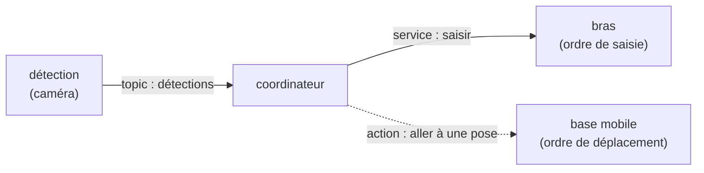

import { Aside } from "@astrojs/starlight/components";

## Le projet final

Le fil rouge de la semaine est un **robot de mission**. Son scénario, de bout en bout :

1. il **détecte** un objet avec la **caméra** ;
2. il **le saisit** avec le **bras SO-101** ;
3. il **navigue** avec la **base mobile LeKiwi** jusqu'à une **zone de dépôt**, choisie selon la classe de l'objet.

Ce graphe **est** le squelette du projet final (Jours 5-6). À vous de le monter
**aujourd'hui avec vos propres nœuds factices** : la détection invente des objets, le bras
répond toujours « pris », la base se contente de logger la pose visée. Aux **Jours 2-4**,
vous remplacerez chaque nœud factice par le vrai robot (vraie caméra, vrai bras, vrai robot
mobile). L'**architecture** — qui parle à qui, et via quel mode de communication — reste la
même ; vos **interfaces** (types de messages, services, actions), elles, pourront être
**ajustées** au contact des vrais robots. Aux **Jours 5-6**, vous assemblerez le tout.

## La consigne

Pour cette deuxième partie, **rien n'est fourni** : à vous de **concevoir et construire** ce
graphe factice en réutilisant les **cinq briques** de la partie 1 — nodes, topics, services,
actions, paramètres — et un **launch file** pour tout démarrer.

Votre graphe doit contenir :

- **Un nœud de détection** qui **publie des détections factices** sur un **topic** (une
  classe d'objet + une pose, inventées et publiées à intervalle régulier).
- **Deux nœuds factices qui exécutent un ordre** : l'un **déplace le bras** (ordre de
  saisie), l'autre **déplace la base mobile** (ordre de déplacement vers une pose). Ce sont
  ces deux nœuds qui seront **remplacés à terme par les vrais robots** — le bras au Jour 3,
  la base au Jour 2. Aujourd'hui ils se contentent de répondre / logger.
- **Un nœud coordinateur** qui **orchestre** la mission : il **s'abonne** au topic de
  détection, puis **donne ses ordres** via **un service** (saisir avec le bras — court, avec
  réponse) et **une action** (déplacer la base — long, avec feedback et annulable). La **zone
  de dépôt par classe** est lue dans un **paramètre** (pas de valeurs en dur).
- **Un launch file** qui démarre les nœuds d'une seule commande.

<Aside type="tip" title="C'est vous qui figez les interfaces">
Choisissez **vos** noms, **votre** découpage et surtout **vos interfaces** (le type des
messages de topic, la requête/réponse du service, le but de l'action). Justifiez chaque
choix : **topic** pour un flux continu, **service** pour une requête courte avec réponse,
**action** pour une tâche longue et annulable. Ces interfaces sont le **contrat** que vous
chercherez à garder **le plus stable possible** quand les nœuds factices céderont la place
aux vrais robots — quitte à les ajuster au contact du réel. Soignez-les.
</Aside>

<Aside type="note" title="Livrable : présentez et validez chaque nœud">
À la fin de la partie, **présentez votre solution en validant chaque nœud** : montrez qu'il
fait bien son travail, outils ROS 2 à l'appui — `rqt_graph` (qui parle à qui), `ros2 topic
echo` (les détections sortent), `ros2 service call` (le bras répond), `ros2 action
send_goal` (la base accepte un but), `ros2 param get` (la zone est paramétrable).
</Aside>

<Aside type="tip" title="Vérifiez votre compréhension">
1. Pourquoi isoler les **interfaces** (messages/services) dans un package séparé ?
2. Pourquoi un **service** pour la saisie et une **action** pour la navigation ?
3. Que faut-il refaire après avoir modifié un `.msg` ?

Afficher les réponses

1. Les `.msg`/`.srv` se génèrent via `ament_cmake` (code C++/Python auto-généré) ; les
   isoler permet à plusieurs packages de les réutiliser sans dépendre du code des nœuds.
2. La saisie est **courte avec une réponse** (réussie ou non) → service ; la navigation est
   **longue, avec feedback et annulable** → action.
3. Re-`colcon build` le package d'interfaces puis re-sourcer le workspace.

</Aside>

<Aside type="caution" title="Gardez votre graphe">
Ce package factice est le **squelette de votre projet final** : vous le ferez évoluer toute
la semaine. Aux Jours 2, 3 et 4, vous remplacerez vos nœuds factices par les vrais robots
**en gardant la même architecture** — quitte à ajuster vos interfaces selon les vrais messages.
</Aside>

## Prochaine étape

Retour au [sommaire J1](/introduction/), ou enchaînez sur le
[Jour 2 — Navigation](/navigation/).
