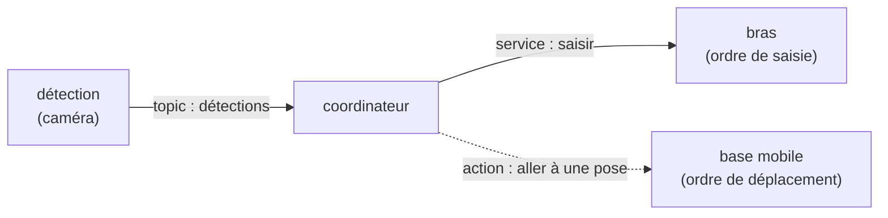

import { Aside } from "@astrojs/starlight/components";

## Le projet final

Le fil rouge de la semaine est un **robot de mission**. Son scénario, de bout en bout :

1. il **détecte** un objet avec la **caméra** ;
2. il **le saisit** avec le **bras SO-101** ;
3. il **navigue** avec la **base mobile LeKiwi** jusqu'à une **zone de dépôt**, choisie selon la classe de l'objet.

Ce graphe est une **proposition de départ** — **à vous de l'adapter** : renommez, découpez
ou complétez les nœuds selon vos choix.

Aujourd'hui, vous le montez avec des **nœuds factices** : la détection invente des objets, le
bras répond toujours « pris », la base logge la pose visée.

Aux **Jours 2-4**, chaque nœud factice laissera place au vrai robot — l'architecture restera
proche, mais vos **interfaces** pourront évoluer au contact du réel.

Aux **Jours 5-6**, vous assemblerez le tout.

## La consigne

**Rien n'est fourni.** À vous de concevoir et de construire ce graphe factice, à partir des
cinq briques de la partie 1 — nodes, topics, services, actions, paramètres — plus un launch
file pour tout démarrer d'une commande.

Reprenez les nœuds du schéma ci-dessus en choisissant le **bon mode de communication** : un
**topic** pour le flux de détections, un **service** pour la saisie (courte, avec réponse),
une **action** pour la navigation (longue, avec feedback). La zone de dépôt par classe vit
dans un **paramètre**, jamais en dur.

<Aside type="tip" title="C'est vous qui figez les interfaces">
Choisissez **vos** noms, **votre** découpage et surtout **vos interfaces** (le type des
messages de topic, la requête/réponse du service, le but de l'action). Justifiez chaque
choix : **topic** pour un flux continu, **service** pour une requête courte avec réponse,
**action** pour une tâche longue et annulable. Ces interfaces sont le **contrat** que vous
chercherez à garder **le plus stable possible** quand les nœuds factices céderont la place
aux vrais robots — quitte à les ajuster au contact du réel. Soignez-les.
</Aside>

<Aside type="note" title="Livrable : présentez et validez chaque nœud">
À la fin de la partie, **présentez votre solution en validant chaque nœud** : montrez qu'il
fait bien son travail, outils ROS 2 à l'appui — `rqt_graph` (qui parle à qui), `ros2 topic
echo` (les détections sortent), `ros2 service call` (le bras répond), `ros2 action
send_goal` (la base accepte un but), `ros2 param get` (la zone est paramétrable).
</Aside>

<Aside type="tip" title="Vérifiez votre compréhension">
1. Pourquoi isoler les **interfaces** (messages/services) dans un package séparé ?
2. Pourquoi un **service** pour la saisie et une **action** pour la navigation ?
3. Que faut-il refaire après avoir modifié un `.msg` ?

Afficher les réponses

1. Les `.msg`/`.srv` se génèrent via `ament_cmake` (code C++/Python auto-généré) ; les
   isoler permet à plusieurs packages de les réutiliser sans dépendre du code des nœuds.
2. La saisie est **courte avec une réponse** (réussie ou non) → service ; la navigation est
   **longue, avec feedback et annulable** → action.
3. Re-`colcon build` le package d'interfaces puis re-sourcer le workspace.

</Aside>

<Aside type="caution" title="Gardez votre graphe">
Ce package factice est le **squelette de votre projet final** : vous le ferez évoluer toute
la semaine. Aux Jours 2, 3 et 4, vous remplacerez vos nœuds factices par les vrais robots
**en gardant la même architecture** — quitte à ajuster vos interfaces selon les vrais messages.
</Aside>

## Prochaine étape

Retour au [sommaire J1](/introduction/), ou enchaînez sur le
[Jour 2 — Navigation](/navigation/).
