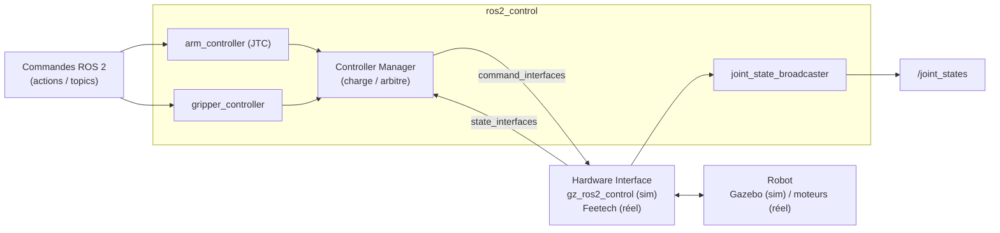

import { Aside, Tabs, TabItem, Steps } from "@astrojs/starlight/components";

Dans cette première partie, vous prenez en main le bras **SO-101** : vous lisez sa
description (URDF), vous le visualisez dans RViz, puis vous le **pilotez en
simulation Gazebo Ionic** via `ros2_control`. À la fin, vous saurez bouger le
bras et la pince à la main — la seconde partie automatisera tout cela avec MoveIt 2.

<Aside type="note" title="Objectifs">
- Lire la chaîne cinématique 6 DoF du SO-101 dans son URDF Xacro.
- Visualiser le bras et inspecter ses topics (`/robot_description`, `/joint_states`, `tf`).
- Comprendre le triptyque `ros2_control` et envoyer une trajectoire manuelle au bras et à la pince.
</Aside>

Le **SO-101** est un bras robotique open-source 6 DoF conçu par la communauté
<a href="https://huggingface.co/lerobot" target="_blank" rel="noopener noreferrer">LeRobot / Hugging Face</a>, motorisé par
des servos Feetech STS3215. Il est suffisamment léger pour être posé sur une
table ou monté sur la [base mobile LeKiwi](/navigation/01-base-mobile/).

## 1. Anatomie

Le SO-101 enchaîne **6 axes en rotation** :

| Joint | Type | Rôle |
| --- | --- | --- |
| `shoulder_pan` | revolute | Rotation horizontale de l'épaule (base) |
| `shoulder_lift` | revolute | Levée verticale de l'épaule |
| `elbow_flex` | revolute | Flexion du coude |
| `wrist_flex` | revolute | Flexion du poignet |
| `wrist_roll` | revolute | Rotation du poignet |
| `gripper` | revolute | Ouverture/fermeture de la pince |

C'est une **chaîne cinématique série** (chaque joint dépend du précédent),
classique pour un bras de manipulation.

## 2. URDF / Xacro

Dans ROS 2, le robot est décrit par un **URDF** (XML). Le package
`so101_description` (dans
[so_arm101_ros2](https://github.com/EtienneSchmitz/so_arm101_ros2)) le découpe en
deux fichiers complémentaires :

- [`so101.urdf`](https://github.com/EtienneSchmitz/so_arm101_ros2/blob/main/so101_description/urdf/so101.urdf) — la **description cinématique** pure : les `<link>` et `<joint>` du bras, indépendante du contexte d'exécution ;
- [`so101.urdf.xacro`](https://github.com/EtienneSchmitz/so_arm101_ros2/blob/main/so101_description/urdf/so101.urdf.xacro) — un **wrapper Xacro** qui assemble `so101.urdf`, la transmission et — selon les arguments — la configuration `ros2_control`.

<Aside type="caution" title="Le Xacro n'est pas figé">
Le `.urdf.xacro` prend des **arguments** (`mode`, `joint_states_gui`…) : selon
leur valeur, l'URDF généré **n'est pas le même** (par exemple avec ou sans
`ros2_control`). Précisez donc toujours le contexte dans lequel vous le générez.
</Aside>

Générez l'URDF à plat (ici en mode visualisation) et vérifiez sa cohérence :

```bash
ros2 run xacro xacro \
  $(ros2 pkg prefix --share so101_description)/urdf/so101.urdf.xacro \
  joint_states_gui:=true \
  > /tmp/so101.urdf
check_urdf /tmp/so101.urdf
```

`check_urdf` affiche l'arbre des liens : vous devez y retrouver la chaîne
`base_link → … → gripper`.

Ouvrez la description [`so101.urdf`](https://github.com/EtienneSchmitz/so_arm101_ros2/blob/main/so101_description/urdf/so101.urdf)
et repérez-y les deux éléments de base :

| Élément | Rôle |
| --- | --- |
| `<link>` | Un segment physique (épaule, avant-bras…) : géométrie visuelle, géométrie de collision, inertie |
| `<joint>` | La liaison entre deux liens : axe de rotation, limites (`lower`/`upper`/`effort`/`velocity`), dynamique |

Côté Xacro (`so101.urdf.xacro`), observez plutôt la **composition** :
`<xacro:include>` pour assembler les fichiers, `<xacro:arg>` pour les paramètres
et `<xacro:if>` pour activer `ros2_control` selon le mode.

<Aside type="tip" title="Arbre cinématique en image">
Pour générer un schéma PDF de l'arbre liens/joints :

```bash
urdf_to_graphiz /tmp/so101.urdf
# Un PDF nommé d'après le robot est créé dans le dossier courant ; ouvrez-le :
xdg-open ./*.pdf
```

</Aside>

## 3. Visualiser le bras

Le package fournit un launch prêt à l'emploi :

```bash
ros2 launch so101_description view.launch.py
```

Un *launch* démarre des **nœuds** (des exécutables ROS 2) ; ici trois :

- `robot_state_publisher` — lit l'URDF et les `/joint_states`, publie la `tf` ;
- `joint_state_publisher_gui` — publie les `/joint_states` à partir de sliders ;
- `rviz2` — le visualiseur 3D, chargé avec la config `display.rviz`.

La fenêtre **JointStatePublisher** est l'interface de ce deuxième nœud : bougez
ses sliders pour voir le bras se déplacer en temps réel.

### Ce que publie le robot

Pendant que le launch tourne, ouvrez un second terminal (workspace sourcé) et
listez les topics apparus :

```bash
ros2 topic list
```

On y retrouve l'état des articulations et la chaîne `tf`. La description URDF
complète, elle, est publiée sur un topic dédié — inspectez-les :

```bash
ros2 topic echo /robot_description --once   # le contenu de l'URDF
ros2 topic hz /joint_states                 # la fréquence des états de joints
```

<Aside type="tip" title="Vérifiez votre compréhension">
1. Quel topic transporte la **description URDF** du robot ?
2. Quel topic publie la **position de chaque articulation**, et à quelle fréquence ?
3. Qui calcule et publie la chaîne `tf` à partir de ces deux informations ?

<details class="quiz-answers">
<summary>Afficher les réponses</summary>

1. `/robot_description` — un `std_msgs/String` *latché*, publié par `robot_state_publisher`.
2. `/joint_states` (`sensor_msgs/JointState`), ici alimenté par `joint_state_publisher_gui` ; la fréquence se lit avec `ros2 topic hz /joint_states`.
3. `robot_state_publisher` : il combine l'URDF (`/robot_description`) et les `/joint_states` pour calculer la `tf` de chaque repère.

</details>
</Aside>

### Inspecter le bras avec Foxglove

RViz est notre outil d'**interaction** (planification MoveIt à la partie suivante), mais pour
**inspecter** le bras — le voir en 3D *et* **lire les valeurs** des articulations —
[Foxglove](https://foxglove.dev) est plus confortable (interface web, panneaux *Raw Messages*
et *Plot*).

Gardez le launch de découverte du bras actif et démarrez le **pont** dans un autre terminal :

```bash
ros2 launch foxglove_bridge foxglove_bridge_launch.xml   # ws://localhost:8765
```

Connectez-vous à `ws://localhost:8765` dans Foxglove (cf. [Installation](/installation/01-ubuntu/)),
puis ajoutez :

- un panneau **3D** : le bras et ses repères. Ajoutez une couche **URDF** (*Custom layers → +
  → URDF*) avec **Source = `Parameter`**, **Parameter = `robot_description`** ;
- un panneau **Raw Messages** sur `/joint_states` : les angles articulaires en direct.

<Aside type="caution" title="Bras mal orienté / meshes invisibles ?">
Mêmes pièges d'affichage que pour la base mobile — voir
[Inspecter le robot avec Foxglove](/navigation/01-base-mobile/#inspecter-le-robot-avec-foxglove) :
**Scene → Mesh up-axis = `Z-up`** (sinon meshes tournés de 90°), et relancez le pont depuis un
terminal **sourcé** si les meshes n'apparaissent pas.
</Aside>

<Aside type="tip" title="Exercice — Suivre une articulation dans Foxglove">
Pont Foxglove lancé et le bras affiché en 3D :

1. Bougez une articulation (sliders, ou plus tard via MoveIt) et **relevez son angle**
   (en radians) dans un panneau **Raw Messages** sur `/joint_states`.
2. Ajoutez un panneau **Plot** sur ce même joint et observez la courbe pendant le mouvement.

À la partie suivante, vous **piloterez le bras depuis RViz** (*drag → Plan → Execute*) tout
en **observant la trajectoire articulaire dans Foxglove** — c'est la complémentarité visée :
RViz commande, Foxglove inspecte.

*Livrable* : l'angle relevé et une description de la courbe pendant un mouvement.
</Aside>

<Aside type="note" title="Aller plus loin — visualisation autonome">
Pour une visualisation 3D **autonome** (sans RViz ni nœud ROS),
[`urdf-viz`](https://github.com/openrr/urdf-viz) ouvre directement le
`/tmp/so101.urdf` généré plus haut (workspace sourcé pour résoudre les
`package://` des meshes).
</Aside>

### Chaîne de transformations (tf)

Quand vous publiez les `joint_states`, `robot_state_publisher` calcule
automatiquement la chaîne de **transformations tf** entre tous les frames
du robot (`base_link` → `shoulder_link` → `upper_arm_link` → … → `gripper_link`).

Cette chaîne est ce que MoveIt 2 utilisera dans la partie suivante pour planifier les trajectoires.

<Aside type="tip" title="Vérifiez votre compréhension">
1. Dans l'arbre URDF, pourquoi `gripper_link` possède-t-il **deux** enfants ?
2. Quelle est la différence entre un joint `revolute` et un joint `fixed` ?
3. À quoi sert le repère `gripper_frame_link` lors de la planification MoveIt 2 ?

<details class="quiz-answers">
<summary>Afficher les réponses</summary>

1. Un joint `revolute` (`gripper`) actionne la mâchoire mobile (`moving_jaw_so101_v1_link`), tandis qu'un joint `fixed` (`gripper_frame_joint`) ajoute un repère de référence : l'arbre **se ramifie** donc à la pince.
2. `revolute` est articulé (axe + limites, il bouge) ; `fixed` est rigide — il solidarise deux liens et sert surtout à définir un repère utile.
3. `gripper_frame_link` est le repère de préhension (TCP) : MoveIt 2 planifie la pose **de ce repère** sur l'objet à saisir, pas celle de `base_link`.

</details>
</Aside>

## 4. Piloter le bras avec `ros2_control`

Jusqu'ici, le bras ne fait que **suivre des sliders** : aucune physique, aucun
contrôleur. Pour le commander comme un vrai robot (en simulation ou réel), ROS 2
utilise `ros2_control`, l'architecture standard pour piloter du matériel de
façon **uniforme et temps réel**.

### Le triptyque



**Comment lire ce schéma** — suivez le trajet d'une commande, de gauche à droite,
puis le retour :

1. Vous envoyez une **commande** (action / topic) à un **contrôleur** (`arm_controller`, `gripper_controller`).
2. Le **controller manager** orchestre les contrôleurs et transmet leurs ordres au matériel via les `command_interfaces` (la flèche qui **descend** vers le hardware).
3. Le **hardware interface** applique ces ordres au robot (Gazebo en sim) et **relit** l'état réel des joints, qu'il renvoie au manager via les `state_interfaces` (la flèche qui **remonte**).
4. En parallèle, le `joint_state_broadcaster` publie cet état sur `/joint_states` — c'est la boucle qui se referme.

Les trois briques, de bas en haut :

- **Hardware interface** : le pont bas-niveau. Il lit l'état (positions, vitesses)
  et applique les commandes. En sim Gazebo Ionic (gz-sim 9), c'est
  `gz_ros2_control` qui le fait automatiquement ; sur le vrai robot, ce serait le
  driver Feetech.
- **Controller manager** : le chef d'orchestre. Il charge / décharge les
  contrôleurs et **arbitre** les accès aux `command_interfaces` (deux contrôleurs
  ne peuvent pas commander le même joint en même temps).
- **Contrôleur** : la politique de contrôle (suivre une trajectoire, maintenir
  une position…). Pour le bras, un **`joint_trajectory_controller`** (JTC) ;
  pour la pince, un **contrôleur de gripper** dédié.

> La distinction clé : `command_interfaces` = ce qu'on **écrit** vers le matériel
> (consignes), `state_interfaces` = ce qu'on **lit** du matériel (mesures). Tout
> `ros2_control` tourne autour de cette boucle écrire / lire.

### Les contrôleurs du SO-101

La sim charge **trois** contrôleurs (visibles via `ros2 control list_controllers`) :

- **`joint_state_broadcaster`** — publie `/joint_states` ; ce n'est pas un
  contrôleur de commande, juste un *broadcaster* d'état.
- **`arm_controller`** — un `joint_trajectory_controller/JointTrajectoryController`
  sur les **5 joints du bras** : `shoulder_pan`, `shoulder_lift`, `elbow_flex`,
  `wrist_flex`, `wrist_roll`.
- **`gripper_controller`** — un `parallel_gripper_action_controller/GripperActionController`
  sur le joint `gripper`.

Le `arm_controller` accepte des trajectoires (liste de points avec positions,
vitesses, temps) sur le topic / action :

```text
/arm_controller/follow_joint_trajectory   (action)
/arm_controller/joint_trajectory          (topic)
```

Il interpole entre les points et envoie les commandes au hardware
interface à fréquence fixe (souvent 100 Hz ou plus). La pince, elle, se
pilote via l'action `control_msgs/action/ParallelGripperCommand` sur
`/gripper_controller/gripper_cmd` — ses champs `name` et `position` sont
des **listes**, cohérent avec le type `parallel_gripper_action_controller`.

### Envoyer une trajectoire manuelle

Pour tester sans MoveIt, on publie une trajectoire à la main. Le bras et la
pince se commandent **séparément** : le bras via le topic / action du
`arm_controller` (5 joints), la pince via l'action du `gripper_controller`.

<Tabs>
<TabItem label="Terminal 1 — sim (GUI Gazebo)">

```bash
ros2 launch so101_bringup gazebo.launch.py
```

→ La fenêtre Gazebo Ionic s'ouvre, le bras SO-101 apparaît posé sur le
sol. Attendez **~10-20 s** (premier rendu) que les trois contrôleurs se
chargent.

</TabItem>
<TabItem label="Terminal 2 — vérifs + bouger">

<Steps>

1. **Vérifier les contrôleurs.** Les trois doivent être `active` :

   ```bash
   ros2 control list_controllers
   ```

2. **Bouger le bras (action, recommandé).** L'action `follow_joint_trajectory`
   est **bloquante** : elle attend le résultat et remonte du *feedback*.

   ```bash
   ros2 action send_goal /arm_controller/follow_joint_trajectory \
     control_msgs/action/FollowJointTrajectory \
     "{trajectory: {joint_names: [shoulder_pan, shoulder_lift, elbow_flex, wrist_flex, wrist_roll], points: [{positions: [0.8, -0.5, 1.0, 0.0, 0.0], time_from_start: {sec: 2}}]}}"
   ```

   Variante **« fire-and-forget »** via le topic — envoyée sans retour
   (ni feedback ni résultat) :

   ```bash
   ros2 topic pub --once /arm_controller/joint_trajectory \
     trajectory_msgs/msg/JointTrajectory "{
     joint_names: [shoulder_pan, shoulder_lift, elbow_flex, wrist_flex, wrist_roll],
     points: [{positions: [0.0, -0.5, 1.0, 0.0, 0.0], time_from_start: {sec: 2}}]
   }"
   ```

3. **Piloter la pince (`ParallelGripperCommand`).** Ouvrir, puis fermer :

   ```bash
   # Ouvrir
   ros2 action send_goal /gripper_controller/gripper_cmd \
     control_msgs/action/ParallelGripperCommand "{command: {name: [gripper], position: [1.5]}}"
   # Fermer
   ros2 action send_goal /gripper_controller/gripper_cmd \
     control_msgs/action/ParallelGripperCommand "{command: {name: [gripper], position: [0.0]}}"
   ```

</Steps>

</TabItem>
</Tabs>

Le bras doit rejoindre la position cible en 2 secondes (vous le voyez
bouger dans Gazebo) ; la pince s'ouvre ou se ferme selon la `position`
demandée.

<Aside type="caution">
Si une commande échoue avec « controller not found », vérifiez le
résultat de `ros2 control list_controllers` : les trois contrôleurs
doivent être `active`. Le premier rendu Gazebo peut prendre quelques
secondes avant que les contrôleurs soient chargés.
</Aside>

## Prochaine étape

Vous savez décrire, visualiser et piloter le bras à la main. Place à la
planification automatique de trajectoires :
[MoveIt & pick and place](/manipulation/02-moveit-pick-place/).
