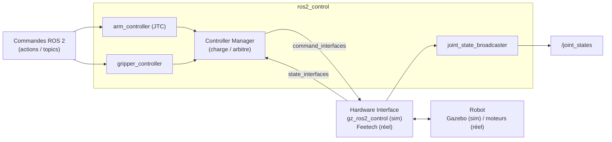

import { Aside, Tabs, TabItem, Steps } from "@astrojs/starlight/components";

`ros2_control` est l'architecture standard de ROS 2 pour piloter du
matériel (réel ou simulé) de façon **uniforme et temps réel**. Comprendre
ses trois briques évite beaucoup de magie noire.

## Le triptyque



- **Hardware interface** : pont bas-niveau, lit l'état et applique les commandes.
  En sim Gazebo Ionic (gz-sim 9), c'est `gz_ros2_control` qui fait ce travail
  automatiquement.
- **Controller manager** : charge / décharge / arbitre les contrôleurs.
- **Contrôleur** : politique de contrôle (suivre une trajectoire,
  maintenir une position, etc.). Pour le bras on utilise un
  **`joint_trajectory_controller`** (JTC), et pour la pince un
  **contrôleur de gripper** dédié.

## Les contrôleurs du SO-101

La sim charge **trois** contrôleurs (visibles via `ros2 control list_controllers`) :

- **`joint_state_broadcaster`** — publie `/joint_states` ; ce n'est pas un
  contrôleur de commande, juste un *broadcaster* d'état.
- **`arm_controller`** — un `joint_trajectory_controller/JointTrajectoryController`
  sur les **5 joints du bras** : `shoulder_pan`, `shoulder_lift`, `elbow_flex`,
  `wrist_flex`, `wrist_roll`.
- **`gripper_controller`** — un `parallel_gripper_action_controller/GripperActionController`
  sur le joint `gripper`.

Le `arm_controller` accepte des trajectoires (liste de points avec positions,
vitesses, temps) sur le topic / action :

```text
/arm_controller/follow_joint_trajectory   (action)
/arm_controller/joint_trajectory          (topic)
```

Il interpole entre les points et envoie les commandes au hardware
interface à fréquence fixe (souvent 100 Hz ou plus). La pince, elle, se
pilote via l'action `control_msgs/action/ParallelGripperCommand` sur
`/gripper_controller/gripper_cmd` — ses champs `name` et `position` sont
des **listes**, cohérent avec le type `parallel_gripper_action_controller`.

## Configuration côté sim

<Aside type="note" title="Lancer la sim">
Lancez la sim Gazebo + contrôleurs :

```bash
ros2 launch so101_bringup gazebo.launch.py
```

La fenêtre **Gazebo Ionic** s'ouvre, le bras SO-101 apparaît posé sur le
sol. Attendez **~10-20 s** (premier rendu) que les **trois** contrôleurs
se chargent, puis vérifiez :

```bash
ros2 control list_controllers
```

Vous devriez voir les **trois** contrôleurs `active` :

- `joint_state_broadcaster` (publie `/joint_states`)
- `arm_controller` (`joint_trajectory_controller` sur les 5 joints du bras)
- `gripper_controller` (`parallel_gripper_action_controller` sur le joint `gripper`)

</Aside>

## Envoyer une trajectoire manuelle

Pour tester sans MoveIt, on peut publier une trajectoire à la main. Le
bras et la pince se commandent **séparément** : le bras via le topic /
action du `arm_controller` (5 joints), la pince via l'action du
`gripper_controller`.

<Tabs>
<TabItem label="Terminal 1 — sim (GUI Gazebo)">

```bash
source /opt/ros/kilted/setup.bash
source ~/ros2_bootcamp_ws/install/setup.bash
ros2 launch so101_bringup gazebo.launch.py
```

→ La fenêtre Gazebo Ionic s'ouvre, le bras SO-101 apparaît posé sur le
sol. Attendez **~10-20 s** (premier rendu) que les trois contrôleurs se
chargent.

</TabItem>
<TabItem label="Terminal 2 — vérifs + bouger">

<Steps>

1. **Vérifier les contrôleurs.** Les trois doivent être `active` :

   ```bash
   source /opt/ros/kilted/setup.bash
   source ~/ros2_bootcamp_ws/install/setup.bash

   ros2 control list_controllers
   ```

2. **Bouger le bras (action, recommandé).** L'action `follow_joint_trajectory`
   est **bloquante** : elle attend le résultat et remonte du *feedback*.

   ```bash
   ros2 action send_goal /arm_controller/follow_joint_trajectory \
     control_msgs/action/FollowJointTrajectory \
     "{trajectory: {joint_names: [shoulder_pan, shoulder_lift, elbow_flex, wrist_flex, wrist_roll], points: [{positions: [0.8, -0.5, 1.0, 0.0, 0.0], time_from_start: {sec: 2}}]}}"
   ```

   Variante **« fire-and-forget »** via le topic — envoyée sans retour
   (ni feedback ni résultat) :

   ```bash
   ros2 topic pub --once /arm_controller/joint_trajectory \
     trajectory_msgs/msg/JointTrajectory "{
     joint_names: [shoulder_pan, shoulder_lift, elbow_flex, wrist_flex, wrist_roll],
     points: [{positions: [0.0, -0.5, 1.0, 0.0, 0.0], time_from_start: {sec: 2}}]
   }"
   ```

3. **Piloter la pince (`ParallelGripperCommand`).** Ouvrir, puis fermer :

   ```bash
   # Ouvrir
   ros2 action send_goal /gripper_controller/gripper_cmd \
     control_msgs/action/ParallelGripperCommand "{command: {name: [gripper], position: [1.5]}}"
   # Fermer
   ros2 action send_goal /gripper_controller/gripper_cmd \
     control_msgs/action/ParallelGripperCommand "{command: {name: [gripper], position: [0.0]}}"
   ```

</Steps>

</TabItem>
</Tabs>

Le bras doit rejoindre la position cible en 2 secondes (vous le voyez
bouger dans Gazebo) ; la pince s'ouvre ou se ferme selon la `position`
demandée.

<Aside type="caution">
Si une commande échoue avec « controller not found », vérifiez le
résultat de `ros2 control list_controllers` : les trois contrôleurs
doivent être `active`. Le premier rendu Gazebo peut prendre quelques
secondes avant que les contrôleurs soient chargés.
</Aside>

## Prochaine étape

[MoveIt 2 — planification](/manipulation/03-moveit/).
