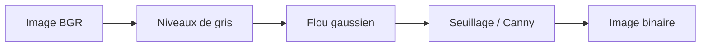

import { Aside, Steps } from "@astrojs/starlight/components";

<Aside type="note" title="Atelier à la carte">
Un des quatre ateliers du jour, au choix. Faites d'abord le
**[Socle commun](/vision/00-communs/)** (dépendances, monde Gazebo, squelette du nœud) :
cet atelier s'appuie dessus.
</Aside>

La **vision classique** avec [OpenCV](https://opencv.org/) : sans aucun apprentissage,
on **détecte une forme** (couleur + géométrie), on en calcule la **position**, puis on
publie un `Detection.msg` sur `/detections`. Rapide, déterministe, idéal pour
comprendre les bases du traitement d'image.

<Aside type="note" title="Objectifs">
- Comprendre qu'une image est un **tableau NumPy** (`H × W × C`) en **BGR**.
- Détecter une forme par **seuillage couleur (HSV)** + **contours** (`findContours`, `approxPolyDP`).
- Calculer le **centroïde** (moments d'image) et back-projeter vers le plan de la table.
- Brancher la détection dans le **nœud `detector`** du socle commun.
</Aside>

## 1. Faire apparaître des formes

Monde lancé (cf. [socle commun](/vision/00-communs/#2-lancer-le-monde-vision)), spawnez
une forme colorée :

```bash
ros2 launch bootcamp_vision spawn_object.launch.py object:=shapes
```

→ Une **étoile rouge**, un **cube bleu** ou un **cylindre vert** apparaît sur la table.

## 2. Une image, c'est un tableau

Travaillons d'abord sur une **image fixe**. Sauvegardez une capture
(`rqt_image_view` → *Save*), puis créez `formes.py` :

```python
import cv2 as cv

img = cv.imread("capture.png")
print(img.shape)        # (hauteur, largeur, canaux) — ex. (720, 1280, 3)
print(img[360, 640])    # pixel central : [B, G, R]
canal_rouge = img[:, :, 2]       # canal R seul (slice NumPy)
roi = img[300:420, 560:720]      # une sous-fenêtre [y1:y2, x1:x2]
```

<Aside type="caution" title="OpenCV travaille en BGR, pas en RGB">
`cv.imread` charge les canaux dans l'ordre **B, G, R**. Pensez à convertir
(`cv.cvtColor(img, cv.COLOR_BGR2RGB)`) avant d'afficher avec une bibliothèque qui attend
du RGB (Matplotlib).
</Aside>

## 3. Prétraitement

La détection est plus robuste sur une image **nettoyée** :



```python
gris = cv.cvtColor(img, cv.COLOR_BGR2GRAY)
flou = cv.GaussianBlur(gris, (5, 5), 0)
_, binaire = cv.threshold(flou, 0, 255, cv.THRESH_BINARY + cv.THRESH_OTSU)
# Variante contours : bords = cv.Canny(flou, 50, 150)
```

## 4. Détecter la forme

### 4.1 Trouver et filtrer les contours

```python
contours, _ = cv.findContours(binaire, cv.RETR_EXTERNAL, cv.CHAIN_APPROX_SIMPLE)
contours = [c for c in contours if 500 < cv.contourArea(c) < 200_000]   # anti-bruit
```

### 4.2 Classer par nombre de côtés

`approxPolyDP` simplifie un contour en polygone : le **nombre de sommets** donne la forme.

```python
def nommer_forme(cnt):
    peri = cv.arcLength(cnt, True)
    approx = cv.approxPolyDP(cnt, 0.04 * peri, True)
    n = len(approx)
    if n == 3:
        return "triangle"
    if n == 4:
        return "carre"
    if n > 6:
        return "cercle"
    return "polygone"
```

### 4.3 Calculer le centre (centroïde)

```python
def centroide(cnt):
    M = cv.moments(cnt)
    if M["m00"] == 0:
        return None
    return int(M["m10"] / M["m00"]), int(M["m01"] / M["m00"])
```

<Aside type="tip" title="Détecter par la couleur (HSV)">
Pour distinguer les formes par **couleur**, l'espace **HSV** (Teinte, Saturation,
Valeur) résiste bien mieux que le BGR à l'éclairage :

```python
hsv = cv.cvtColor(img, cv.COLOR_BGR2HSV)        # H∈[0,179], S,V∈[0,255]
masque = cv.inRange(hsv, (0, 120, 70), (10, 255, 255))   # rouge
contours, _ = cv.findContours(masque, cv.RETR_EXTERNAL, cv.CHAIN_APPROX_SIMPLE)
```

Réglez les seuils en direct avec des
[trackbars](https://docs.opencv.org/4.x/d9/dc8/tutorial_py_trackbar.html).
</Aside>

## 5. Brancher dans le nœud `detector`

Reprenez le [squelette du socle commun](/vision/00-communs/#34-le-squelette-du-nœud-detector)
et complétez `on_image` avec votre détection (`make_det` y est défini) :

```python
def on_image(self, msg):
    frame = self.bridge.imgmsg_to_cv2(msg, "bgr8")
    gris = cv.cvtColor(frame, cv.COLOR_BGR2GRAY)
    flou = cv.GaussianBlur(gris, (5, 5), 0)
    _, binaire = cv.threshold(flou, 0, 255, cv.THRESH_BINARY + cv.THRESH_OTSU)
    contours, _ = cv.findContours(binaire, cv.RETR_EXTERNAL, cv.CHAIN_APPROX_SIMPLE)

    out = DetectionArray()
    out.header = msg.header
    for cnt in contours:
        if not (500 < cv.contourArea(cnt) < 200_000):
            continue
        x, y, w, h = cv.boundingRect(cnt)          # boîte 2D
        u, v = x + w / 2, y + h / 2                 # centre
        out.detections.append(self.make_det(nommer_forme(cnt), 0, 1.0, u, v, w, h))
    self.pub.publish(out)
```

Testez :

```bash
ros2 run mon_projet_vision detector
ros2 topic echo /detections
```

Vous devez voir défiler un `DetectionArray` dont les détections portent un `class_name`
(`triangle`, `carre`, `cercle`) et une `pose.position` non nulle. **C'est votre premier
détecteur réel.**

<Aside type="caution" title="Position 2D">
La `pose.position` publiée suppose l'objet **posé à plat** (back-projection sur le plateau,
orientation laissée à l'identité). Pour une pose **6D**, voir l'atelier
[ArUco](/vision/02-aruco/).
</Aside>

<Aside type="tip" title="Vérifiez votre compréhension">
1. Pourquoi convertir en **HSV** plutôt que de seuiller directement en BGR ?
2. Que représente le résultat de `approxPolyDP`, et comment en déduit-on la forme ?
3. Pourquoi la `position` publiée est-elle « 2D » (sans orientation) ?

<details class="quiz-answers">
<summary>Afficher les réponses</summary>

1. En HSV, la **teinte** (H) sépare la couleur de la luminosité (V) : le seuillage
   résiste mieux aux variations d'éclairage qu'en BGR.
2. `approxPolyDP` simplifie le contour en **polygone** ; le **nombre de sommets** indique
   la forme (3 → triangle, 4 → carré, beaucoup → cercle).
3. On suppose l'objet **posé sur la table** (z fixé) avec une orientation identité : ni
   hauteur réelle ni orientation estimées → ce n'est pas une pose 6D.

</details>
</Aside>

## Pour aller plus loin

- Étendez la détection HSV pour distinguer les **trois couleurs** (rouge/bleu/vert).
- Comparez la robustesse de la détection **géométrique** vs **couleur** quand vous bougez
  l'objet ou changez l'éclairage.
- Curieux d'une **pose 6D** ou de l'**IA** ? Tentez un autre atelier :
  [ArUco](/vision/02-aruco/), [YOLO](/vision/03-yolo/), [Chiffres](/vision/04-chiffres/).
