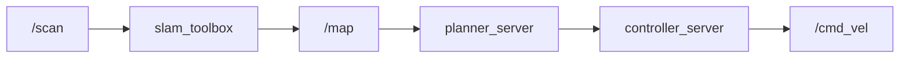

# ROS 2 — Bootcamp

::subtitle::
Démo du thème custom · session 2026

---
layout: section
eyebrow: Demo · 02
---

# Animations v-click

---
layout: default
---

# Liste progressive

- <v-click>Premier point — apparaît au clic 1</v-click>
- <v-click>Deuxième point — apparaît au clic 2</v-click>
- <v-click>Troisième point — apparaît au clic 3</v-click>

<v-click>

Bloc séparé qui apparaît à la fin.

</v-click>

---
layout: section
eyebrow: Demo · 03
---

# Math (KaTeX)

---
layout: default
---

# Cinématique différentielle

Modèle d'une base mobile à roues différentielles :

$$
\dot{x} = v\cos\theta,\quad \dot{y} = v\sin\theta,\quad \dot\theta = \omega
$$

Avec $v$ la vitesse linéaire et $\omega$ la vitesse angulaire de la base.

---
layout: section
eyebrow: Demo · 04
---

# Diagrammes Mermaid

---
layout: default
---

# Pipeline Nav2 simplifié

---
layout: end
---
