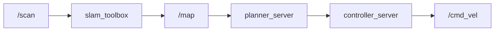

# ROS 2 — Bootcamp

::subtitle::
Démo du thème custom · vitrine des capacités

---
layout: section
eyebrow: Identité · 01
---

# Palette & typographie

---
layout: two-cols
---

### Palette

<div class="bc-swatch">
  <span class="bc-swatch__chip" style="background:#1f6f8b"></span>
  <span class="bc-swatch__name">primary</span>
  <span class="bc-swatch__hex">#1F6F8B</span>
</div>
<div class="bc-swatch">
  <span class="bc-swatch__chip" style="background:#40a8c4"></span>
  <span class="bc-swatch__name">accent</span>
  <span class="bc-swatch__hex">#40A8C4</span>
</div>
<div class="bc-swatch">
  <span class="bc-swatch__chip" style="background:#ff7a1a"></span>
  <span class="bc-swatch__name">industrial</span>
  <span class="bc-swatch__hex">#FF7A1A</span>
</div>
<div class="bc-swatch">
  <span class="bc-swatch__chip" style="background:#5bc07a"></span>
  <span class="bc-swatch__name">success</span>
  <span class="bc-swatch__hex">#5BC07A</span>
</div>
<div class="bc-swatch">
  <span class="bc-swatch__chip" style="background:#e5a552"></span>
  <span class="bc-swatch__name">warn</span>
  <span class="bc-swatch__hex">#E5A552</span>
</div>
<div class="bc-swatch">
  <span class="bc-swatch__chip" style="background:#e45858"></span>
  <span class="bc-swatch__name">danger</span>
  <span class="bc-swatch__hex">#E45858</span>
</div>

::right::

### Typographie

<div class="bc-type">
  <div class="bc-type__label">Display · Space Grotesk</div>
  <div class="bc-type__sample--display">ROS 2 — Bootcamp</div>
</div>

<div class="bc-type">
  <div class="bc-type__label">Texte · Inter</div>
  <div class="bc-type__sample--sans">Cours intensif robotique mobile et manipulation, full-stack ROS 2.</div>
</div>

<div class="bc-type">
  <div class="bc-type__label">Code · JetBrains Mono</div>
  <div class="bc-type__sample--mono">ros2 run kiwi_bringup launch.py</div>
</div>

---
layout: section
eyebrow: Layouts · 02
---

# Layouts disponibles

::note::
4 layouts custom + le `default` Slidev. Plus de détails dans `packages/theme-bootcamp/README.md`.

---
layout: default
---

# Inventaire

| Layout | Usage |
|---|---|
| `cover` | Première slide d'un deck (titre + sous-titre + day) |
| `section` | Séparateur de partie (eyebrow + grand titre) |
| `two-cols` | Deux colonnes 50/50, slot `left` (default) et `right` |
| `end` | Slide finale (Questions ? + logo + repo) |
| `default` | Slide texte standard avec footer global |

Le footer global (logo + brand + page) apparaît automatiquement sur **tous** les layouts sauf `cover` et `end`.

---
layout: section
eyebrow: Animations · 03
---

# v-click

---
layout: default
---

# Liste progressive

- <v-click>Premier point — apparaît au clic 1</v-click>
- <v-click>Deuxième point — apparaît au clic 2</v-click>
- <v-click>Troisième point — apparaît au clic 3</v-click>

<v-click>

> Bloc séparé qui apparaît à la fin.

</v-click>

---
layout: section
eyebrow: Math · 04
---

# Équations KaTeX

---
layout: default
---

# Cinématique différentielle

Modèle d'une base mobile à roues différentielles :

$$
\dot{x} = v\cos\theta,\quad \dot{y} = v\sin\theta,\quad \dot\theta = \omega
$$

Jacobien d'un bras planaire 2-DOF :

$$
J(\theta) =
\begin{bmatrix}
-l_1\sin\theta_1 - l_2\sin(\theta_1+\theta_2) & -l_2\sin(\theta_1+\theta_2) \\
\phantom{-}l_1\cos\theta_1 + l_2\cos(\theta_1+\theta_2) & \phantom{-}l_2\cos(\theta_1+\theta_2)
\end{bmatrix}
$$

---
layout: section
eyebrow: Diagrammes · 05
---

# Mermaid

---
layout: default
---

# Pipeline Nav2 simplifié



Le thème Mermaid est configuré au niveau du theme Slidev (`setup/mermaid.ts`), pas du deck — il s'applique au PDF comme au HTML.

---
layout: section
eyebrow: Code · 06
---

# Coloration syntaxique

---
layout: default
---

# Publisher minimal `rclpy`

```python {3-5|7-13|all}
import rclpy
from rclpy.node import Node
from std_msgs.msg import String


class MinimalPublisher(Node):
    def __init__(self):
        super().__init__("minimal_publisher")
        self.publisher_ = self.create_publisher(String, "topic", 10)
        timer_period = 0.5
        self.timer = self.create_timer(timer_period, self.timer_callback)

    def timer_callback(self):
        msg = String()
        msg.data = "Hello ROS 2"
        self.publisher_.publish(msg)
```

Shiki avec **line highlighting** progressif (clic) et **language detection** automatique.

---
layout: end
---
