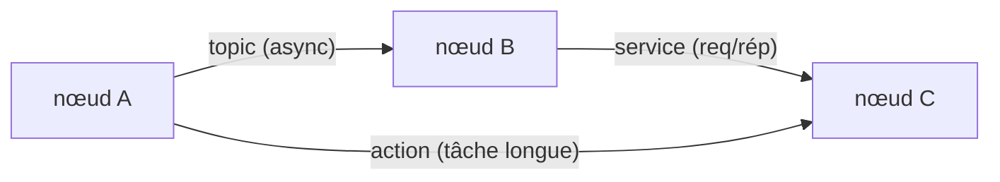
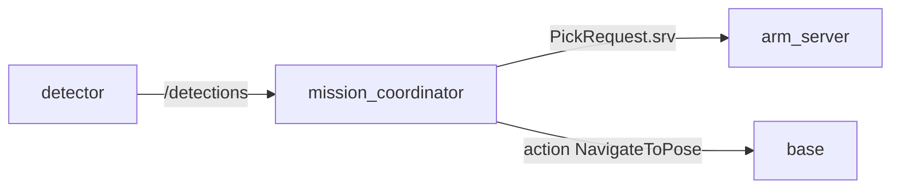

# Jour 1 — Introduction

::subtitle::
ROS 2 · écosystème · concepts · CLI

---
layout: default
---

# Au programme

<v-clicks>

- ce qu'est ROS 2 et son **écosystème**
- l'**architecture** : graphe de nœuds, RMW, DDS
- les **concepts** : nodes, topics, services, actions, paramètres
- l'**organisation** d'un projet : packages, workspace, launch, CLI
- une **application** : la première brique du projet final

</v-clicks>

---
layout: section
eyebrow: ROS 2 · 01
---

# Un écosystème open-source

---
layout: default
---

# Qu'est-ce que ROS 2 ?

**ROS 2** (Robot Operating System 2) est un **middleware open-source** qui **accélère** et
**simplifie** le développement de systèmes robotiques.

Au lieu d'un SDK par robot, une **infrastructure modulaire, unifiée et réutilisable** :

<v-clicks>

- 🧪 recherche et prototypage
- 🏭 industrie (cobots, automatisation)
- 🚗 véhicules autonomes, drones, AMR
- 🦾 bras manipulateurs et robots de service

</v-clicks>

---
layout: two-cols
---

# Fonctionnalités

- 🧰 **Bibliothèques** : communication, trajectoires, contrôle moteur, capteurs
- 🖥️ **Applications** : simulation (Gazebo), visualisation (RViz), `rosbag`
- 📐 **Conventions** : URDF/SDF, messages, unités SI
- 🌍 **Communauté** : composants open-source, docs, forums

::right::

# Historique

- **2010** ROS 1 (Willow Garage, robot PR2)
- **2012** ROS-Industrial + création OSRF → Open Robotics
- **2017** ROS 2 : réécriture complète (temps réel, sécurité, DDS)

---
layout: default
---

# De ROS 1 à ROS 2

Réécriture complète pour les besoins modernes :

<v-clicks>

- ⏱️ **temps réel** mieux géré (middleware **DDS**)
- 🔐 **sécurité** renforcée
- 🧩 **modularité** accrue, architecture propre
- ↔️ architecture **centralisée → distribuée** (plus de `roscore`)

</v-clicks>

<v-click>

> ⚠️ ROS 2 n'est **pas** rétrocompatible avec ROS 1 (des *bridges* existent).

</v-click>

---
layout: two-cols
---

# Distributions

- Versions **annuelles**, nommées par ordre alphabétique
- **LTS** tous les 2 ans (support 5 ans)
- Cette session : **Kilted** (2025)
- `Rolling` : développement continu

::right::

# Avantages / limites

✅ gain d'ingénierie, écosystème riche, modulaire, pas de *vendor lock-in*

⚠️ courbe d'apprentissage, surtout Linux, APIs qui évoluent vite

---
layout: default
---

# Communication : RMW & DDS

ROS 2 repose sur le **RMW** (ROS Middleware Interface), au-dessus de **DDS** (Data
Distribution Service, standard OMG temps réel).

<v-clicks>

- 🛠️ **QoS** : fiabilité, fréquence, persistance
- 🔒 **sécurité** (`sros2`) : chiffrement, authentification
- 🔄 **interopérabilité** : Fast DDS, Cyclone DDS…

</v-clicks>

---
layout: default
---

# Trois modes de communication



- 📬 **Topic** — publish/subscribe **asynchrone** (`/scan`, `/cmd_vel`)
- 🔁 **Service** — requête/réponse **synchrone** (interrogation ponctuelle)
- 🎯 **Action** — tâche **longue** avec feedback et annulation (aller à une pose)

---
layout: section
eyebrow: Écosystème · 02
---

# La boîte à outils

---
layout: two-cols
---

# Simulation & visualisation

- 🌍 **Gazebo** — simulation physique 3D (capteurs, moteurs)
- 🧭 **RViz** — visualiseur 3D des données ROS
- 🧩 **rqt** — outils graphiques (`rqt_graph`, `rqt_console`)
- 🛰️ **Foxglove** — visualisation moderne (web)

::right::

# Briques applicatives

- 🚗 **Nav2** — navigation autonome (Jour 2)
- 🦾 **MoveIt 2** — manipulation (Jour 3)
- ⚙️ **ros2_control** — contrôle bas-niveau temps réel
- 🌲 **Behavior Trees** — décision (Nav2, Groot 2)

---
layout: default
---

# Des conventions partagées

<v-clicks>

- 📏 **unités SI** : mètre, seconde, radian, newton
- 📨 **messages standardisés** : `geometry_msgs`, `sensor_msgs`, `std_msgs`
- 🧩 **nommage** : `/joint_states`, `/scan`, `/cmd_vel`
- 📂 **formats** : URDF, SRDF, YAML
- 🔄 **tf2** : transformations entre repères datées

</v-clicks>

<v-click>

> Tout le monde « parle le même langage » → interopérabilité.

</v-click>

---
layout: section
eyebrow: Concepts · 03
---

# Les briques de base

---
layout: default
---

# Les nœuds

- Un **nœud** = une unité de calcul (un exécutable C++ ou Python)
- Chaque nœud fait **une** tâche précise
- Ils communiquent via **topics / services / actions**

<v-click>

Exemple à 3 nœuds : **caméra** (perception) → **planif** (décision) → **moteurs** (action).
Un système ROS 2 = plusieurs nœuds coopérants.

</v-click>

---
layout: two-cols
---

# Topics & messages

Canaux **asynchrones** publish/subscribe.

- N publishers, N subscribers
- anonyme, flux continus

`/camera/image_raw` → `sensor_msgs/msg/Image`

::right::

# Services

Communication **synchrone** client/serveur.

- requête → réponse
- tâche courte avec résultat

Ex : « remets la tortue à zéro »

---
layout: two-cols
---

# Actions

Pour les **tâches longues** :

- requête + **feedback** continu
- **résultat** final
- **annulable**

Ex : « va à cette pose » (Nav2)

::right::

# Paramètres

Configurent un nœud **sans recompiler** :

- seuils, fréquences, couleurs
- surchargés au lancement ou via YAML

Ex : zones de dépôt par classe

---
layout: section
eyebrow: Projet ROS 2 · 04
---

# Organiser son code

---
layout: two-cols
---

# Workspace & packages

```text
ros2_bootcamp_ws/
├── src/
│   ├── mission_interfaces/
│   └── mission/
├── build/  install/  log/
```

- **package** = unité de build (`ros2 pkg create`)
- **workspace** = ensemble de packages (`colcon build`)

::right::

# Launch & isolation

```bash
ros2 launch mission mission.launch.py
```

- **launch file** : démarre plusieurs nœuds + params
- `ROS_DOMAIN_ID` : isole votre robot sur le réseau partagé

```bash
export ROS_DOMAIN_ID=42
```

---
layout: default
---

# La CLI `ros2`

```bash
ros2 node list                 # nœuds actifs
ros2 topic echo /turtle1/pose  # messages d'un topic
ros2 service call /clear std_srvs/srv/Empty
ros2 action send_goal ...      # lancer une action
ros2 param get /turtlesim background_b
rqt_graph                      # voir le graphe
```

> La CLI est votre couteau suisse pour **inspecter** et **interagir** avec le graphe.

---
layout: section
eyebrow: TP · 05
---

# À vous de jouer

---
layout: default
---

# Le fil rouge de la semaine

Vous allez monter **le graphe du projet final** — avec des nœuds factices :



<v-clicks>

- chaque concept du jour = une **brique** du graphe
- aux Jours 2-4, les nœuds factices deviennent les **vrais robots**
- au Jour 5, on **assemble** le tout

</v-clicks>

---
layout: end
---
