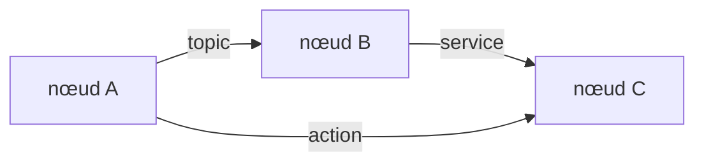
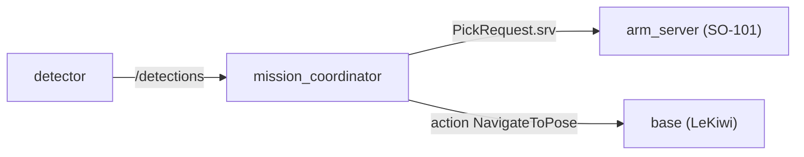

# Jour 1 — Introduction

::subtitle::
ROS 2 · écosystème · concepts · CLI

---
layout: default
---

# Au programme

<ul class="bc-agenda">
<li><span>Ce qu'est ROS 2 et son <strong>écosystème</strong></span></li>
<li><span>L'<strong>architecture</strong> : graphe de nœuds, RMW, DDS</span></li>
<li><span>Les <strong>concepts</strong> : nodes, topics, services, actions, paramètres</span></li>
<li><span>L'<strong>organisation</strong> d'un projet : packages, workspace, launch, CLI</span></li>
<li><span>Une <strong>application</strong> : la première brique du projet final</span></li>
</ul>

---
layout: section
eyebrow: Partie 01 · Présentation
---

# Un écosystème open-source

::note::
Middleware, distributions et communication : le socle de ROS 2.

---
layout: default
---

# Qu'est-ce que ROS 2 ?

**ROS** = **R**obot **O**perating **S**ystem.

Mais malgré son nom, **ce n'est pas un système d'exploitation** : ROS 2 est un
**middleware** + un **écosystème d'outils** pour construire des applications robotiques.

<v-clicks>

- 🧩 un robot = plusieurs programmes (**nœuds**) : perception, décision, contrôle
- 🔗 ROS 2 les fait **communiquer** entre eux (topics, services, actions)
- ♻️ et fournit des **briques réutilisables** : on ne réécrit pas tout pour chaque robot

</v-clicks>

<v-click>

<div class="bc-callout bc-callout--info">
<div class="bc-callout__icon">💡</div>
<div class="bc-callout__body">
<div class="bc-callout__title">En une phrase</div>
<p>ROS 2 = un <strong>langage commun</strong> + une <strong>boîte à outils</strong> pour passer du prototype au robot industriel.</p>
</div>
</div>

</v-click>

---
layout: default
---

# Ce que ROS 2 fournit

<div class="bc-cards bc-cards--2">
<div class="bc-card" v-click><div class="bc-card__title">🧰 Bibliothèques</div><p>API C++/Python (<code>rclcpp</code>, <code>rclpy</code>), <code>tf2</code>, calcul de trajectoires, <code>ros2_control</code></p></div>
<div class="bc-card" v-click><div class="bc-card__title">🖥️ Outils</div><p>Simulation (Gazebo), visualisation (RViz, Foxglove), enregistrement (<code>rosbag2</code>), build (<code>colcon</code>)</p></div>
<div class="bc-card" v-click><div class="bc-card__title">📐 Conventions</div><p>Messages standard (<code>sensor_msgs</code>…), URDF/SDF, unités SI, nommage des topics</p></div>
<div class="bc-card" v-click><div class="bc-card__title">🌍 Communauté</div><p>Des milliers de packages open-source, docs, ROS Discourse, drivers constructeurs</p></div>
</div>

---
layout: default
---

# Où l'utilise-t-on ?

<div class="bc-cards bc-cards--2">
<div class="bc-card" v-click><div class="bc-card__title">🧪 Recherche</div><p>Prototypage rapide et expérimentation en laboratoire</p></div>
<div class="bc-card" v-click><div class="bc-card__title">🏭 Industrie</div><p>Cobots, automatisation, lignes de production</p></div>
<div class="bc-card" v-click><div class="bc-card__title">🚗 Mobilité</div><p>Véhicules autonomes, drones, AMR</p></div>
<div class="bc-card" v-click><div class="bc-card__title">🦾 Manipulation</div><p>Bras manipulateurs et robots de service</p></div>
</div>

---
layout: two-cols
---

# Historique

<ul class="bc-timeline">
<li><span class="bc-timeline__year">2010</span> ROS 1 (Willow Garage, robot PR2)</li>
<li><span class="bc-timeline__year">2012</span> ROS-Industrial + création OSRF → Open Robotics</li>
<li><span class="bc-timeline__year">2017</span> ROS 2 : réécriture complète (temps réel, sécurité, DDS)</li>
<li><span class="bc-timeline__year">2025</span> Kilted Kaiju — la distribution de cette session</li>
</ul>

::right::

<div class="bc-media">

</div>

---
layout: default
---

# De ROS 1 à ROS 2

Réécriture complète pour les besoins modernes de la robotique :

<v-clicks>

- ⏱️ **temps réel** mieux géré (middleware **DDS**)
- 🔐 **sécurité** renforcée (chiffrement, authentification)
- 🧩 **modularité** accrue, architecture propre
- ↔️ architecture **centralisée → distribuée** (plus de `roscore`)

</v-clicks>

<v-click>

<div class="bc-callout bc-callout--warn">
<div class="bc-callout__icon">⚠️</div>
<div class="bc-callout__body">
<div class="bc-callout__title">Pas de rétrocompatibilité</div>
<p>Un package ROS 2 ne communique qu'avec ROS 2. Des <em>bridges</em> (<code>ros1_bridge</code>) permettent de relier ponctuellement les deux mondes — sans plus.</p>
</div>
</div>

</v-click>

---
layout: default
---

# Le cycle des distributions

<div class="bc-cards">
<div class="bc-card"><div class="bc-card__title">📅 Une par an</div><p>Une nouvelle version chaque <strong>23 mai</strong> (World Turtle Day)</p></div>
<div class="bc-card"><div class="bc-card__title">🐢 Nom de tortue</div><p>Adjectif + tortue, dans l'ordre <strong>alphabétique</strong></p></div>
<div class="bc-card"><div class="bc-card__title">🛡️ LTS tous les 2 ans</div><p>Support <strong>5 ans</strong> (sinon ~1,5 an)</p></div>
</div>

<div class="bc-callout bc-callout--info">

<div class="bc-callout__body">
<div class="bc-callout__title">Rolling Ridley — la branche de tête</div>
<p><strong>Développement continu</strong> : toujours à jour, jamais figée, <strong>sans fin de vie</strong> — mais <strong>non stable</strong>. À réserver aux tests, pas à la production.</p>
</div>
</div>

---
layout: default
---

# Les versions actives

<table class="bc-distros">
<thead>
<tr><th></th><th>Distribution</th><th>Sortie</th><th>Fin de vie</th><th>Type</th></tr>
</thead>
<tbody>
<tr><td></td><td class="bc-distros__name">Makoa Mata-mata</td><td>mai 2027</td><td>déc. 2028</td><td><span class="bc-badge">à venir</span></td></tr>
<tr><td></td><td class="bc-distros__name">Lyrical Luth</td><td>mai 2026</td><td>mai 2031</td><td><span class="bc-badge bc-badge--lts">LTS</span></td></tr>
<tr class="is-current"><td></td><td class="bc-distros__name">Kilted Kaiju</td><td>mai 2025</td><td>déc. 2026</td><td><span class="bc-badge">cette session</span></td></tr>
<tr><td></td><td class="bc-distros__name">Jazzy Jalisco</td><td>mai 2024</td><td>mai 2029</td><td><span class="bc-badge bc-badge--lts">LTS</span></td></tr>
<tr><td></td><td class="bc-distros__name">Humble Hawksbill</td><td>mai 2022</td><td>mai 2027</td><td><span class="bc-badge bc-badge--lts">LTS</span></td></tr>
</tbody>
</table>

---
layout: two-cols
---

# Kilted Kaiju (2025)

La distribution **non-LTS** de cette session, sur **Ubuntu 24.04**.

<v-clicks>

- 📦 packages = nom ROS 1 + suffixe **2** : `MoveIt 2`, `Nav2`
- 🐢 sortie le **23 mai 2025**, support jusqu'à **déc. 2026**
- 🔄 ROS 1 (Noetic) est en **fin de vie** depuis mai 2025

</v-clicks>

::right::

<div class="bc-media">

</div>

---
layout: default
---

# REP — ROS Enhancement Proposals

Des documents qui **standardisent** ROS (inspirés des **PEP** de Python) :

<v-clicks>

- 📦 organisation des distributions et des packages
- 📨 formats de messages, fichiers, conventions de nommage
- 🔧 évolutions du middleware (DDS, RMW…)

</v-clicks>

<v-click>

> 🧠 Les REP assurent une **gouvernance ouverte** et une **cohérence technique**.
> Ex : [REP 2000](https://www.ros.org/reps/rep-2000.html) (publication), [REP 2002](https://www.ros.org/reps/rep-2002.html) (rolling).

</v-click>

---
layout: default
---

# Avantages

<div class="bc-cards bc-cards--3">
<div class="bc-card" v-click><div class="bc-card__title">⏱️ Gain d'ingénierie</div><p>Des briques éprouvées (navigation, perception, contrôle) prêtes à l'emploi</p></div>
<div class="bc-card" v-click><div class="bc-card__title">🧩 Modularité</div><p>Architecture en nœuds : remplacer un composant sans tout casser</p></div>
<div class="bc-card" v-click><div class="bc-card__title">🔓 Pas de lock-in</div><p>Standards ouverts, multi-fournisseurs, aucune dépendance constructeur</p></div>
<div class="bc-card" v-click><div class="bc-card__title">🌍 Écosystème riche</div><p>Des milliers de packages, simulateurs et outils de debug</p></div>
<div class="bc-card" v-click><div class="bc-card__title">🤝 Communauté</div><p>Forums, GitHub, ROS Discourse + support professionnel (intégrateurs)</p></div>
<div class="bc-card" v-click><div class="bc-card__title">🔁 Du simu au réel</div><p>Le même code du simulateur au robot, du prototype à l'industrie</p></div>
</div>

---
layout: default
---

# Limites

<div class="bc-cards bc-cards--3">
<div class="bc-card" v-click><div class="bc-card__title">📘 Apprentissage</div><p>Concepts denses (DDS, QoS, tf2, colcon) à assimiler</p></div>
<div class="bc-card" v-click><div class="bc-card__title">🐧 Surtout Linux</div><p>Support Windows/macOS partiel ; Docker souvent nécessaire</p></div>
<div class="bc-card" v-click><div class="bc-card__title">🔄 Évolution rapide</div><p>APIs et distributions changent vite → veille nécessaire</p></div>
<div class="bc-card" v-click><div class="bc-card__title">🧱 Standards rigides</div><p>Parfois inadaptés à des cas très spécifiques</p></div>
<div class="bc-card" v-click><div class="bc-card__title">🐢 Latence</div><p>La couche middleware ajoute un coût ; tuning QoS requis</p></div>
<div class="bc-card" v-click><div class="bc-card__title">🧩 Mise en place</div><p>Configurer un système complet reste long et technique</p></div>
</div>

---
layout: default
---

# Langages supportés

Deux langages **officiels** :

- 🐍 **Python** (`rclpy`) — scripts, prototypage, démos pédagogiques
- ⚙️ **C++** (`rclcpp`) — drivers, nœuds critiques, performance

Autres via *bindings* : 🦀 Rust (`rclrs`), ☕ Java, Ada…

<v-click>

<div class="bc-callout bc-callout--info">
<div class="bc-callout__icon">🔬</div>
<div class="bc-callout__body">
<div class="bc-callout__title">micro-ROS</div>
<p>Une version allégée de ROS 2 pour les <strong>microcontrôleurs</strong> (ESP32, STM32…) : un capteur ou un actionneur rejoint directement le graphe ROS 2.</p>
</div>
</div>

</v-click>

---
layout: default
---

# Robots compatibles

- 🚗 robots à roues : AGV, AMR (ex. **LeKiwi**)
- 🦾 cobots et bras manipulateurs (ex. **SO-101**)
- 🚁 robots volants : drones, UAV
- 🦿 robots à pattes et humanoïdes

<v-click>

<div class="bc-callout bc-callout--info">
<div class="bc-callout__icon">🔌</div>
<div class="bc-callout__body">
<div class="bc-callout__title">C'est quoi un driver ROS ?</div>
<p>Le <strong>pont logiciel</strong> entre le matériel et le graphe : il publie les données des capteurs en <em>topics</em> et exécute les commandes reçues. Fourni par le constructeur, un labo ou la communauté — catalogue sur <a href="https://robots.ros.org">robots.ros.org</a>.</p>
</div>
</div>

</v-click>

---
layout: two-cols
---

# Architecture en couches

De votre code jusqu'au réseau, ROS 2 empile **5 couches**.

**Couche 1 / 5 — 🧩 Vos nœuds**

Votre **code applicatif**. Chaque nœud (C++ ou Python) réalise une tâche :
perception, décision, contrôle. C'est la **seule couche que vous écrivez**.

::right::

<div class="bc-layers">
<div class="bc-layers__item is-active"><div class="bc-layers__name">🧩 Vos nœuds</div><div class="bc-layers__desc">votre code applicatif (C++ / Python)</div></div>
<div class="bc-layers__item"><div class="bc-layers__name">🐍 rclcpp / rclpy</div><div class="bc-layers__desc">l'API ROS 2 (au-dessus de rcl, en C)</div></div>
<div class="bc-layers__item"><div class="bc-layers__name">🔌 RMW</div><div class="bc-layers__desc">masque le middleware réseau</div></div>
<div class="bc-layers__item"><div class="bc-layers__name">🛰️ DDS</div><div class="bc-layers__desc">le transport réseau réel</div></div>
<div class="bc-layers__item"><div class="bc-layers__name">🐧 OS</div><div class="bc-layers__desc">Linux (Windows / macOS partiels)</div></div>
</div>

---
layout: two-cols
---

# Architecture en couches

**Couche 2 / 5 — 🐍 rclcpp / rclpy**

L'**API ROS 2**. `rclcpp` (C++) et `rclpy` (Python) exposent nœuds, topics,
services… Les deux s'appuient sur **`rcl`**, une base commune en C → un
**comportement identique** entre les langages.

::right::

<div class="bc-layers">
<div class="bc-layers__item"><div class="bc-layers__name">🧩 Vos nœuds</div><div class="bc-layers__desc">votre code applicatif (C++ / Python)</div></div>
<div class="bc-layers__item is-active"><div class="bc-layers__name">🐍 rclcpp / rclpy</div><div class="bc-layers__desc">l'API ROS 2 (au-dessus de rcl, en C)</div></div>
<div class="bc-layers__item"><div class="bc-layers__name">🔌 RMW</div><div class="bc-layers__desc">masque le middleware réseau</div></div>
<div class="bc-layers__item"><div class="bc-layers__name">🛰️ DDS</div><div class="bc-layers__desc">le transport réseau réel</div></div>
<div class="bc-layers__item"><div class="bc-layers__name">🐧 OS</div><div class="bc-layers__desc">Linux (Windows / macOS partiels)</div></div>
</div>

---
layout: two-cols
---

# Architecture en couches

**Couche 3 / 5 — 🔌 RMW**

*ROS MiddleWare interface*. Une couche d'**abstraction** qui masque le middleware
réseau : changer de DDS = changer une variable (`RMW_IMPLEMENTATION`),
**sans toucher à votre code**.

::right::

<div class="bc-layers">
<div class="bc-layers__item"><div class="bc-layers__name">🧩 Vos nœuds</div><div class="bc-layers__desc">votre code applicatif (C++ / Python)</div></div>
<div class="bc-layers__item"><div class="bc-layers__name">🐍 rclcpp / rclpy</div><div class="bc-layers__desc">l'API ROS 2 (au-dessus de rcl, en C)</div></div>
<div class="bc-layers__item is-active"><div class="bc-layers__name">🔌 RMW</div><div class="bc-layers__desc">masque le middleware réseau</div></div>
<div class="bc-layers__item"><div class="bc-layers__name">🛰️ DDS</div><div class="bc-layers__desc">le transport réseau réel</div></div>
<div class="bc-layers__item"><div class="bc-layers__name">🐧 OS</div><div class="bc-layers__desc">Linux (Windows / macOS partiels)</div></div>
</div>

---
layout: two-cols
---

# Architecture en couches

**Couche 4 / 5 — 🛰️ DDS**

Le **transport réel** (standard OMG) : découverte des nœuds, fiabilité et **QoS**.
Plusieurs implémentations interchangeables — **Fast DDS** (défaut),
**Cyclone DDS**…

::right::

<div class="bc-layers">
<div class="bc-layers__item"><div class="bc-layers__name">🧩 Vos nœuds</div><div class="bc-layers__desc">votre code applicatif (C++ / Python)</div></div>
<div class="bc-layers__item"><div class="bc-layers__name">🐍 rclcpp / rclpy</div><div class="bc-layers__desc">l'API ROS 2 (au-dessus de rcl, en C)</div></div>
<div class="bc-layers__item"><div class="bc-layers__name">🔌 RMW</div><div class="bc-layers__desc">masque le middleware réseau</div></div>
<div class="bc-layers__item is-active"><div class="bc-layers__name">🛰️ DDS</div><div class="bc-layers__desc">le transport réseau réel</div></div>
<div class="bc-layers__item"><div class="bc-layers__name">🐧 OS</div><div class="bc-layers__desc">Linux (Windows / macOS partiels)</div></div>
</div>

---
layout: two-cols
---

# Architecture en couches

**Couche 5 / 5 — 🐧 OS**

Le **système d'exploitation**. ROS 2 tourne surtout sous **Linux (Ubuntu)** ;
support Windows/macOS partiel. C'est par le réseau de l'OS que **DDS** fait
transiter les messages.

::right::

<div class="bc-layers">
<div class="bc-layers__item"><div class="bc-layers__name">🧩 Vos nœuds</div><div class="bc-layers__desc">votre code applicatif (C++ / Python)</div></div>
<div class="bc-layers__item"><div class="bc-layers__name">🐍 rclcpp / rclpy</div><div class="bc-layers__desc">l'API ROS 2 (au-dessus de rcl, en C)</div></div>
<div class="bc-layers__item"><div class="bc-layers__name">🔌 RMW</div><div class="bc-layers__desc">masque le middleware réseau</div></div>
<div class="bc-layers__item"><div class="bc-layers__name">🛰️ DDS</div><div class="bc-layers__desc">le transport réseau réel</div></div>
<div class="bc-layers__item is-active"><div class="bc-layers__name">🐧 OS</div><div class="bc-layers__desc">Linux (Windows / macOS partiels)</div></div>
</div>

---
layout: default
---

# DDS — le moteur réseau

Sous le RMW, ROS 2 utilise **DDS** (*Data Distribution Service*), middleware réseau
standardisé par l'**OMG** (qui maintient aussi UML).

<v-clicks>

- 🛠️ **QoS** : fiabilité, fréquence, persistance
- 🔒 **sécurité** (`sros2`) : chiffrement, authentification, contrôle d'accès
- 🔄 **interopérabilité** : Fast DDS, Cyclone DDS…

</v-clicks>

<v-click>

> ✅ Ces options rendent ROS 2 robuste, adapté à la **robotique industrielle critique**.

</v-click>

---
layout: default
---

# Trois modes de communication

<div class="bc-cards">
<div class="bc-card" v-click><div class="bc-card__title">📬 Topic</div><p>Publish/subscribe <strong>asynchrone</strong> — flux continus (<code>/scan</code>, <code>/cmd_vel</code>)</p></div>
<div class="bc-card" v-click><div class="bc-card__title">🔁 Service</div><p>Requête/réponse <strong>synchrone</strong> — interrogation ponctuelle</p></div>
<div class="bc-card" v-click><div class="bc-card__title">🎯 Action</div><p>Tâche <strong>longue</strong> avec feedback et annulation (aller à une pose)</p></div>
</div>



---
layout: section
eyebrow: Partie 02 · Boîte à outils
---

# La boîte à outils

::note::
Simulation, visualisation et briques applicatives.

---
layout: two-cols
---

# Simulation & visualisation

- 🌍 **Gazebo** — simulation physique 3D (capteurs, moteurs)
- 🧭 **RViz** — visualiseur 3D des données ROS
- 🧩 **rqt** — outils graphiques (`rqt_graph`, `rqt_console`)
- 🛰️ **Foxglove** — visualisation moderne (web)

::right::

<div class="bc-media">


</div>

---
layout: two-cols
---

# Briques applicatives

- 🚗 **Nav2** — navigation autonome (Jour 2)
- 🦾 **MoveIt 2** — manipulation (Jour 3)
- ⚙️ **ros2_control** — contrôle bas-niveau temps réel
- 🌲 **Behavior Trees** — décision (Nav2, Groot 2)

> Le logiciel reste **indépendant du hardware** du robot.

::right::

<div class="bc-media">

</div>

---
layout: two-cols
---

# Behavior Trees & Groot

- 🌲 modèle de décision en **arborescence d'actions**
- remplace les machines à états (FSM)
- utilisé par **Nav2**, MoveIt Task Constructor
- édition visuelle avec **Groot 2**

🔗 [behaviortree.dev](https://www.behaviortree.dev/docs/ros2_integration/)

::right::

<div class="bc-media">

</div>

---
layout: default
---

# Projets connexes

ROS 2 sert de **socle** à de nombreux projets spécialisés :

<div class="bc-cards bc-cards--2">
<div class="bc-card"><div class="bc-card__title">🚗 Autoware</div><p>Middleware open-source pour la conduite autonome (voitures, navettes)</p></div>
<div class="bc-card"><div class="bc-card__title">🏭 ROS-Industrial</div><p>Adaptation aux besoins industriels (ABB, Fanuc, UR…)</p></div>
</div>

> 🧩 Un écosystème en pleine expansion dans la robotique moderne.

---
layout: two-cols
---

# Conventions partagées

<v-clicks>

- 📏 **unités SI** : mètre, seconde, radian, newton
- 📨 **messages standardisés** : `geometry_msgs`, `sensor_msgs`
- 🧩 **nommage** : `/joint_states`, `/scan`, `/cmd_vel`
- 📂 **formats** : URDF, SRDF, YAML

</v-clicks>

<v-click>

> Tout le monde « parle le même langage » → interopérabilité.

</v-click>

::right::

## Boîte à outils

- 🧩 **URDF** — description du robot
- 🔄 **tf2** — transformations entre repères datées
- 🎥 **rosbag2** — enregistrement / rejeu
- 📈 **PlotJuggler** — courbes temps réel
- 📊 **rqt_graph** — vue des nœuds

---
layout: section
eyebrow: Partie 03 · Concepts
---

# Les briques de base

::note::
Nœuds, topics, services, actions et paramètres.

---
layout: two-cols
---

# Les nœuds

- Un **nœud** = une unité de calcul (exécutable C++ ou Python)
- Chaque nœud fait **une** tâche précise
- Ils communiquent via **topics / services / actions**
- Exemple : **caméra** → **planif** → **moteurs**

::right::

<div class="bc-media">

</div>

---
layout: two-cols
---

# Topics & messages

Canaux **asynchrones** publish/subscribe.

- N publishers, N subscribers
- anonyme, flux continus

`/camera/image_raw` → `sensor_msgs/msg/Image`

::right::

<div class="bc-media">

</div>

---
layout: two-cols
---

# Services

Communication **synchrone** client/serveur.

- requête → réponse
- tâche courte avec résultat
- **un seul** serveur, plusieurs clients

Ex : « remets le robot à l'origine »

::right::

<div class="bc-media">

</div>

---
layout: two-cols
---

# Actions

Pour les **tâches longues** :

- objectif + **feedback** continu
- **résultat** final
- **annulable**

Ex : « va à cette pose » (Nav2)

::right::

<div class="bc-media">

</div>

---
layout: default
---

# Paramètres

Configurent un nœud **sans recompiler** :

<v-clicks>

- seuils, fréquences, vitesses, couleurs
- accessibles par le code **ou** la CLI (`ros2 param`)
- surchargés au lancement ou via YAML

</v-clicks>

<v-click>

> Très utiles pour **tester**, **ajuster** et **déployer** un système de façon flexible.

</v-click>

---
layout: section
eyebrow: Partie 04 · Projet
---

# Organiser son code

::note::
Workspace, packages, launch et CLI.

---
layout: two-cols
---

# Workspace & packages

```text
ros2_bootcamp_ws/
├── src/
│   ├── mission_interfaces/
│   └── mission/
├── build/  install/  log/
```

- **package** = unité de build (`ros2 pkg create`)
- **workspace** = ensemble de packages (`colcon build`)

::right::

# Launch & isolation

```bash
ros2 launch mission mission.launch.py
```

- **launch file** : démarre plusieurs nœuds + params
- `ROS_DOMAIN_ID` : isole votre robot sur le réseau partagé

```bash
export ROS_DOMAIN_ID=42
```

---
layout: default
---

# `ROS_DOMAIN_ID` — isolation réseau

DDS fonctionne par **multidiffusion** sur le réseau local. Pour éviter que les robots se
perturbent, on isole les communications par un identifiant (`0`–`232`).

<v-clicks>

- même `ROS_DOMAIN_ID` sur **le robot et le PC**
- un numéro **unique par groupe** dans la salle
- à définir dans `~/.bashrc`

</v-clicks>

```bash
export ROS_DOMAIN_ID=12
```

---
layout: default
---

# La CLI `ros2`

```bash
ros2 node list                 # nœuds actifs
ros2 topic echo /turtle1/pose  # messages d'un topic
ros2 service call /clear std_srvs/srv/Empty
ros2 action send_goal ...      # lancer une action
ros2 param get /turtlesim background_b
rqt_graph                      # voir le graphe
```

> La CLI est votre couteau suisse pour **inspecter** et **interagir** avec le graphe.

---
layout: default
---

# CLI — commandes courantes

| Catégorie | Exemple | Description |
|---|---|---|
| 📦 Packages | `ros2 pkg list` | packages installés |
| 🧠 Nœuds | `ros2 node list` | nœuds actifs |
| 📨 Topics | `ros2 topic echo /scan` | messages d'un topic |
| ⚙️ Paramètres | `ros2 param list` | paramètres d'un nœud |
| 🔁 Services | `ros2 service list` | services disponibles |
| 🎯 Actions | `ros2 action list` | actions disponibles |
| 🧪 Diagnostic | `ros2 doctor` | état de l'installation |

---
layout: section
eyebrow: Partie 05 · Pratique
---

# À vous de jouer

::note::
La première brique du projet final.

---
layout: default
---

# Le fil rouge de la semaine

Vous allez monter **le graphe du projet final** — avec des nœuds factices :



<v-clicks>

- chaque concept du jour = une **brique** du graphe
- aux Jours 2-4, les nœuds factices deviennent les **vrais robots**
- au Jour 5, on **assemble** le tout

</v-clicks>

---
layout: default
---

# Exercices

<ul class="bc-agenda">
<li><span><a href="https://ros2.etienne-schmitz.com/installation/">Installation ROS 2 Kilted</a> (natif ou Docker)</span></li>
<li><span><a href="https://ros2.etienne-schmitz.com/introduction/">Exercice 1 — premiers pas avec ROS 2</a></span></li>
<li><span>Si le temps le permet : préparer les robots <strong>LeKiwi</strong> / <strong>SO-101</strong></span></li>
</ul>

---
layout: end
---
