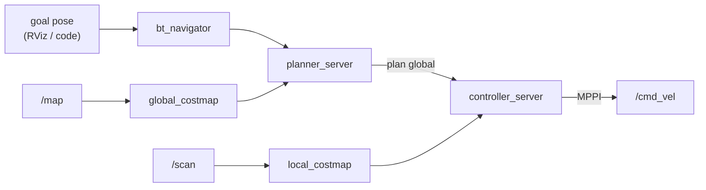
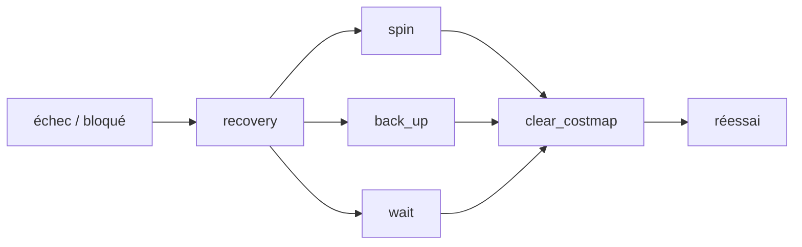

# Jour 2 — Navigation

::subtitle::
LeKiwi · slam_toolbox · Nav2

---
layout: default
---

# Au programme

À la fin de la journée, vous saurez :

<v-clicks>

- décrire la cinématique d'une base **omnidirectionnelle Kiwi** (3 roues à 120°) ;
- piloter la base en téléop dans **Gazebo Ionic** (gz-sim 9) ;
- construire une carte avec **slam_toolbox** ;
- planifier et exécuter des trajectoires autonomes avec **Nav2**.

</v-clicks>

<v-click>

> Pré-requis : workspace `~/ros2_bootcamp_ws/` opérationnel + concepts ROS 2 du Jour 1 (nodes, topics, tf, frames).

</v-click>

---
layout: section
eyebrow: Base mobile · 01
---

# La base mobile LeKiwi

::note::
Une plateforme open-source à 3 roues omnidirectionnelles — holonome.

---
layout: two-cols
---

# Configuration kiwi à 120°

Trois roues identiques réparties à **120°**, sur moteurs indépendants.

- Chaque roue est **omnidirectionnelle** (roue + galets latéraux).
- Elle n'entraîne le sol que dans son axe principal…
- … et glisse librement latéralement.

<v-click>

**Conséquence** : la base est **holonome** — elle translate dans n'importe quelle direction sans se réorienter.

</v-click>

::right::

```text
        roue 0 (avant)
             │
             ▼
          ╱──────╲
         ╱        ╲
        │  base    │
         ╲        ╱
          ╲──────╱
        ╱           ╲
    roue 1         roue 2
   (arr. gauche)  (arr. droit)
```

---
layout: default
---

# Cinématique inverse

Pour une consigne `(vₓ, v_y, ω)` — translation X, translation Y, rotation autour de Z — la vitesse linéaire de chaque roue `i` à l'angle `θᵢ` :

$$
v_i = -\sin(\theta_i)\, v_x + \cos(\theta_i)\, v_y + L\, \omega
$$

avec `L` = rayon entre le centre du robot et chaque roue.

<v-click>

Implémentée par un nœud **`base_controller`** qui consomme `/cmd_vel` (`geometry_msgs/Twist`) et publie les commandes de vitesse de chaque moteur.

</v-click>

---
layout: two-cols
---

# URDF de la base

L'URDF `lekiwi_description` définit :

- un `base_link` central ;
- trois `wheel_link` à 120° (joints `continuous`) ;
- un `laser_link` — LiDAR 360° en haut du robot ;
- inerties & collisions approximées (cylindres / boîtes).

::right::

Visualiser le modèle :

```bash
ros2 launch lekiwi_description \
  display.launch.py
```

<v-click>

Démarre `robot_state_publisher` + RViz avec une config qui charge le modèle.

</v-click>

---
layout: default
---

# Téléop & premier lancement

Lancer la sim Gazebo + bridges, puis piloter au clavier :

```bash
# Terminal 1 — sim (Gazebo + bridges /cmd_vel /odom /scan /clock /tf)
ros2 launch lekiwi_bringup sim_base.launch.py

# Terminal 2 — téléop clavier
ros2 run teleop_twist_keyboard teleop_twist_keyboard
```

| Touches | Action |
|---|---|
| `i` / `,` | avancer / reculer |
| `j` / `l` | **translation latérale** gauche / droite (la magie holonome) |
| `u` / `o` | rotation |
| `q` / `z` | modifier la vitesse |

<v-click>

> Si la base se déplace latéralement **sans changer de cap**, la cinématique est correcte. ✅

</v-click>

---
layout: section
eyebrow: SLAM · 02
---

# SLAM avec slam_toolbox

::note::
Construire la carte **en même temps** qu'on s'y localise.

---
layout: two-cols
---

# Modes de slam_toolbox

| Mode | Quand |
|---|---|
| **online async** | robot en mouvement, quasi temps réel. **Mode du cours.** |
| online sync | strict temps réel, coûteux |
| offline | replay d'un bag |
| lifelong | mise à jour d'une carte existante |

::right::

```text
 /scan (LaserScan)   ──┐
 /tf (odom→base_link) ─┤
                       ▼
                 slam_toolbox
                       │
        ┌──────────────┼─────────────┐
        ▼              ▼              ▼
      /map        /tf (map→odom)  /map_metadata
```

<v-click>

À retenir : `slam_toolbox` publie **`map → odom`**, qui corrige la dérive de l'odométrie via les features du scan.

</v-click>

---
layout: default
---

# Lancer SLAM + sim

```bash
# Terminal 1 — sim
ros2 launch lekiwi_bringup sim_base.launch.py

# Terminal 2 — SLAM (online async)
ros2 launch lekiwi_navigation slam.launch.py

# Terminal 3 — RViz
rviz2 -d $(ros2 pkg prefix lekiwi_navigation)/share/lekiwi_navigation/rviz/slam.rviz
```

Dans RViz, vous devez voir :

<v-clicks>

- l'`OccupancyGrid` `/map` apparaître progressivement ;
- la silhouette du LeKiwi suivre la base ;
- les rayons laser en bleu.

</v-clicks>

---
layout: two-cols
---

# Bien cartographier

Téléopérez et baladez le robot dans le monde :

- **Vitesses modérées** (< 0.3 m/s) — le SLAM a le temps de fitter chaque scan.
- **Fermez les boucles** — revenez sur vos pas pour corriger la dérive.
- **Couverture complète** — longez les murs pour qu'ils soient nets.

::right::

Sauvegarder la carte :

```bash
ros2 run nav2_map_server map_saver_cli \
  -f ~/ros2_bootcamp_ws/maps/lekiwi_world
```

<v-click>

Produit deux fichiers :

- `lekiwi_world.yaml` — métadonnées (origine, résolution, seuils).
- `lekiwi_world.pgm` — image grayscale de l'OccupancyGrid.

Rejouable ensuite en **localisation pure**.

</v-click>

---
layout: section
eyebrow: Nav2 · 03
---

# Navigation autonome avec Nav2

::note::
Planning global, suivi local, recovery, obstacles dynamiques.

---
layout: default
---

# Pipeline Nav2



- **`bt_navigator`** — orchestre via un *behavior tree* (planifier, suivre, recovery).
- **Planner** — trajectoire globale (Smac hybrid, NavFn).
- **Controller** — suivi local évitant les obstacles (MPPI, DWB, RPP).
- **Costmaps** — grilles statique + locale, avec inflation.

---
layout: two-cols
---

# Contrôleur holonome

Une base omni **(kiwi)** peut translater sans tourner — tous les controllers ne le savent pas :

| Controller | Holonome ? |
|---|---|
| DWB | Oui, si `vy_samples > 0` |
| **MPPI** | **Oui, nativement** |
| Reg. Pure Pursuit | Non (différentielle) |

<v-click>

Pour LeKiwi → **MPPI** : meilleur tracking, holonome natif.

</v-click>

::right::

```yaml
controller_server:
  ros__parameters:
    controller_plugins: ["FollowPath"]
    FollowPath:
      plugin: "nav2_mppi_controller::MPPIController"
      time_steps: 56
      model_dt: 0.05
      vx_max: 0.5
      vy_max: 0.5   # ← non nul = holonome
      wz_max: 1.5
```

---
layout: default
---

# Premier goal 2D

```bash
# Empile sim + slam_toolbox (localization si carte, sinon async) + Nav2
ros2 launch lekiwi_navigation navigation.launch.py
```

Dans RViz :

<v-clicks>

1. **2D Pose Estimate** — cliquez la pose réelle du robot + orientez la flèche (pose initiale du filtre).
2. **Nav2 Goal** — cliquez la destination. Nav2 planifie et exécute.

</v-clicks>

<v-click>

Suivre l'avancement :

```bash
ros2 topic echo /behavior_server/behavior_tree_log
```

</v-click>

---
layout: default
---

# Recoveries

Quand le robot est bloqué, le behavior tree déclenche un **recovery** :



<v-click>

> Pour une base holonome, préférez **`drive_on_heading`** à `back_up` — manœuvres latérales possibles.

</v-click>

---
layout: section
eyebrow: Exercices · 04
---

# Exercices

::note::
Quatre exercices guidés — sim + SLAM + Nav2.

---
layout: two-cols
---

# Exercices 1 & 2

**1 — Cartographier une pièce**

- Sim + slam_toolbox (async).
- Couvrir toute la zone, fermer une boucle.
- `map_saver_cli`, puis recharger en **localisation pure**.

::right::

**2 — Tuner le controller MPPI**

Un paramètre à la fois :

- `vx_max`, `vy_max`, `wz_max`
- `time_steps` × `model_dt` (horizon)
- `critic_names` (Obstacles, GoalAngle…)
- `inflation_radius`

Mesurez : temps, distance, confort de la trajectoire.

---
layout: two-cols
---

# Exercices 3 & 4

**3 — Obstacle dynamique**

- Spawn un cube pendant la navigation.
- Le `local_costmap` s'allume quand le LiDAR le voit.
- MPPI **replanifie** localement.

> Combien de temps avant réaction ?

::right::

**4 — Mission multi-waypoints**

- Action `/follow_waypoints` (`waypoint_follower`).
- Liste de `PoseStamped`, visite ordonnée + pauses.

<v-click>

> **Bonus** : émettre un message ROS à chaque waypoint atteint → prépare le Jour 5 (intégration).

</v-click>

---
layout: end
---
