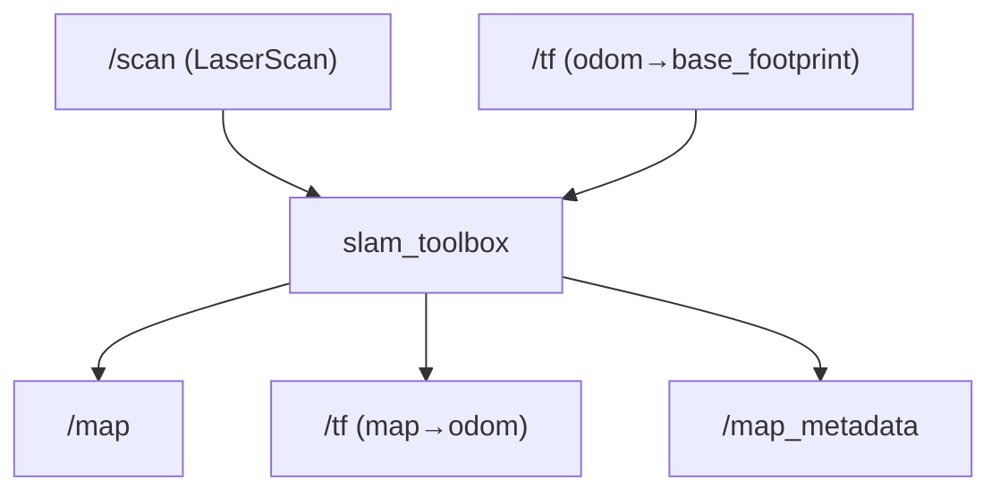
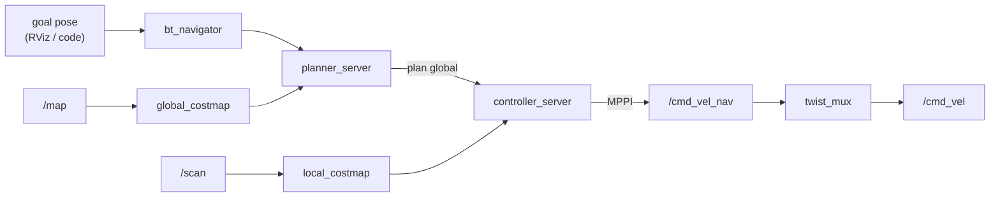
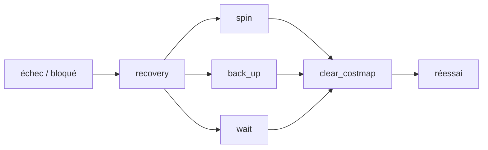

# Jour 2 — Navigation

::subtitle::
LeKiwi · slam_toolbox · Nav2

---
layout: default
---

# Au programme

À la fin de la journée, vous saurez :

<v-clicks>

- décrire la cinématique d'une base **omnidirectionnelle Kiwi** (3 roues à 120°) ;
- **lire le graphe ROS 2** d'un robot qui tourne (nœuds, topics, services, actions) ;
- piloter la base en téléop dans **Gazebo Ionic** (gz-sim 9) ;
- construire **et sauvegarder** une carte avec **slam_toolbox** ;
- planifier et exécuter des trajectoires autonomes avec **Nav2** (goal au clic).

</v-clicks>

<v-click>

> Pré-requis : workspace `~/ros2_bootcamp_ws/` compilé + concepts ROS 2 du Jour 1 (nodes, topics, tf, frames).

</v-click>

---
layout: section
eyebrow: Partie 01 · Base mobile
---

# La base mobile LeKiwi

::note::
Une plateforme open-source à 3 roues omnidirectionnelles — holonome.

---
layout: two-cols
---

# Configuration kiwi à 120°

Trois roues identiques réparties à **120°**, sur moteurs indépendants :

- `left_wheel` (60°), `right_wheel` (300°), `back_wheel` (180°) ;
- chaque roue est **omnidirectionnelle** (roue + galets latéraux) ;
- elle n'entraîne le sol que dans son axe et **glisse latéralement**.

<v-click>

**Conséquence** : la base est **holonome** — elle translate dans n'importe quelle direction sans se réorienter.

</v-click>

::right::

<div class="bc-media">

</div>

---
layout: default
---

# Cinématique inverse

Pour une consigne `(vₓ, v_y, ω)` — translation X, translation Y, rotation autour de Z — la vitesse linéaire de chaque roue `i` à l'angle `θᵢ` :

$$
v_i = -\sin(\theta_i)\, v_x + \cos(\theta_i)\, v_y + L\, \omega
$$

<v-click>

Calculée par le contrôleur **`omni_wheel_drive_controller`** (`ros2_control`). La chaîne des commandes :

```text
téléop ─► /cmd_vel_teleop ─┐
                           ├─► twist_mux ─► /cmd_vel ─► omni_wheel_drive_controller ─► roues
Nav2   ─► /cmd_vel_nav   ──┘
```

</v-click>

<v-click>

> Topics en **`TwistStamped`**. `twist_mux` donne la priorité à la téléop sur Nav2.

</v-click>

---
layout: two-cols
---

# Découvrir le graphe

Le robot tourne — **inspectez-le avant de le piloter** :

```bash
ros2 node list
ros2 topic list
ros2 service list
ros2 action list
rqt_graph
```

<v-click>

Pour creuser :

```bash
ros2 topic info /scan --verbose
ros2 node info /twist_mux
```

</v-click>

::right::

<div class="bc-callout bc-callout--info">
<div class="bc-callout__icon">❓</div>
<div class="bc-callout__body">
<div class="bc-callout__title">Faites deviner</div>
<p>Qui <strong>publie</strong> <code>/scan</code> ? Qui <strong>consomme</strong> <code>/cmd_vel</code> ? D'où vient <code>/odometry/filtered</code> ?</p>
<p>Voit-on déjà l'action <code>/navigate_to_pose</code> ?</p>
</div>
</div>

<v-click>

> Réponses : pont `ros_gz` → `/scan` ; `omni_wheel_drive_controller` → roues ; EKF `robot_localization` → `/odometry/filtered`. **Pas** de `/navigate_to_pose` : Nav2 n'est pas lancé.

</v-click>

---
layout: default
---

# Téléop & observer

Lancer la sim, puis piloter au clavier **AZERTY** (publie `TwistStamped` sur `/cmd_vel_teleop`, sans remap) :

```bash
# Terminal 1 — sim (Gazebo Ionic, monde bootcamp.sdf + bridges + contrôleurs + EKF)
ros2 launch lekiwi_bringup sim_base.launch.py

# Terminal 2 — téléop clavier AZERTY
ros2 run lekiwi_bringup teleop_azerty
```

| Touches | Action |
|---|---|
| `z` / `s` | avancer / reculer |
| `q` / `d` | **translation latérale** (la magie holonome) |
| `a` / `e` | rotation |

<v-click>

> Observez : `ros2 topic echo /odometry/filtered` + `tf2_tools view_frames`. Frames `odom → base_footprint`… mais **pas encore de `map`** (pas de SLAM).

</v-click>

---
layout: section
eyebrow: Partie 02 · Cartographier
---

# SLAM avec slam_toolbox

::note::
Construire la carte **en même temps** qu'on s'y localise.

---
layout: default
---

# Qu'est-ce que le SLAM ?

**SLAM** = *Simultaneous Localization And Mapping*.

<div class="bc-cards bc-cards--3">
<div class="bc-card" v-click><div class="bc-card__title">🎯 Le problème</div><p>L'odométrie <strong>dérive</strong> : sans repère absolu, l'erreur s'accumule au fil du trajet.</p></div>
<div class="bc-card" v-click><div class="bc-card__title">🧩 L'idée</div><p>Recaler en continu les <strong>scans laser</strong> sur la carte en construction pour estimer la vraie pose.</p></div>
<div class="bc-card" v-click><div class="bc-card__title">🔗 Le résultat</div><p>Une carte <code>/map</code> <strong>et</strong> la transformation <code>map → odom</code> qui corrige la dérive.</p></div>
</div>

<v-click>

> `slam_toolbox` complète enfin la chaîne `map → odom → base_footprint`.

</v-click>

---
layout: two-cols
---

# Modes & flux

```bash
ros2 launch lekiwi_navigation \
  slam.launch.py slam_mode:=map
```

| `slam_mode` | Rôle |
|---|---|
| **map** | cartographie. **Mode du cours.** |
| localize | localisation (carte slam_toolbox) |
| amcl | localisation AMCL (carte statique) |

::right::



<v-click>

À retenir : `slam_toolbox` publie **`map → odom`**, qui corrige la dérive via les features du scan.

</v-click>

---
layout: default
---

# Lancer SLAM + sim

```bash
# Terminal 1 — sim
ros2 launch lekiwi_bringup sim_base.launch.py

# Terminal 2 — SLAM (mapping)
ros2 launch lekiwi_navigation slam.launch.py slam_mode:=map

# Terminal 3 — RViz
rviz2 -d $(ros2 pkg prefix lekiwi_navigation)/share/lekiwi_navigation/rviz/nav.rviz
```

Dans RViz, vous devez voir :

<v-clicks>

- l'`OccupancyGrid` `/map` apparaître progressivement ;
- la silhouette du LeKiwi suivre la base ;
- les rayons laser en couleur.

</v-clicks>

---
layout: two-cols
---

# Bien cartographier

Téléopérez et baladez le robot :

- **Vitesses modérées** (< 0,3 m/s) — le SLAM a le temps de fitter chaque scan.
- **Fermez les boucles** — revenez sur vos pas pour corriger la dérive.
- **Couverture complète** — longez les murs.

::right::

Sauvegarder la carte (un dossier = `map.yaml` + `map.pgm`) :

```bash
ros2 run nav2_map_server map_saver_cli \
  -f ~/ros2_bootcamp_ws/src/lekiwi_ros2/\
lekiwi_navigation/maps/bootcamp/map
```

<v-click>

Recharger en **localisation pure** :

```bash
ros2 launch lekiwi_navigation \
  navigation.launch.py \
  slam_mode:=localize map_name:=bootcamp
```

</v-click>

---
layout: section
eyebrow: Partie 03 · Naviguer
---

# Navigation autonome avec Nav2

::note::
Planning global, suivi local, recovery, obstacles dynamiques.

---
layout: default
---

# Pipeline Nav2



- **`bt_navigator`** — orchestre via un *behavior tree* (planifier, suivre, recovery).
- **Planner** / **Controller** — trajectoire globale (Smac, NavFn) puis suivi local (MPPI).

---
layout: default
---

# Les costmaps

Nav2 raisonne sur deux **grilles de coût** (`base_footprint`) :

<div class="bc-cards bc-cards--2">
<div class="bc-card" v-click><div class="bc-card__title">🗺️ Global costmap</div><p>La carte statique <code>/map</code> + obstacles connus. Sert au <strong>planner</strong> pour le chemin global.</p></div>
<div class="bc-card" v-click><div class="bc-card__title">📡 Local costmap</div><p>Fenêtre glissante alimentée par le <strong>LiDAR temps réel</strong>. Sert au <strong>controller</strong> pour éviter les obstacles dynamiques.</p></div>
</div>

<v-click>

<div class="bc-callout bc-callout--info">
<div class="bc-callout__icon">💡</div>
<div class="bc-callout__body">
<div class="bc-callout__title">Inflation</div>
<p>Une marge de coût est « gonflée » autour des obstacles (<code>inflation_radius</code>) pour garder le robot à distance des murs.</p>
</div>
</div>

</v-click>

---
layout: two-cols
---

# Contrôleur holonome

Une base omni **(kiwi)** peut translater sans tourner — tous les controllers ne le savent pas :

| Controller | Holonome ? |
|---|---|
| DWB | Oui, si `vy_samples > 0` |
| **MPPI** | **Oui, `motion_model: Omni`** |
| Reg. Pure Pursuit | Non (différentielle) |

<v-click>

Pour LeKiwi → **MPPI Omni** : meilleur tracking, sortie sur `/cmd_vel_nav`.

</v-click>

::right::

```yaml
controller_server:
  ros__parameters:
    controller_plugins: ["FollowPath"]
    FollowPath:
      plugin: "nav2_mppi_controller::MPPIController"
      motion_model: "Omni"   # ← base holonome
      time_steps: 56
      model_dt: 0.05
      vx_max: 0.5
      vy_max: 0.5            # ← non nul = holonome
      wz_max: 1.5
```

---
layout: default
---

# Premier goal au clic

```bash
# Empile sim + slam/localisation + Nav2 + RViz
ros2 launch lekiwi_navigation navigation.launch.py
# ... ou sur une carte sauvegardée :
#   navigation.launch.py slam_mode:=localize map_name:=bootcamp
```

Dans RViz :

<v-clicks>

1. **2D Pose Estimate** — cliquez la pose réelle du robot + orientez la flèche.
2. **Nav2 Goal** — cliquez la destination. Nav2 planifie et exécute.

</v-clicks>

<v-click>

> Par le code : action `navigate_to_pose` (cf. `go_to.py`).

</v-click>

---
layout: default
---

# Recoveries

Quand le robot est bloqué, le behavior tree déclenche un **recovery** :



<v-click>

> Pour une base holonome, préférez **`drive_on_heading`** à `back_up` — manœuvres latérales possibles.

</v-click>

---
layout: section
eyebrow: Partie 04 · Exercices
---

# Exercices

::note::
Quatre exercices guidés — sim + SLAM + Nav2.

---
layout: two-cols
---

# Exercices 1 & 2

**1 — Cartographier une pièce**

- Sim + `slam.launch.py slam_mode:=map`.
- Couvrir toute la zone, fermer une boucle.
- `map_saver_cli`, puis recharger en **localisation** (`slam_mode:=localize`).

::right::

**2 — Tuner le controller MPPI**

Un paramètre à la fois (`config/nav2/nav2.yaml`) :

- `vx_max`, `vy_max`, `wz_max`
- `time_steps` × `model_dt` (horizon)
- `critic_names` (Obstacles, GoalAngle…)
- `inflation_radius`

Mesurez : temps, distance, confort.

---
layout: two-cols
---

# Exercices 3 & 4

**3 — Obstacle dynamique**

- Spawn un cube pendant la navigation.
- Le `local_costmap` s'allume quand le LiDAR le voit.
- MPPI **replanifie** localement.

> Combien de temps avant réaction ?

::right::

**4 — Mission multi-waypoints**

- Action `/follow_waypoints` (`waypoint_follower`).
- Liste de `PoseStamped`, visite ordonnée + pauses.

<v-click>

> **Bonus** : émettre un message ROS à chaque waypoint atteint → prépare le Jour 5 (intégration).

</v-click>

---
layout: end
---
