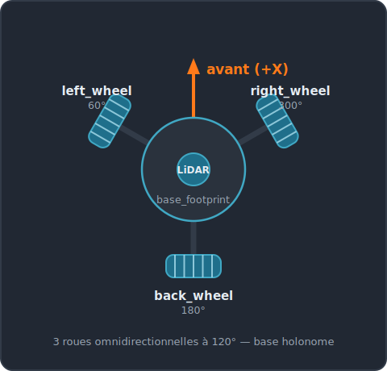
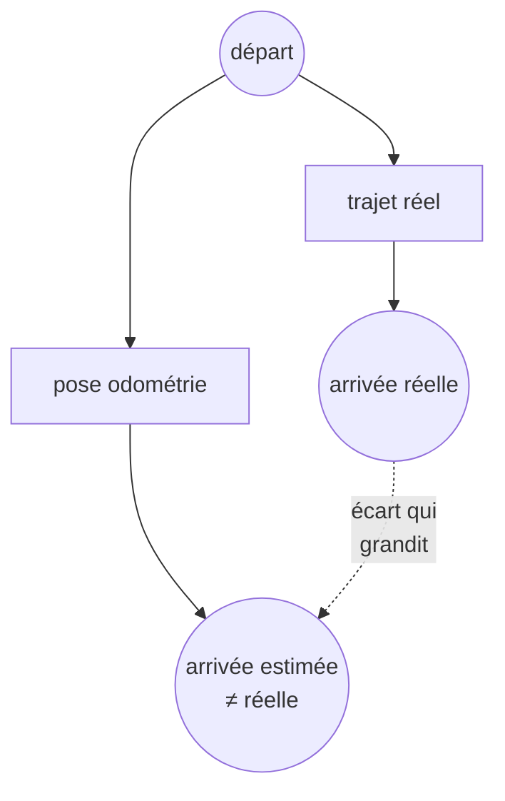
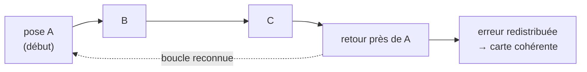
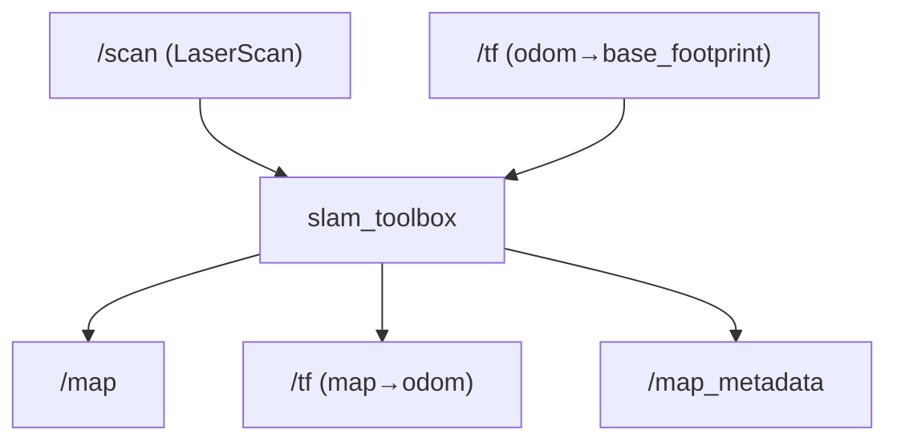
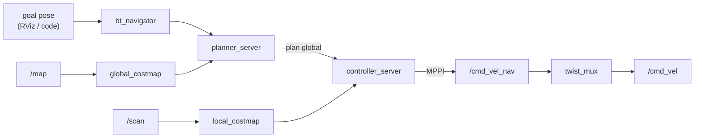
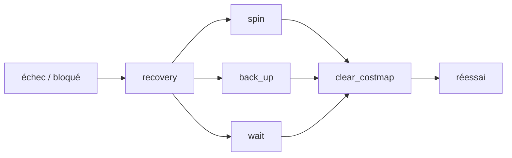

# Jour 2 — Navigation

::subtitle::
LeKiwi · slam_toolbox · Nav2

---
layout: default
---

# Au programme

À la fin de la journée, vous saurez :

<v-clicks>

- décrire la cinématique d'une base **omnidirectionnelle Kiwi** (3 roues à 120°) ;
- expliquer les grands **capteurs de localisation** (IMU, odométrie, LiDAR, GPS-RTK, UWB) ;
- comprendre le **SLAM** : dérive, scan matching, fermeture de boucle ;
- distinguer **SLAM** (cartographier) et **AMCL** (se localiser dans une carte connue) ;
- décrire l'**architecture de Nav2** (behavior tree, planner, controller, costmaps).

</v-clicks>

<v-click>

> Ce deck est **théorique**. La mise en pratique (lancements, RViz, cartographie, goals)
> est détaillée dans la **documentation** du bootcamp.

</v-click>

---
layout: section
eyebrow: Partie 01 · Pourquoi naviguer ?
---

# Naviguer, c'est répondre à 3 questions

::note::
Se localiser, planifier, et avancer sans rien heurter.

---
layout: two-cols
---

# Pourquoi un robot doit-il naviguer ?

Pour **accomplir une mission** dans un environnement réel :

- livrer un colis 🧺 ;
- nettoyer une pièce 🧹 ;
- explorer un lieu inconnu 🗺️ ;
- suivre une personne 👣.

::right::

<div class="bc-cards" style="grid-template-columns: 1fr;">
<div class="bc-card" v-click><div class="bc-card__title">📍 Où suis-je ?</div><p><strong>Localisation</strong> — estimer sa pose dans l'environnement.</p></div>
<div class="bc-card" v-click><div class="bc-card__title">🎯 Où aller ?</div><p><strong>Planification</strong> — calculer un chemin vers l'objectif.</p></div>
<div class="bc-card" v-click><div class="bc-card__title">🚧 Comment, sans heurter ?</div><p><strong>Perception & contrôle</strong> — suivre le chemin en évitant les obstacles.</p></div>
</div>

---
layout: two-cols
---

# La réponse : la stack Nav2

**Nav2** est la stack de navigation de ROS 2. Elle combine tout ce qu'il faut pour naviguer **de façon autonome** :

<v-clicks>

- 🧠 **se localiser** — SLAM / AMCL ;
- 🗺️ **créer ou utiliser une carte** ;
- 📦 **planifier** un chemin — global *et* local ;
- 📡 **fusionner les capteurs** — LiDAR, IMU, odométrie ;
- ⚙️ **exécuter** les mouvements avec feedback.

</v-clicks>

::right::

<div class="bc-media">

</div>

<v-click>

> Nav2 orchestre ces briques pour un comportement **intelligent et adaptable**.

</v-click>

---
layout: section
eyebrow: Partie 02 · Base mobile
---

# La base mobile LeKiwi

::note::
Une plateforme open-source à 3 roues omnidirectionnelles — holonome.

---
layout: two-cols
---

# Configuration kiwi à 120°

Trois roues identiques réparties à **120°**, sur moteurs indépendants :

- `left_wheel` (60°), `right_wheel` (300°), `back_wheel` (180°) ;
- chaque roue est **omnidirectionnelle** (roue + galets latéraux) ;
- elle n'entraîne le sol que dans son axe et **glisse latéralement**.

<v-click>

**Conséquence** : la base est **holonome** — elle translate dans n'importe quelle direction sans se réorienter.

</v-click>

::right::

<div class="bc-media">

</div>

---
layout: default
---

# Cinématique inverse

Pour une consigne `(vₓ, v_y, ω)` — translation X, translation Y, rotation autour de Z — la vitesse linéaire de chaque roue `i` à l'angle `θᵢ` :

$$
v_i = -\sin(\theta_i)\, v_x + \cos(\theta_i)\, v_y + L\, \omega
$$

<v-click>

Calculée par le contrôleur **`omni_wheel_drive_controller`** (`ros2_control`). La chaîne des commandes :

```text
téléop ─► /cmd_vel_teleop ─┐
                           ├─► twist_mux ─► /cmd_vel ─► omni_wheel_drive_controller ─► roues
Nav2   ─► /cmd_vel_nav   ──┘
```

</v-click>

<v-click>

> Topics en **`TwistStamped`**. `twist_mux` donne la priorité à la téléop sur Nav2.

</v-click>

---
layout: two-cols
---

# Le graphe ROS 2

Avant de piloter un robot, on **comprend son graphe** : qui parle à qui ?

- **nœuds** — les processus actifs ;
- **topics** — les flux de données (`/scan`, `/cmd_vel`…) ;
- **services** — les appels ponctuels ;
- **actions** — les tâches longues avec feedback.

::right::

<div class="bc-callout bc-callout--info">
<div class="bc-callout__icon">❓</div>
<div class="bc-callout__body">
<div class="bc-callout__title">Faites deviner</div>
<p>Qui <strong>publie</strong> <code>/scan</code> ? Qui <strong>consomme</strong> <code>/cmd_vel</code> ? D'où vient <code>/odometry/filtered</code> ?</p>
</div>
</div>

<v-click>

> Réponses : pont `ros_gz` → `/scan` ; `omni_wheel_drive_controller` → roues ; EKF `robot_localization` → `/odometry/filtered`. **Pas** d'action `/navigate_to_pose` tant que **Nav2 n'est pas lancé**.

</v-click>

---
layout: two-cols
---

# La magie holonome

La téléop clavier **AZERTY** illustre les 3 degrés de liberté de la base :

| Touches | Action |
|---|---|
| `z` / `s` | avancer / reculer |
| `q` / `d` | **translation latérale** |
| `a` / `e` | rotation |

::right::

<v-click>

La ligne `q` / `d` est la **signature holonome** : le robot se décale **sans tourner** — impossible sur une base différentielle.

</v-click>

<v-click>

<div class="bc-callout bc-callout--warn">
<div class="bc-callout__icon">⚠️</div>
<div class="bc-callout__body">
<div class="bc-callout__title">Pas encore de carte</div>
<p>À ce stade : frames <code>odom → base_footprint</code> seulement. <strong>Pas de frame <code>map</code></strong> — il faut le SLAM.</p>
</div>
</div>

</v-click>

---
layout: section
eyebrow: Partie 03 · Se localiser
---

# Capteurs & principes de localisation

::note::
« Où suis-je ? » — aucun capteur n'est parfait, on les combine.

---
layout: two-cols
---

# IMU — Inertial Measurement Unit

Mesure le **mouvement propre** du robot :

- **vitesses angulaires** (gyroscope) ;
- **accélérations linéaires** (accéléromètre) ;
- parfois le **champ magnétique** (magnétomètre).

::right::

<div class="bc-callout bc-callout--warn">
<div class="bc-callout__icon">⚠️</div>
<div class="bc-callout__body">
<div class="bc-callout__title">Dérive rapide</div>
<p>Intégrer une accélération cumule l'erreur. Utile en <strong>fusion</strong> et sur des mouvements <strong>courts</strong>, pas seule.</p>
</div>
</div>

<v-click>

> IMU numérique typique : 1 gyroscope, 3 accéléromètres, 3 magnétomètres.

</v-click>

---
layout: two-cols
---

# Odométrie

Combine **IMU** et **encodeurs de roues** pour une estimation **continue** de la pose.

- toujours disponible, haute fréquence ;
- **erreur cumulative** : la pose dérive avec le temps (glissements, imprécisions).

<v-click>

> Seule, elle ne suffit pas. Elle doit être **fusionnée** (LiDAR, GPS…) ou **recalée** (SLAM).

</v-click>

::right::

<div class="bc-media">

</div>

---
layout: two-cols
---

# Multilatération (2D / 3D)

Estime la position en mesurant les **distances** à plusieurs **stations fixes** :

- **3** stations → localisation 2D ;
- **4** stations → localisation 3D.

<v-clicks>

- ⚠️ à ne pas confondre avec la **triangulation** (qui utilise des **angles**) ;
- ⚠️ sensible aux **réflexions** de signal (rebonds, interférences).

</v-clicks>

::right::

<div class="bc-media">

</div>

---
layout: two-cols
---

# GPS-RTK & UWB

**GPS-RTK** *(Real Time Kinematic)* — extérieur :

- combine le GPS avec une **station de référence au sol** ;
- précision **centimétrique**, en temps réel ;
- exige une zone **dégagée** (agriculture, topo, véhicules autonomes).

::right::

**UWB** *(Ultra Wide Band)* — intérieur :

- mêmes principes, avec des **ancres fixes** dans le bâtiment ;
- mesure les **temps de vol** du signal ;
- précision **±10 à 30 cm** (usines, entrepôts).

<v-click>

> Deux réponses au même besoin — **un repère absolu** — selon l'environnement.

</v-click>

---
layout: two-cols
---

# LiDAR — Light Detection and Ranging

Un **laser** mesure les **distances** à l'environnement → une carte de **profondeur**.

**Types :**

- 📍 fixe ;
- 🔁 rotatif 360° (mono-faisceau, 2D) ;
- 🌐 multi-beam rotatif (3D).

**Usages :** détection d'obstacles, **cartographie (SLAM)**, suivi de murs / de personnes.

::right::

<div class="bc-callout bc-callout--info">
<div class="bc-callout__icon">📡</div>
<div class="bc-callout__body">
<div class="bc-callout__title">Le capteur clé du cours</div>
<p>Le LeKiwi embarque un <strong>LiDAR 360° 2D</strong> (<code>/scan</code>) — c'est lui qui rend le SLAM possible.</p>
</div>
</div>

---
layout: two-cols
---

# LiDAR multi-beam (3D)

Superpose plusieurs **faisceaux** verticaux et horizontaux → une **perception 3D dense**.

<v-clicks>

- très précis pour l'**évitement d'obstacles 3D** ;
- compréhension fine de la **scène** autour du robot ;
- au prix d'un volume de données bien plus lourd.

</v-clicks>

::right::

<div class="bc-media">

</div>

---
layout: section
eyebrow: Partie 04 · Cartographier & se localiser
---

# SLAM & AMCL

::note::
Construire la carte… puis s'y retrouver.

---
layout: default
---

# Qu'est-ce que le SLAM ?

**SLAM** = *Simultaneous Localization And Mapping* — un problème de **l'œuf et la poule** :
pour se localiser il faut une carte, pour cartographier il faut savoir où l'on est. Le SLAM résout **les deux à la fois**.

<div class="bc-cards bc-cards--3">
<div class="bc-card" v-click><div class="bc-card__title">🎯 Le problème</div><p>L'odométrie <strong>dérive</strong> : sans repère absolu, l'erreur s'accumule au fil du trajet.</p></div>
<div class="bc-card" v-click><div class="bc-card__title">🧩 L'idée</div><p>Recaler en continu les <strong>scans laser</strong> sur la carte en construction pour estimer la vraie pose.</p></div>
<div class="bc-card" v-click><div class="bc-card__title">🔗 Le résultat</div><p>Une carte <code>/map</code> <strong>et</strong> la transformation <code>map → odom</code> qui corrige la dérive.</p></div>
</div>

<v-click>

> `slam_toolbox` complète enfin la chaîne `map → odom → base_footprint`.

</v-click>

---
layout: two-cols
---

# La dérive odométrique

Pourquoi l'odométrie seule ne suffit pas :

- les roues **glissent**, les encodeurs **arrondissent** ;
- on **intègre** ces petites erreurs à chaque pas ;
- la pose estimée **s'éloigne** peu à peu du réel.

<v-click>

> Il faut un **repère absolu** pour recaler : les **murs** vus au LiDAR ne bougent pas.

</v-click>

::right::



---
layout: two-cols
---

# Scan matching & fermeture de boucle

**Scan matching** — à chaque nouveau `/scan`, on **aligne** le nuage de points sur la carte déjà construite. L'alignement donne le **déplacement réel** → on corrige la dérive.

<v-click>

**Fermeture de boucle** — en **reconnaissant un lieu déjà visité**, l'algo « referme » la boucle et **redistribue** l'erreur accumulée sur tout le trajet → carte cohérente.

</v-click>

::right::



---
layout: two-cols
---

# slam_toolbox : modes

`slam_toolbox` est l'implémentation de référence pour une base 2D + LiDAR. Quatre **modes internes** :

| Mode | Quand l'utiliser |
|---|---|
| **`online async`** | robot en mouvement, quasi temps réel. **Mode du cours.** |
| `online sync` | strict temps réel, sans drop. Coûteux. |
| `offline` | replay d'un *bag* pour optimiser hors-ligne. |
| `lifelong` | mise à jour continue d'une carte existante. |

::right::

<div class="bc-callout bc-callout--info">
<div class="bc-callout__icon">💡</div>
<div class="bc-callout__body">
<div class="bc-callout__title">Modes ≠ rôles de lancement</div>
<p>Ne pas confondre ces <strong>modes internes</strong> avec les <strong>rôles</strong> exposés par le launch du cours : <code>map</code> (cartographier), <code>localize</code> (slam_toolbox), <code>amcl</code> (carte statique).</p>
</div>
</div>

---
layout: two-cols
---

# slam_toolbox : flux

**Entrées** → `slam_toolbox` → **sorties** :

- in : `/scan` + `/tf (odom → base_footprint)` ;
- out : `/map`, `/tf (map → odom)`, `/map_metadata`.

<v-click>

> L'essentiel : il publie **`map → odom`**, la transformation qui **corrige la dérive** en recalant les scans.

</v-click>

::right::



---
layout: two-cols
---

# AMCL — Monte-Carlo Localization

Une fois la **carte connue**, plus besoin de la reconstruire : on s'y **localise** avec **AMCL**.

- repose sur un **filtre à particules** : des centaines d'**hypothèses** de pose ;
- chaque scan **renforce** les bonnes hypothèses, **élimine** les mauvaises ;
- combine **LiDAR** + **odométrie** + **IMU**.

<v-click>

> SLAM = **construire** la carte · AMCL = **se repérer** dans une carte existante.

</v-click>

::right::

<div class="bc-media">

</div>

---
layout: default
---

# AMCL — convergence des particules (2D)

<div class="bc-media">

</div>

<v-click>

> Le nuage de particules se **resserre** autour de la vraie pose à mesure que les scans concordent avec la carte.

</v-click>

---
layout: section
eyebrow: Partie 05 · Naviguer avec Nav2
---

# L'architecture de Nav2

::note::
Planifier globalement, réagir localement.

---
layout: default
---

# La stack Nav2

Une **boîte à outils complète** pour naviguer de façon autonome dans un environnement **inconnu ou non structuré** :

<div class="bc-cards bc-cards--3">
<div class="bc-card" v-click><div class="bc-card__title">🗺️ Planifier</div><p>Chemin <strong>global</strong> (vers le but) et <strong>local</strong> (suivi temps réel).</p></div>
<div class="bc-card" v-click><div class="bc-card__title">🛑 Éviter</div><p>Obstacles <strong>statiques et dynamiques</strong>.</p></div>
<div class="bc-card" v-click><div class="bc-card__title">📡 Percevoir</div><p>Fusionner LiDAR, odométrie, IMU.</p></div>
<div class="bc-card" v-click><div class="bc-card__title">🧭 Se localiser</div><p>SLAM ou AMCL.</p></div>
<div class="bc-card" v-click><div class="bc-card__title">⚙️ Exécuter</div><p>Mouvements avec <strong>feedback</strong>.</p></div>
<div class="bc-card" v-click><div class="bc-card__title">🌲 Orchestrer</div><p>Un <strong>behavior tree</strong> coordonne le tout.</p></div>
</div>

---
layout: two-cols
---

# Structure interne

Nav2 n'est pas un nœud unique mais un **ensemble de serveurs** spécialisés, démarrés et supervisés par un **`lifecycle_manager`** :

- `bt_navigator`, `planner_server`, `controller_server` ;
- `behavior_server`, `velocity_smoother`, `collision_monitor`.

<v-click>

> Chacun a un **cycle de vie** (configure → activate) géré proprement par le manager.

</v-click>

::right::

<div class="bc-media">

</div>

---
layout: default
---

# Le pipeline, vu de haut



On donne un **but**, le **planner** trace le chemin global, le **controller** le suit en temps réel → `/cmd_vel`.

---
layout: two-cols
---

# BT Navigator & Planner

**`bt_navigator`** — le **cœur** de la stack :

- orchestre via un **behavior tree** ;
- reçoit une cible → planifie, suit, **récupère** ;
- guide le robot du début à la fin de la mission.

::right::

**`planner_server`** — la **planification globale** :

- entrées : **pose actuelle** + **objectif** ;
- calcule un **itinéraire optimal** (court, sûr, sans obstacle) ;
- planners : **Smac**, **NavFn** ;
- sort un **chemin global** à suivre.

---
layout: two-cols
---

# Controller : suivi local

**`controller_server`** transforme le chemin global en **commandes de vitesse** :

- suit le chemin et **réagit en temps réel** (obstacles, glissements) ;
- garde le robot sur la voie dans un monde **changeant**.

| Controller | Holonome ? |
|---|---|
| DWB | Oui, si `vy_samples > 0` |
| **MPPI** | **Oui, `motion_model: Omni`** |
| Reg. Pure Pursuit | Non (différentielle) |

::right::

Le LeKiwi est **holonome** → **MPPI Omni** : meilleur tracking, sortie sur `/cmd_vel_nav`.

```yaml
controller_server:
  ros__parameters:
    controller_plugins: ["FollowPath"]
    FollowPath:
      plugin: "nav2_mppi_controller::MPPIController"
      motion_model: "Omni"   # ← base holonome
      time_steps: 56
      model_dt: 0.05
      vx_max: 0.5
      vy_max: 0.5            # ← non nul = holonome
      wz_max: 1.5
```

---
layout: two-cols
---

# Behavior & Smoother

**`behavior_server`** — réagit aux imprévus :

- robot **bloqué** ? obstacle **soudain** ?
- lance des **comportements de récupération** : reculer, tourner, attendre, réessayer.

::right::

**`velocity_smoother`** — lisse la trajectoire :

- **courbes plus douces**, vitesses réalistes ;
- déplacement **fluide**, moins d'à-coups.

<v-click>

> Ensemble, ils rendent la navigation **robuste** *et* **confortable**.

</v-click>

---
layout: default
---

# Les costmaps

Nav2 raisonne sur **deux grilles de coût** complémentaires — il **planifie globalement** et **réagit localement** :

<div class="bc-cards bc-cards--2">
<div class="bc-card" v-click><div class="bc-card__title">🗺️ Global costmap</div><p>La carte statique <code>/map</code> + obstacles connus. Sert au <strong>planner</strong> pour le chemin global.</p></div>
<div class="bc-card" v-click><div class="bc-card__title">📡 Local costmap</div><p>Fenêtre glissante alimentée par le <strong>LiDAR temps réel</strong>. Sert au <strong>controller</strong> pour éviter les obstacles dynamiques.</p></div>
</div>

<v-click>

<div class="bc-callout bc-callout--info">
<div class="bc-callout__icon">💡</div>
<div class="bc-callout__body">
<div class="bc-callout__title">Inflation</div>
<p>Une marge de coût est « gonflée » autour des obstacles (<code>inflation_radius</code>) pour garder le robot à distance des murs.</p>
</div>
</div>

</v-click>

---
layout: default
---

# Recoveries

Quand le robot est bloqué, le behavior tree déclenche un **recovery** :



<v-click>

> Pour une base holonome, préférez **`drive_on_heading`** à `back_up` — manœuvres latérales possibles.

</v-click>

---
layout: end
---
