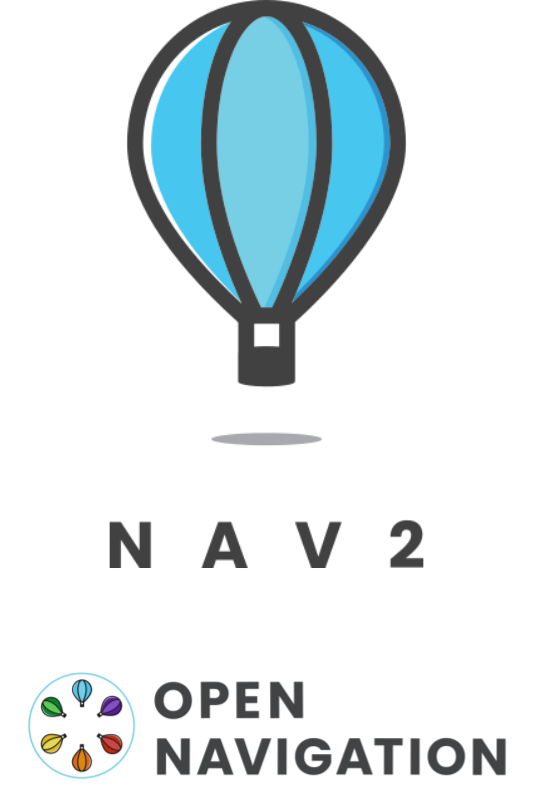
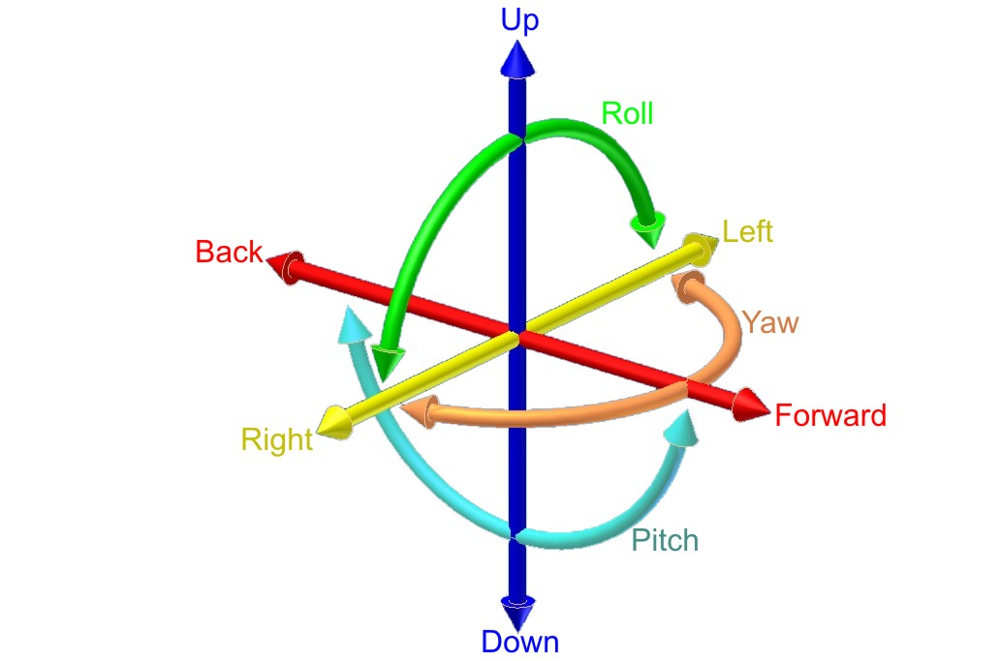
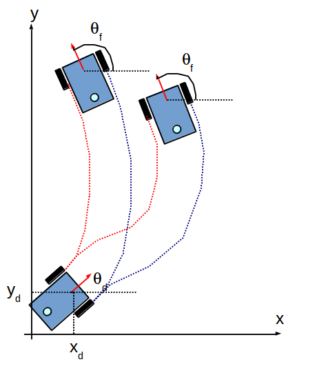
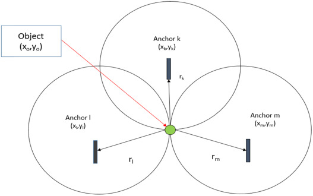
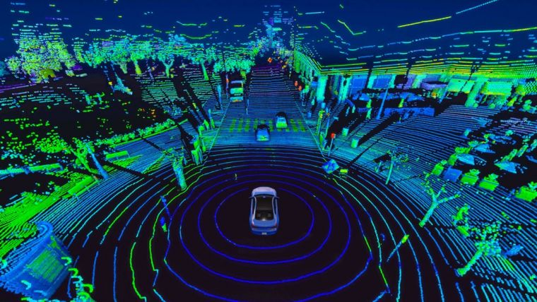
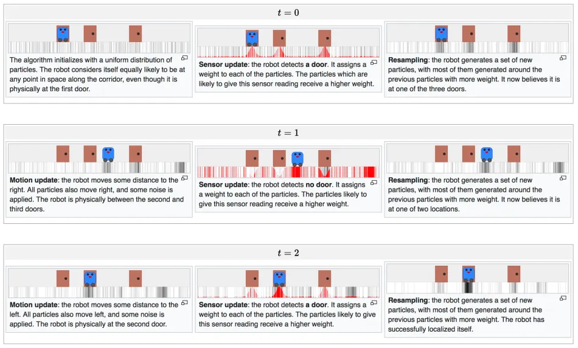
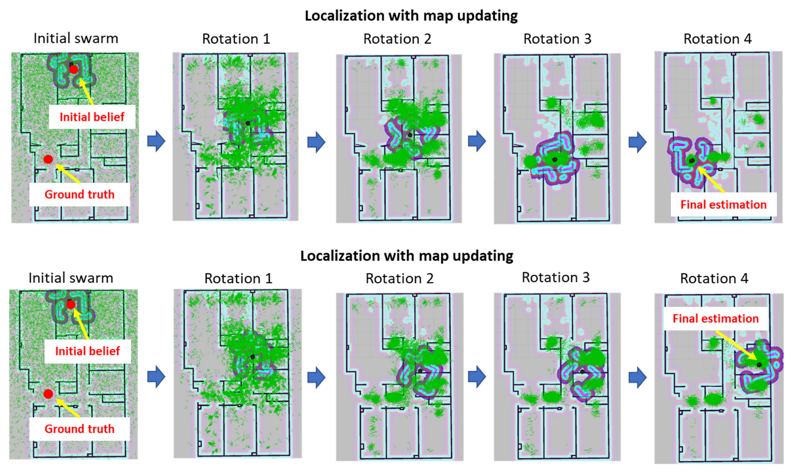
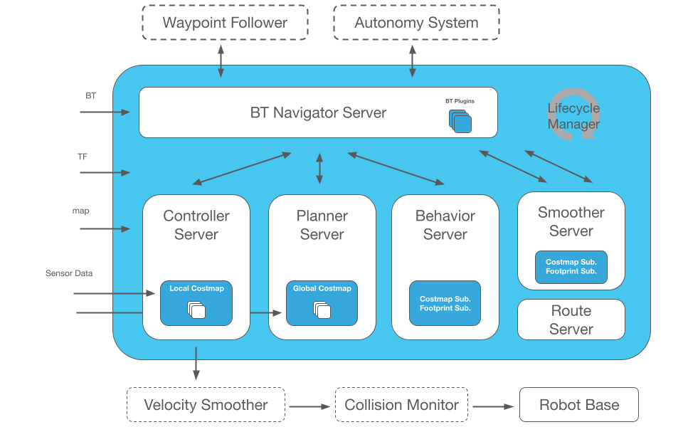
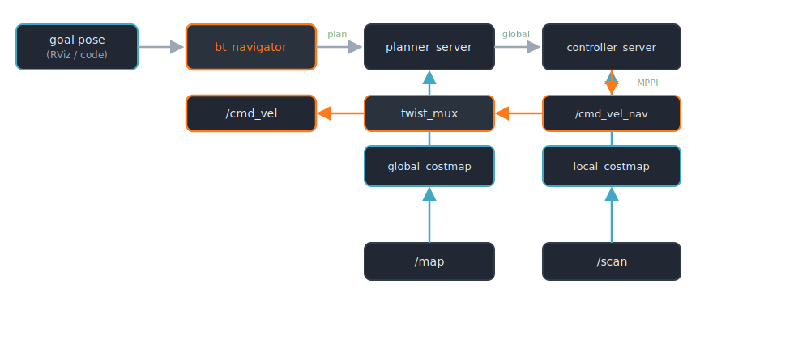
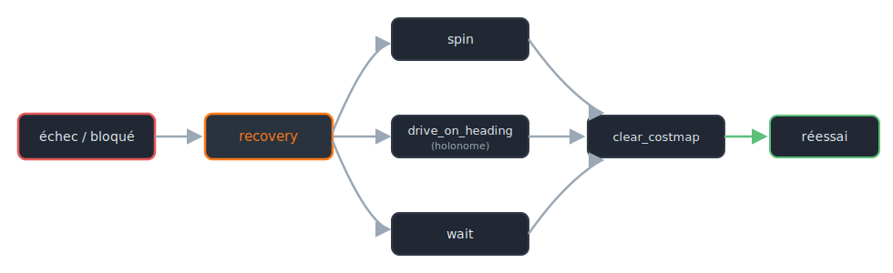

# Jour 2 — Navigation

::subtitle::
LeKiwi · slam_toolbox · Nav2

---
layout: default
---

# Au programme

<ul class="bc-agenda">
<li><span>Pourquoi <strong>naviguer</strong> : se localiser, planifier, avancer sans rien heurter</span></li>
<li><span>Les <strong>capteurs de localisation</strong> : IMU, odométrie, LiDAR, GPS-RTK, UWB</span></li>
<li><span>Le <strong>SLAM</strong> & l'<strong>AMCL</strong> : cartographier la carte, puis s'y localiser</span></li>
<li><span>L'<strong>architecture de Nav2</strong> : behavior tree, planner, controller, costmaps</span></li>
</ul>

---
layout: section
eyebrow: Partie 01 · Pourquoi naviguer ?
---

# Accomplir une mission dans le monde réel

::note::
Se localiser, planifier, avancer sans rien heurter.

---
layout: default
---

# Pourquoi un robot doit-il naviguer ?

Un robot mobile navigue pour **accomplir une mission** dans un environnement réel :

<div class="bc-cards bc-cards--2">
<div class="bc-card" v-click><div class="bc-card__title">🧺 Livrer</div><p>Transporter un colis d'un point à un autre.</p></div>
<div class="bc-card" v-click><div class="bc-card__title">🧹 Nettoyer</div><p>Couvrir toute la surface d'une pièce.</p></div>
<div class="bc-card" v-click><div class="bc-card__title">🗺️ Explorer</div><p>Cartographier un lieu inconnu.</p></div>
<div class="bc-card" v-click><div class="bc-card__title">👣 Suivre</div><p>Accompagner une personne en mouvement.</p></div>
</div>

<v-click>

> Dans tous les cas, le robot doit **se déplacer seul**, et **en sécurité**.

</v-click>

---
layout: default
---

# Naviguer, c'est répondre à 3 questions

<div class="bc-cards bc-cards--3">
<div class="bc-card" v-click><div class="bc-card__title">📍 Où suis-je ?</div><p><strong>Localisation</strong> — estimer sa pose dans l'environnement.</p></div>
<div class="bc-card" v-click><div class="bc-card__title">🎯 Où aller ?</div><p><strong>Planification</strong> — calculer un chemin vers l'objectif.</p></div>
<div class="bc-card" v-click><div class="bc-card__title">🚧 Comment, sans heurter ?</div><p><strong>Perception & contrôle</strong> — suivre le chemin en évitant les obstacles.</p></div>
</div>

<v-click>

> Trois questions que la stack **Nav2** orchestre de bout en bout.

</v-click>

---
layout: two-cols
---

# La réponse : la stack Nav2

**Nav2** est la stack de navigation de ROS 2. Elle combine tout ce qu'il faut pour naviguer **de façon autonome** :

<v-clicks>

- 🧠 **se localiser** — SLAM / AMCL ;
- 🗺️ **créer ou utiliser une carte** ;
- 📦 **planifier** un chemin — global *et* local ;
- 📡 **fusionner les capteurs** — LiDAR, IMU, odométrie ;
- ⚙️ **exécuter** les mouvements avec feedback.

</v-clicks>

<v-click>

> Nav2 orchestre ces briques pour un comportement **intelligent et adaptable**.

</v-click>

::right::

<div class="bc-media bc-media--frame">

</div>

---
layout: section
eyebrow: Partie 02 · Se localiser
---

# Capteurs & principes de localisation

::note::
« Où suis-je ? » — aucun capteur n'est parfait, on les combine.

---
layout: default
---

# Les capteurs de localisation

Avant le tour d'horizon, **quatre familles** répondent à « où suis-je ? » — chacune avec ses forces :

<div class="bc-cards bc-cards--2">
<div class="bc-card" v-click><div class="bc-card__title">🌀 IMU</div><p>Mouvement propre (gyroscope + accéléromètre). Haute fréquence, mais <strong>dérive</strong>.</p></div>
<div class="bc-card" v-click><div class="bc-card__title">🛞 Odométrie</div><p>Encodeurs + IMU fusionnés → pose <strong>continue</strong>, mais cumulative.</p></div>
<div class="bc-card" v-click><div class="bc-card__title">📡 Multilatération</div><p>Distances à des balises fixes — <strong>UWB</strong> (intérieur), <strong>GPS-RTK</strong> (extérieur).</p></div>
<div class="bc-card" v-click><div class="bc-card__title">🔦 LiDAR</div><p>Profondeur par laser → obstacles et <strong>cartographie (SLAM)</strong>.</p></div>
</div>

<v-click>

> On les **fusionne** : aucun capteur seul ne donne une pose fiable et absolue.

</v-click>

---
layout: two-cols
---

# IMU — Inertial Measurement Unit

Mesure le **mouvement propre** du robot :

- **vitesses angulaires** (gyroscope) ;
- **accélérations linéaires** (accéléromètre) ;
- parfois le **champ magnétique** (magnétomètre).

<v-click>

<div class="bc-callout bc-callout--warn">
<div class="bc-callout__icon">⚠️</div>
<div class="bc-callout__body">
<div class="bc-callout__title">Dérive rapide</div>
<p>Intégrer une accélération cumule l'erreur. Utile en <strong>fusion</strong> et sur des mouvements <strong>courts</strong>, pas seule.</p>
</div>
</div>

</v-click>

::right::

<div class="bc-media bc-media--frame">

</div>

<v-click>

> 6 axes : 3 **rotations** (gyro) + 3 **accélérations** (accel).

</v-click>

---
layout: two-cols
---

# Odométrie

Combine **encodeurs de roues** et **IMU** pour estimer la pose en **continu**, par intégration du déplacement.

<v-clicks>

- **toujours disponible**, à **haute fréquence** — idéale pour le contrôle ;
- pas besoin de repère externe ni de carte ;
- fusionnée par un **EKF** (`robot_localization`) → `/odometry/filtered` ;
- mais **erreur cumulative** : glissements et arrondis font **dériver** la pose avec le temps.

</v-clicks>

<v-click>

> Seule, elle ne suffit pas : elle doit être **recalée** par un repère absolu (LiDAR + SLAM).

</v-click>

::right::

<div class="bc-media">

</div>

---
layout: two-cols
---

# Multilatération (2D / 3D)

Estime la position en mesurant les **distances** à plusieurs **stations fixes** :

- **3** stations → localisation 2D ;
- **4** stations → localisation 3D.

<v-clicks>

- ⚠️ à ne pas confondre avec la **triangulation** (qui utilise des **angles**) ;
- ⚠️ sensible aux **réflexions** de signal (rebonds, interférences).

</v-clicks>

::right::

<div class="bc-media">

</div>

---
layout: default
---

# GPS-RTK & UWB — un repère absolu

Deux technologies, **même principe** (distances à des points fixes connus), selon l'environnement :

<div class="bc-cards bc-cards--2">
<div class="bc-card" v-click><div class="bc-card__title">🛰️ GPS-RTK — extérieur</div><p><em>Real Time Kinematic.</em> GPS + <strong>station de référence au sol</strong>. Précision <strong>centimétrique</strong> temps réel. Exige une zone <strong>dégagée</strong> (agriculture, topo, véhicules autonomes).</p></div>
<div class="bc-card" v-click><div class="bc-card__title">📶 UWB — intérieur</div><p><em>Ultra Wide Band.</em> <strong>Ancres fixes</strong> dans le bâtiment, mesure des <strong>temps de vol</strong> du signal. Précision <strong>±10 à 30 cm</strong> (usines, entrepôts).</p></div>
</div>

<v-click>

<div class="bc-callout bc-callout--info">
<div class="bc-callout__icon">🧭</div>
<div class="bc-callout__body">
<div class="bc-callout__title">Le point commun</div>
<p>Tous deux fournissent un <strong>repère absolu</strong> — ce qui manque à l'odométrie seule.</p>
</div>
</div>

</v-click>

---
layout: default
---

# LiDAR — Light Detection and Ranging

Un **laser** mesure les **distances** à l'environnement → une carte de **profondeur**. Trois grandes familles :

<div class="bc-cards bc-cards--3">
<div class="bc-card" v-click><div class="bc-card__title">📍 Fixe</div><p>un faisceau orienté, distance sur un seul axe.</p></div>
<div class="bc-card" v-click><div class="bc-card__title">🔁 Rotatif 360° (2D)</div><p>mono-faisceau qui balaie un plan — le <strong>capteur du cours</strong>.</p></div>
<div class="bc-card" v-click><div class="bc-card__title">🌐 Multi-beam (3D)</div><p>plusieurs faisceaux empilés → perception volumique.</p></div>
</div>

<v-click>

<div class="bc-callout bc-callout--info">
<div class="bc-callout__icon">📡</div>
<div class="bc-callout__body">
<div class="bc-callout__title">Le capteur clé du cours</div>
<p>Le LeKiwi embarque un <strong>LiDAR 360° 2D</strong> (<code>/scan</code>) — détection d'obstacles, suivi de murs, et surtout <strong>cartographie (SLAM)</strong>.</p>
</div>
</div>

</v-click>

---
layout: two-cols
---

# LiDAR multi-beam (3D)

Superpose plusieurs **faisceaux** verticaux et horizontaux → une **perception 3D dense**.

<v-clicks>

- très précis pour l'**évitement d'obstacles 3D** ;
- compréhension fine de la **scène** autour du robot ;
- au prix d'un volume de données bien plus lourd.

</v-clicks>

::right::

<div class="bc-media">

</div>

---
layout: section
eyebrow: Partie 03 · Cartographier & se localiser
---

# SLAM & AMCL

::note::
Construire la carte… puis s'y retrouver.

---
layout: default
---

# Qu'est-ce que le SLAM ?

**SLAM** = *Simultaneous Localization And Mapping* — un problème de **l'œuf et la poule** :
pour se localiser il faut une carte, pour cartographier il faut savoir où l'on est. Le SLAM résout **les deux à la fois**.

<div class="bc-cards bc-cards--3">
<div class="bc-card" v-click><div class="bc-card__title">🎯 Le problème</div><p>L'odométrie <strong>dérive</strong> : sans repère absolu, l'erreur s'accumule au fil du trajet.</p></div>
<div class="bc-card" v-click><div class="bc-card__title">🧩 L'idée</div><p>Recaler en continu les <strong>scans laser</strong> sur la carte en construction pour estimer la vraie pose.</p></div>
<div class="bc-card" v-click><div class="bc-card__title">🔗 Le résultat</div><p>Une carte <code>/map</code> <strong>et</strong> la transformation <code>map → odom</code> qui corrige la dérive.</p></div>
</div>

<v-click>

> `slam_toolbox` complète enfin la chaîne `map → odom → base_footprint`.

</v-click>

---
layout: default
---

# Comment le SLAM se recale

L'odométrie seule **dérive** : le SLAM la recale en continu sur ce que voit le LiDAR.

<div class="bc-cards bc-cards--3">
<div class="bc-card" v-click><div class="bc-card__title">🌀 Dérive odométrique</div><p>Les roues <strong>glissent</strong>, les encodeurs <strong>arrondissent</strong> : l'erreur s'accumule à chaque pas.</p></div>
<div class="bc-card" v-click><div class="bc-card__title">🧩 Scan matching</div><p>Aligner chaque <code>/scan</code> sur la carte déjà construite → le <strong>déplacement réel</strong>, la dérive corrigée.</p></div>
<div class="bc-card" v-click><div class="bc-card__title">🔁 Fermeture de boucle</div><p>Un <strong>lieu reconnu</strong> ferme la boucle → l'erreur est <strong>redistribuée</strong> sur tout le trajet.</p></div>
</div>

<v-click>

> `slam_toolbox` publie ainsi **`map → odom`**, la transformation qui **corrige la dérive** en recalant les scans.

</v-click>

---
layout: default
---

# AMCL — l'algorithme

Une fois la **carte connue**, plus besoin de la reconstruire : on s'y **localise** avec **AMCL** (*Adaptive Monte-Carlo Localization*).

<v-clicks>

- repose sur un **filtre à particules** : des centaines d'**hypothèses** de pose réparties sur la carte ;
- chaque scan **renforce** les bonnes hypothèses, **élimine** les mauvaises ;
- combine **LiDAR** + **odométrie** + **IMU**.

</v-clicks>

<v-click>

<div class="bc-callout bc-callout--info">
<div class="bc-callout__icon">🧭</div>
<div class="bc-callout__body">
<div class="bc-callout__title">SLAM ≠ AMCL</div>
<p><strong>SLAM</strong> <em>construit</em> la carte tout en se localisant (aucune carte au départ, il modifie <code>/map</code>). <strong>AMCL</strong> <em>se localise seulement</em> dans une carte <strong>déjà connue</strong> — il ne touche jamais à la carte.</p>
</div>
</div>

</v-click>

---
layout: default
title: AMCL — le filtre à particules en action
---

<div class="bc-media" style="height: 100%;">

</div>

---
layout: default
title: AMCL — convergence 2D
---

<div class="bc-media" style="height: 100%;">

</div>

---
layout: section
eyebrow: Partie 04 · Naviguer avec Nav2
---

# L'architecture de Nav2

::note::
Planifier globalement, réagir localement.

---
layout: default
---

# La stack Nav2

Une **boîte à outils complète** pour naviguer de façon autonome dans un environnement **inconnu ou non structuré** :

<div class="bc-cards bc-cards--3">
<div class="bc-card" v-click><div class="bc-card__title">🗺️ Planifier</div><p>Chemin <strong>global</strong> (vers le but) et <strong>local</strong> (suivi temps réel).</p></div>
<div class="bc-card" v-click><div class="bc-card__title">🛑 Éviter</div><p>Obstacles <strong>statiques et dynamiques</strong>.</p></div>
<div class="bc-card" v-click><div class="bc-card__title">📡 Percevoir</div><p>Fusionner LiDAR, odométrie, IMU.</p></div>
<div class="bc-card" v-click><div class="bc-card__title">🧭 Se localiser</div><p>SLAM ou AMCL.</p></div>
<div class="bc-card" v-click><div class="bc-card__title">⚙️ Exécuter</div><p>Mouvements avec <strong>feedback</strong>.</p></div>
<div class="bc-card" v-click><div class="bc-card__title">🌲 Orchestrer</div><p>Un <strong>behavior tree</strong> coordonne le tout.</p></div>
</div>

---
layout: two-cols
---

# Vue d'ensemble

Nav2 n'est pas un nœud unique mais un **ensemble de serveurs** spécialisés, démarrés et supervisés par un **`lifecycle_manager`** :

- `bt_navigator`, `planner_server`, `controller_server` ;
- `behavior_server`, `velocity_smoother`, `collision_monitor`.

<v-click>

> Chacun a un **cycle de vie** (configure → activate) géré proprement par le manager. On les détaille un par un.

</v-click>

::right::

<div class="bc-media bc-media--frame">

</div>

---
layout: default
---

# Le pipeline, vu de haut

Du **but** à la **commande moteur** : qui calcule quoi, et avec quelles données.

<div class="bc-media" style="justify-content: flex-start; height: auto;">

</div>

- **goal pose** (RViz ou code) → `bt_navigator` **orchestre** la mission ;
- `planner_server` trace le **chemin global** — sur le `global_costmap` alimenté par `/map` ;
- `controller_server` (**MPPI**) le suit **localement** — sur le `local_costmap` alimenté par `/scan` → `/cmd_vel_nav` ;
- `twist_mux` **arbitre** les sources de vitesse → `/cmd_vel`, la commande finale envoyée au robot.

---
layout: two-cols
---

# Les serveurs de Nav2
**`bt_navigator`** — le **cœur** de la stack :

- orchestre la mission via un **behavior tree** ;
- reçoit une cible → planifie, suit, **récupère** ;
- guide le robot du début à la fin de la mission.

::right::

<div class="bc-layers">
<div class="bc-layers__item is-active"><div class="bc-layers__name">🌲 bt_navigator</div><div class="bc-layers__desc">orchestre la mission (behavior tree)</div></div>
<div class="bc-layers__item"><div class="bc-layers__name">🗺️ planner_server</div><div class="bc-layers__desc">chemin global vers le but</div></div>
<div class="bc-layers__item"><div class="bc-layers__name">🎮 controller_server</div><div class="bc-layers__desc">suivi local temps réel (MPPI)</div></div>
<div class="bc-layers__item"><div class="bc-layers__name">🛟 behavior_server</div><div class="bc-layers__desc">comportements de récupération</div></div>
<div class="bc-layers__item"><div class="bc-layers__name">〰️ velocity_smoother</div><div class="bc-layers__desc">lisse les commandes de vitesse</div></div>
</div>

---
layout: two-cols
---

# Les serveurs de Nav2
**`planner_server`** — la **planification globale** :

- entrées : **pose actuelle** + **objectif** ;
- calcule un **itinéraire optimal** (court, sûr, sans obstacle) ;
- planners : **Smac**, **NavFn** ;
- sort un **chemin global** à suivre.

::right::

<div class="bc-layers">
<div class="bc-layers__item"><div class="bc-layers__name">🌲 bt_navigator</div><div class="bc-layers__desc">orchestre la mission (behavior tree)</div></div>
<div class="bc-layers__item is-active"><div class="bc-layers__name">🗺️ planner_server</div><div class="bc-layers__desc">chemin global vers le but</div></div>
<div class="bc-layers__item"><div class="bc-layers__name">🎮 controller_server</div><div class="bc-layers__desc">suivi local temps réel (MPPI)</div></div>
<div class="bc-layers__item"><div class="bc-layers__name">🛟 behavior_server</div><div class="bc-layers__desc">comportements de récupération</div></div>
<div class="bc-layers__item"><div class="bc-layers__name">〰️ velocity_smoother</div><div class="bc-layers__desc">lisse les commandes de vitesse</div></div>
</div>

---
layout: two-cols
---

# Les serveurs de Nav2
**`controller_server`** — le **suivi local** :

- transforme le chemin global en **commandes de vitesse** ;
- **réagit en temps réel** aux obstacles et glissements ;
- garde le robot sur la voie dans un monde **changeant**.

<v-click>

> Détail du contrôleur **MPPI Omni** (base holonome) sur la slide suivante.

</v-click>

::right::

<div class="bc-layers">
<div class="bc-layers__item"><div class="bc-layers__name">🌲 bt_navigator</div><div class="bc-layers__desc">orchestre la mission (behavior tree)</div></div>
<div class="bc-layers__item"><div class="bc-layers__name">🗺️ planner_server</div><div class="bc-layers__desc">chemin global vers le but</div></div>
<div class="bc-layers__item is-active"><div class="bc-layers__name">🎮 controller_server</div><div class="bc-layers__desc">suivi local temps réel (MPPI)</div></div>
<div class="bc-layers__item"><div class="bc-layers__name">🛟 behavior_server</div><div class="bc-layers__desc">comportements de récupération</div></div>
<div class="bc-layers__item"><div class="bc-layers__name">〰️ velocity_smoother</div><div class="bc-layers__desc">lisse les commandes de vitesse</div></div>
</div>

---
layout: two-cols
---

# Controller : MPPI Omni (holonome)

Tous les contrôleurs ne gèrent pas la **translation latérale**. Pour une base holonome, il faut le bon plugin :

| Controller | Holonome ? |
|---|---|
| DWB | Oui, si `vy_samples > 0` |
| **MPPI** | **Oui, `motion_model: Omni`** |
| Reg. Pure Pursuit | Non (différentielle) |

::right::

Le LeKiwi est **holonome** → **MPPI Omni** : meilleur tracking, sortie sur `/cmd_vel_nav`.

```yaml
controller_server:
  ros__parameters:
    controller_plugins: ["FollowPath"]
    FollowPath:
      plugin: "nav2_mppi_controller::MPPIController"
      motion_model: "Omni"   # ← base holonome
      time_steps: 56
      model_dt: 0.05
      vx_max: 0.5
      vy_max: 0.5            # ← non nul = holonome
      wz_max: 1.5
```

---
layout: two-cols
---

# Les serveurs de Nav2
**`behavior_server`** — réagit aux imprévus :

- robot **bloqué** ? obstacle **soudain** ?
- lance des **comportements de récupération** : reculer, tourner, attendre, réessayer.

::right::

<div class="bc-layers">
<div class="bc-layers__item"><div class="bc-layers__name">🌲 bt_navigator</div><div class="bc-layers__desc">orchestre la mission (behavior tree)</div></div>
<div class="bc-layers__item"><div class="bc-layers__name">🗺️ planner_server</div><div class="bc-layers__desc">chemin global vers le but</div></div>
<div class="bc-layers__item"><div class="bc-layers__name">🎮 controller_server</div><div class="bc-layers__desc">suivi local temps réel (MPPI)</div></div>
<div class="bc-layers__item is-active"><div class="bc-layers__name">🛟 behavior_server</div><div class="bc-layers__desc">comportements de récupération</div></div>
<div class="bc-layers__item"><div class="bc-layers__name">〰️ velocity_smoother</div><div class="bc-layers__desc">lisse les commandes de vitesse</div></div>
</div>

---
layout: two-cols
---

# Les serveurs de Nav2
**`velocity_smoother`** — lisse la trajectoire :

- **courbes plus douces**, vitesses réalistes ;
- déplacement **fluide**, moins d'à-coups.

<v-click>

> Avec `bt_navigator` et `behavior_server`, il rend la navigation **robuste** *et* **confortable**.

</v-click>

::right::

<div class="bc-layers">
<div class="bc-layers__item"><div class="bc-layers__name">🌲 bt_navigator</div><div class="bc-layers__desc">orchestre la mission (behavior tree)</div></div>
<div class="bc-layers__item"><div class="bc-layers__name">🗺️ planner_server</div><div class="bc-layers__desc">chemin global vers le but</div></div>
<div class="bc-layers__item"><div class="bc-layers__name">🎮 controller_server</div><div class="bc-layers__desc">suivi local temps réel (MPPI)</div></div>
<div class="bc-layers__item"><div class="bc-layers__name">🛟 behavior_server</div><div class="bc-layers__desc">comportements de récupération</div></div>
<div class="bc-layers__item is-active"><div class="bc-layers__name">〰️ velocity_smoother</div><div class="bc-layers__desc">lisse les commandes de vitesse</div></div>
</div>

---
layout: default
---

# Les costmaps

Nav2 raisonne sur **deux grilles de coût** complémentaires — il **planifie globalement** et **réagit localement** :

<div class="bc-cards bc-cards--2">
<div class="bc-card" v-click><div class="bc-card__title">🗺️ Global costmap</div><p>La carte statique <code>/map</code> + obstacles connus. Sert au <strong>planner</strong> pour le chemin global.</p></div>
<div class="bc-card" v-click><div class="bc-card__title">📡 Local costmap</div><p>Fenêtre glissante alimentée par le <strong>LiDAR temps réel</strong>. Sert au <strong>controller</strong> pour éviter les obstacles dynamiques.</p></div>
</div>

<v-click>

<div class="bc-callout bc-callout--info">
<div class="bc-callout__icon">💡</div>
<div class="bc-callout__body">
<div class="bc-callout__title">Inflation</div>
<p>Une marge de coût est « gonflée » autour des obstacles (<code>inflation_radius</code>) pour garder le robot à distance des murs.</p>
</div>
</div>

</v-click>

---
layout: default
---

# Recoveries

Quand le robot est bloqué, le behavior tree déclenche un **recovery** :

<div class="bc-media" style="justify-content: flex-start; padding-top: 0.5rem; height: auto;">

</div>

<v-click>

> Pour une base holonome, on retient **`drive_on_heading`** plutôt que `back_up` — manœuvres latérales possibles.

</v-click>

---
layout: end
---
