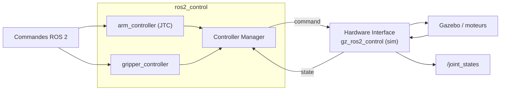
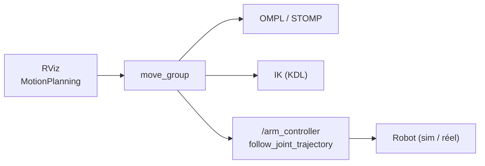

# Jour 3 — Manipulation

::subtitle::
SO-101 · ros2_control · MoveIt 2

---
layout: section
eyebrow: Partie 01 · Matériel
---

# Le bras SO-101

::note::
Plateforme 6 DoF open-source (LeRobot / Hugging Face) — la base matérielle du jour.

---
layout: two-cols
---

# Un bras 6 DoF

Bras open-source de la communauté **LeRobot / Hugging Face**, servos Feetech
STS3215. Chaîne cinématique **série** : chaque joint dépend du précédent.

<v-click>

Léger → posable sur table ou monté sur la base mobile **LeKiwi** (Jour 2).

</v-click>

::right::

| Joint | Rôle |
| --- | --- |
| `shoulder_pan` | rotation base |
| `shoulder_lift` | levée épaule |
| `elbow_flex` | flexion coude |
| `wrist_flex` | flexion poignet |
| `wrist_roll` | rotation poignet |
| `gripper` | pince |

---
layout: default
---

# De l'URDF au robot pilotable

- <v-click>**URDF / Xacro** — `link` (segments), `joint` (axes + limites). Le `.xacro` prend des args (`mode`, `joint_states_gui`) → l'URDF généré change.</v-click>
- <v-click>**`robot_state_publisher`** — combine URDF + `/joint_states` → publie la `tf`.</v-click>
- <v-click>**Visualisation** — `ros2 launch so101_description view.launch.py` (RViz + sliders).</v-click>

<v-click>

> Cette chaîne `tf` (`base_link → … → gripper_link`) est ce que MoveIt 2 planifie.

</v-click>

---
layout: default
---

# `ros2_control` — le triptyque



Trois contrôleurs : `joint_state_broadcaster`, `arm_controller` (5 joints, JTC),
`gripper_controller` (pince).

---
layout: section
eyebrow: Partie 02 · Cinématique
---

# Cinématique directe & inverse

::note::
FK directe, IK numérique : le calcul que MoveIt résout pour vous.

---
layout: default
---

# Cinématique directe (FK)

Chaque joint $i$ porte une transformation homogène $T_{i-1}^{i}(\theta_i)$.
La pose de la pince dans le repère base est le **produit** des transformations :

$$
T_0^{n}(\boldsymbol\theta) = \prod_{i=1}^{n} T_{i-1}^{i}(\theta_i)
= \begin{bmatrix} R(\boldsymbol\theta) & \mathbf{p}(\boldsymbol\theta) \\ \mathbf{0} & 1 \end{bmatrix}
$$

<v-click>

**FK** : on connaît $\boldsymbol\theta$ → on calcule la pose $T_0^n$. Direct, une seule solution.

</v-click>

---
layout: default
---

# Cinématique inverse (IK)

Problème inverse : on **veut** une pose $T^{*}$, on cherche les angles $\boldsymbol\theta$ :

$$
\text{trouver } \boldsymbol\theta \ \text{ t.q. } \ T_0^{n}(\boldsymbol\theta) = T^{*}
$$

- <v-click>Plusieurs solutions possibles (coude haut / bas), ou **aucune** (hors d'atteinte).</v-click>
- <v-click>Résolution **numérique** par le Jacobien $J$ : $\;\Delta\boldsymbol\theta = J^{+}\,\Delta\mathbf{x}\;$ (itéré).</v-click>
- <v-click>MoveIt utilise un solveur **KDL** (ou TracIK) — c'est lui qui fait ce calcul pour vous.</v-click>

<v-click>

> SO-101 : chaîne **5-DOF** → l'IK cartésienne 6D arbitraire est dégradée. La planification dans l'espace des joints, elle, marche très bien.

</v-click>

---
layout: section
eyebrow: Partie 03 · MoveIt 2
---

# MoveIt 2

::note::
URDF + SRDF, planification OMPL / STOMP, exécution via ros2_control.

---
layout: default
---

# Le pipeline MoveIt



`move_group` consomme **URDF + SRDF** et expose services/actions de planification.
La trajectoire planifiée part au `arm_controller` ; la pince est pilotée à part.

---
layout: two-cols
---

# Le SRDF

L'URDF décrit la **géométrie**. Le SRDF ajoute la **sémantique**, généré par le
*MoveIt Setup Assistant* :

- groupes : `arm`, `gripper`
- poses nommées : `home`, `ready`, `gripper_open`, `gripper_close`
- matrice de collisions à ignorer
- end-effector : `gripper_ee`

::right::

<v-click>

```bash
# Lancer la démo (locale FR : forcer le séparateur décimal)
LC_NUMERIC=C.UTF-8 ros2 launch so101_moveit_config \
  demo.launch.py
```

Dans RViz : *drag* du marqueur → **Plan** → **Execute** → le bras bouge dans Gazebo.

</v-click>

---
layout: section
eyebrow: Partie 04 · Pick & place
---

# Pick & place

::note::
Séquencer des trajectoires : approche, prise, retrait, dépôt.

---
layout: default
---

# La séquence

- <v-click>**Approche** — 5 cm au-dessus de l'objet, pince ouverte</v-click>
- <v-click>**Descente** — trajectoire cartésienne jusqu'à l'objet</v-click>
- <v-click>**Préhension** — fermeture de la pince (`gripper_close`)</v-click>
- <v-click>**Retrait** — remontée de 10 cm</v-click>
- <v-click>**Dépôt** — pose de dépôt, puis ouverture de la pince</v-click>

<v-click>

> Pas de perception ici : c'est un **séquencement de trajectoires**. La détection
> arrive au Jour 4, l'intégration au Jour 5.

</v-click>

---
layout: default
---

# À vous de coder

```python {1-3|5-7|9-12}
moveit = MoveItPy(node_name="pick_and_place")
arm = moveit.get_planning_component("arm")
gripper = moveit.get_planning_component("gripper")

arm.set_start_state_to_current_state()
arm.set_goal_state(configuration_name="ready")
plan = arm.plan()

if plan:
    moveit.execute(plan.trajectory, controllers=[])
# … remplir les TODO du package so101_pick_place
```

Package squelette `so101_pick_place` à compléter + solution de référence fournie.

---
layout: default
---

# Récap Jour 3

- <v-click>Lire et visualiser un bras 6 DoF (URDF/Xacro, tf, RViz).</v-click>
- <v-click>Le piloter en sim via `ros2_control` (JTC + gripper).</v-click>
- <v-click>FK directe, IK numérique → résolue par MoveIt (KDL).</v-click>
- <v-click>Planifier & exécuter avec MoveIt 2, gérer les collisions.</v-click>
- <v-click>Coder un pick & place complet en simulation.</v-click>

---
layout: end
---
