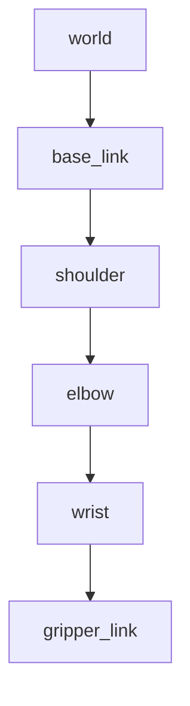
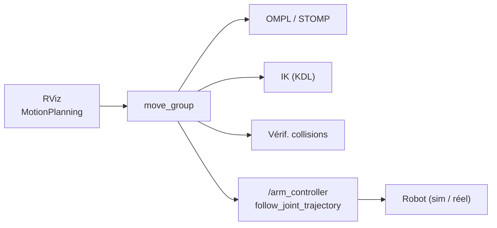

# Jour 3 — Manipulation

::subtitle::
Anatomie · Cinématique · Modélisation · Planification

---
layout: default
---

# Au programme

<ul class="bc-agenda">
<li><span>L'<strong>anatomie d'un bras</strong> : joints, degrés de liberté, espaces, redondance, singularités</span></li>
<li><span>La <strong>cinématique</strong> : directe (FK), inverse (IK) et ses méthodes de résolution</span></li>
<li><span>La <strong>modélisation dans ROS 2</strong> : URDF, Xacro, SRDF et l'arbre de transformations TF</span></li>
<li><span>La <strong>planification de mouvement</strong> : OMPL et la boîte à outils MoveIt 2</span></li>
</ul>

---
layout: section
eyebrow: Partie 01 · Anatomie d'un bras robotique
---

# De quoi est fait un bras ?

::note::
Segments, articulations, degrés de liberté — le vocabulaire de base.

---
layout: two-cols
---

# Une chaîne cinématique série

Un bras manipulateur est une suite de **segments rigides** (`link`) reliés par des
**articulations** (`joint`). La chaîne est **série** : chaque joint dépend de tous
ceux qui le précèdent.

<v-clicks>

- chaque joint apporte **un degré de liberté** (DDL) ;
- au bout de la chaîne : l'**effecteur** (la pince, *end-effector*) ;
- bouger un joint déplace **tout** ce qui est en aval.

</v-clicks>

::right::

Le **SO-101** (notre fil rouge) — 6 joints :

| Joint | Rôle |
| --- | --- |
| `shoulder_pan` | rotation base |
| `shoulder_lift` | levée épaule |
| `elbow_flex` | flexion coude |
| `wrist_flex` | flexion poignet |
| `wrist_roll` | rotation poignet |
| `gripper` | pince |

---
layout: two-cols
---

# Définition d'un joint

Un joint représente **un mouvement élémentaire** commandé. Deux grandes familles :

<v-clicks>

- **rotationnel** (*revolute*) — une rotation autour d'un axe (le cas le plus courant) ;
- **linéaire** (*prismatic*) — une translation le long d'un axe.

</v-clicks>

<v-click>

Chaque joint a des **limites** : butées de position, vitesse max, effort max.

</v-click>

::right::

<div class="bc-media bc-media--frame" style="height: 80%;">

<!-- TODO : déposer l'image du joint (rotationnel vs linéaire) dans le dossier des
     ressources, puis ajouter ici la balise image correspondante. Chemin laissé vide
     volontairement pour ne pas faire échouer le link-checker CI tant que le fichier manque. -->

<p style="opacity: 0.45; font-style: italic;">🖼️ Image joint — à insérer (rotationnel vs linéaire)</p>

</div>

---
layout: default
---

# Commander un joint

On pilote un joint de **trois façons**, selon ce qu'on impose au moteur :

<div class="bc-cards bc-cards--3">
<div class="bc-card" v-click><div class="bc-card__title">📐 Position</div><p>Angle visé, ex. <em>θ</em> = π/2 rad</p></div>
<div class="bc-card" v-click><div class="bc-card__title">⏩ Vitesse</div><p>Vitesse angulaire, ex. <em>ω</em> = π/4 rad/s</p></div>
<div class="bc-card" v-click><div class="bc-card__title">💪 Couple</div><p>Effort appliqué, ex. <em>τ</em> = 2 N·m</p></div>
</div>

<v-click>

<div class="bc-callout bc-callout--info">
<div class="bc-callout__icon">🧮</div>
<div class="bc-callout__body">
<div class="bc-callout__title">1 joint = 1 DDL</div>
<p>Compter les joints actifs, c'est compter les <strong>degrés de liberté</strong> du bras. Le SO-101 en a 6.</p>
</div>
</div>

</v-click>

---
layout: two-cols
---

# Espace des joints vs espace cartésien

Deux façons, équivalentes, de décrire l'état du bras :

<v-clicks>

- **espace des joints** — la liste des angles internes
  $\boldsymbol\theta = (\theta_1, \dots, \theta_n)$ ;
- **espace cartésien** — la **pose** de l'effecteur : sa **position** $(x, y, z)$ **et** son **orientation**.

</v-clicks>

::right::

<v-click>

<div class="bc-callout bc-callout--info">
<div class="bc-callout__icon">🔁</div>
<div class="bc-callout__body">
<div class="bc-callout__title">Passer de l'un à l'autre</div>
<p>L'humain raisonne en cartésien (« attrape la tasse là »), le moteur obéit en joints. Traduire entre les deux, c'est tout l'enjeu de la <strong>cinématique</strong> (FK / IK, partie suivante).</p>
</div>
</div>

</v-click>

---
layout: default
---

# La redondance

En 3D, positionner **et** orienter un effecteur demande **6 DDL** : 3 pour la
position, 3 pour l'orientation.

<v-clicks>

- un bras à **7 DDL ou plus** est dit **redondant** ;
- il existe alors une **infinité** de configurations pour une même pose ;
- on exploite cette liberté pour : **éviter un obstacle**, **minimiser l'effort**, **rester loin des butées**.

</v-clicks>

<v-click>

<div class="bc-callout bc-callout--info">
<div class="bc-callout__icon">🦾</div>
<div class="bc-callout__body">
<div class="bc-callout__title">Intuition</div>
<p>Comme votre bras : main posée sur la table, vous pouvez encore <strong>bouger le coude</strong>. La main ne bouge pas, la configuration si.</p>
</div>
</div>

</v-click>

---
layout: default
---

# Aparté — les DDL du SO-101

Le SO-101 a **6 articulations**, mais toutes ne servent pas à *positionner* l'effecteur :

<v-clicks>

- **5 DDL** orientent et placent le poignet (`shoulder_pan`, `shoulder_lift`, `elbow_flex`, `wrist_flex`, `wrist_roll`) ;
- **1 DDL** pour la **pince** (`gripper`) — il ouvre/ferme, il ne déplace pas l'effecteur.

</v-clicks>

<v-click>

<div class="bc-callout bc-callout--warn">
<div class="bc-callout__icon">🧮</div>
<div class="bc-callout__body">
<div class="bc-callout__title">5 DDL utiles &lt; 6</div>
<p>Une pose 6D <strong>arbitraire</strong> (position + orientation libres) demande 6 DDL. Avec 5, le SO-101 est <strong>sous-actionné</strong> : il n'est <strong>pas redondant</strong>, et l'IK cartésienne 6D y est <strong>dégradée</strong>.</p>
</div>
</div>

</v-click>

<v-click>

> En pratique on planifie souvent **dans l'espace des joints** plutôt que d'imposer une pose 6D complète.

</v-click>

---
layout: default
---

# Les singularités

Une **singularité** est une configuration où le bras **perd un degré de liberté
de contrôle** de l'effecteur dans l'espace cartésien.

<div class="bc-cards bc-cards--3">
<div class="bc-card" v-click><div class="bc-card__title">📍 De position</div><p>Impossible de translater l'effecteur le long d'un certain axe.</p></div>
<div class="bc-card" v-click><div class="bc-card__title">🧭 D'orientation</div><p>Impossible de tourner autour d'un certain axe (deux axes alignés).</p></div>
<div class="bc-card" v-click><div class="bc-card__title">♾️ Cinématique</div><p>Le Jacobien <em>J</em> devient <strong>non inversible</strong> → vitesses articulaires qui explosent.</p></div>
</div>

<v-click>

<div class="bc-callout bc-callout--warn">
<div class="bc-callout__icon">⚠️</div>
<div class="bc-callout__body">
<div class="bc-callout__title">Intuition : le bras tendu</div>
<p>Bras complètement <strong>étiré</strong>, vous voulez avancer la main encore un peu : impossible sans plier le coude. Près de cette limite, un tout petit déplacement cartésien exige une vitesse articulaire <strong>énorme</strong> — le planificateur doit éviter ces zones.</p>
</div>
</div>

</v-click>

---
layout: section
eyebrow: Partie 02 · Cinématique
---

# Cinématique directe & inverse

::note::
FK : des angles vers une pose. IK : une pose vers des angles. Le calcul que MoveIt résout pour vous.

---
layout: default
---

# FK vs IK — vue d'ensemble

Deux problèmes **inverses** l'un de l'autre, qui relient les deux espaces vus en Partie 01 :

<div class="bc-cards bc-cards--2">
<div class="bc-card" v-click><div class="bc-card__title">➡️ Cinématique directe (FK)</div><p>On <strong>connaît les angles</strong> <em>θ</em> → on calcule la <strong>pose</strong> de l'effecteur. Toujours <strong>une seule</strong> réponse.</p></div>
<div class="bc-card" v-click><div class="bc-card__title">⬅️ Cinématique inverse (IK)</div><p>On <strong>veut une pose</strong> <em>T</em>* → on cherche les <strong>angles</strong> <em>θ</em>. Zéro, une, plusieurs ou une infinité de réponses.</p></div>
</div>

<v-click>

> FK est facile et déterministe. **IK est le problème difficile** — et celui qu'on résout en permanence pour piloter un bras.

</v-click>

---
layout: default
---

# Cinématique directe (FK)

Chaque joint $i$ porte une transformation homogène $T_{i-1}^{i}(\theta_i)$.
La pose de la pince dans le repère base est le **produit** des transformations :

$$
T_0^{n}(\boldsymbol\theta) = \prod_{i=1}^{n} T_{i-1}^{i}(\theta_i)
= \begin{bmatrix} R(\boldsymbol\theta) & \mathbf{p}(\boldsymbol\theta) \\ \mathbf{0} & 1 \end{bmatrix}
$$

<v-click>

**FK** : on connaît $\boldsymbol\theta$ → on calcule la pose $T_0^n$. Direct, une seule solution.

</v-click>

<v-click>

> $R$ est la matrice de **rotation** (orientation), $\mathbf{p}$ le vecteur **position** de l'effecteur.

</v-click>

---
layout: default
---

# Cinématique inverse (IK)

Problème inverse : on **veut** une pose $T^{*}$, on cherche les angles $\boldsymbol\theta$ :

$$
\text{trouver } \boldsymbol\theta \ \text{ t.q. } \ T_0^{n}(\boldsymbol\theta) = T^{*}
$$

- <v-click>**Plusieurs** solutions (coude haut / coude bas) ;</v-click>
- <v-click>**aucune** solution (cible hors d'atteinte ou contrainte géométrique) ;</v-click>
- <v-click>une **infinité** si le bras est redondant → on parle de **null-space**.</v-click>

<v-click>

> SO-101 : bras **5 DOF** → on ne peut pas imposer une **orientation arbitraire**. Viser une pose 6D directe échoue souvent ; on **résout l'IK une fois** puis on planifie **dans l'espace des joints** (mesuré en TP : pose 6D 0/5 vs but articulaire 5/5).

</v-click>

---
layout: two-cols
---

# Choisir une solution d'IK

Quand l'IK renvoie **plusieurs** solutions, laquelle prendre ? On les **classe**
selon des critères :

<v-clicks>

- **continuité** — la plus proche de la pose actuelle (mouvement minimal) ;
- **limites articulaires** — rester dans les butées ;
- **collisions** — écarter les configurations qui heurtent le robot ou la scène ;
- **distance aux singularités** — privilégier les poses « robustes ».

</v-clicks>

::right::

<v-click>

<div class="bc-callout bc-callout--info">
<div class="bc-callout__icon">🎯</div>
<div class="bc-callout__body">
<div class="bc-callout__title">Pas juste « une » solution</div>
<p>Trouver des angles ne suffit pas : il faut <strong>la bonne</strong> configuration pour le contexte. C'est ce tri que MoveIt fait à votre place.</p>
</div>
</div>

</v-click>

---
layout: default
---

# Résoudre l'IK : trois familles de méthodes

<div class="bc-cards bc-cards--3">
<div class="bc-card" v-click><div class="bc-card__title">📐 Analytique</div><p>Équations trigonométriques <strong>exactes</strong>. Rapide et précis, mais difficile à généraliser aux bras complexes.</p></div>
<div class="bc-card" v-click><div class="bc-card__title">🔢 Numérique</div><p>Itère via le Jacobien : Δ<em>θ</em> = <em>J</em>⁺·Δ<em>x</em>. Général, mais peut <strong>échouer près des singularités</strong>.</p></div>
<div class="bc-card" v-click><div class="bc-card__title">🧠 Apprentissage / IA</div><p>Un réseau entraîné à résoudre l'IK. Rapide et généralisable, au prix de <strong>beaucoup de données</strong>.</p></div>
</div>

<v-click>

<div class="bc-callout bc-callout--info">
<div class="bc-callout__icon">⚙️</div>
<div class="bc-callout__body">
<div class="bc-callout__title">En pratique dans MoveIt</div>
<p>Le solveur par défaut est <strong>numérique</strong> : <code>KDL</code> (ou <code>TracIK</code>, plus robuste). C'est lui qui fait ce calcul pour vous, à chaque planification.</p>
</div>
</div>

</v-click>

---
layout: section
eyebrow: Partie 03 · Modélisation dans ROS 2
---

# URDF · Xacro · SRDF · TF

::note::
Comment ROS 2 « connaît » le robot : sa géométrie, sa sémantique, ses repères.

---
layout: default
---

# Trois fichiers, trois rôles

Pour qu'un logiciel raisonne sur le bras, il faut le **décrire**. ROS 2 sépare cette description en couches complémentaires :

<div class="bc-cards bc-cards--3">
<div class="bc-card" v-click><div class="bc-card__title">🧱 URDF</div><p>La <strong>géométrie</strong> : links, joints, formes, masses. <em>« À quoi ressemble le robot ? »</em></p></div>
<div class="bc-card" v-click><div class="bc-card__title">🏷️ SRDF</div><p>La <strong>sémantique</strong> pour la planification : groupes, poses, collisions. <em>« Comment on le pilote ? »</em></p></div>
<div class="bc-card" v-click><div class="bc-card__title">🌳 TF</div><p>Les <strong>repères</strong> et leurs relations spatiales, dans le temps. <em>« Où est chaque pièce, maintenant ? »</em></p></div>
</div>

<v-click>

> URDF + SRDF sont **statiques** (des fichiers). TF est **dynamique** : il vit à l'exécution et change à chaque mouvement.

</v-click>

---
layout: two-cols
---

# URDF — description structurelle

Le **URDF** (*Unified Robot Description Format*) est un fichier **XML** qui décrit
la structure du robot :

<v-clicks>

- les **`link`** (segments) et les **`joint`** (axes + limites) ;
- des **formes** (box, cylinder, sphere) ou des **meshes** ;
- deux modèles par link : **visuel** (le rendu) et **collision** (souvent simplifié).

</v-clicks>

::right::

<v-click>

Il est publié sur le topic **`/robot_description`** et consommé par **RViz**,
**Gazebo** et **MoveIt**.

</v-click>

<v-click>

<div class="bc-callout bc-callout--info">
<div class="bc-callout__icon">🧩</div>
<div class="bc-callout__body">
<div class="bc-callout__title">Visuel ≠ collision</div>
<p>Le maillage <strong>visuel</strong> peut être détaillé ; le maillage de <strong>collision</strong> est simplifié (boîtes, cylindres) pour que la détection de collisions reste rapide.</p>
</div>
</div>

</v-click>

---
layout: two-cols
---

# Xacro — l'URDF paramétré

Écrire un URDF à la main devient vite **répétitif** (6 joints quasi identiques…).
**Xacro** génère le XML à partir de **macros**, **propriétés** et **includes**.

<v-clicks>

- **propriétés** réutilisables (longueurs, limites) ;
- **macros** : un patron de link/joint instancié N fois ;
- **arguments** : un même `.xacro` produit des **variantes** (sim vs réel, avec/sans pince).

</v-clicks>

::right::

```xml
<xacro:property name="arm_len" value="0.12"/>

<xacro:macro name="segment" params="name len">
  <link name="${name}">
    <visual>
      <geometry>
        <cylinder length="${len}" radius="0.02"/>
      </geometry>
    </visual>
  </link>
</xacro:macro>

<!-- une ligne → un link complet -->
<xacro:segment name="elbow" len="${arm_len}"/>
```

<v-click>

> Au lancement, Xacro est **développé en URDF pur** : c'est toujours ce dernier que ROS 2 consomme.

</v-click>

---
layout: two-cols
---

# SRDF — description sémantique

L'URDF décrit la **géométrie**. Le **SRDF** (*Semantic Robot Description Format*)
ajoute ce qu'il faut pour **planifier**, généré par le *MoveIt Setup Assistant* :

<v-clicks>

- **groupes** : `arm` (chaîne `base_link → gripper_link`), `gripper` (joint `gripper`) ;
- **poses nommées** : `home`, `ready`, `gripper_open`, `gripper_close` ;
- **end-effector** : `gripper_ee` (parent `gripper_link`) ;
- **matrice de collisions désactivées** (paires toujours/jamais en contact).

</v-clicks>

::right::

<v-click>

<div class="bc-callout bc-callout--info">
<div class="bc-callout__icon">🚫</div>
<div class="bc-callout__body">
<div class="bc-callout__title">Pourquoi désactiver des collisions ?</div>
<p>Des links <strong>toujours en contact</strong> (voisins dans la chaîne) ou dont la collision est <strong>géométriquement impossible</strong> sont ignorés. Sinon MoveIt croirait le robot constamment en collision avec lui-même.</p>
</div>
</div>

</v-click>

---
layout: two-cols
---

# TF2 — l'arbre de transformations

**TF2** gère les relations spatiales (**position + orientation**) entre tous les
repères : épaule, coude, poignet, pince… et les objets de la scène.



Chaque arête est une transformation ; les composer donne la pose **de n'importe quel repère dans n'importe quel autre**.

::right::

<v-click>

<div class="bc-callout bc-callout--info">
<div class="bc-callout__icon">⏱️</div>
<div class="bc-callout__body">
<div class="bc-callout__title">Pourquoi un buffer dans le temps ?</div>
<p>TF garde un <strong>historique</strong> des transformations. On peut demander « où était la pince <strong>à l'instant t</strong> ? » — indispensable pour recaler une <strong>mesure capteur</strong> arrivée avec un peu de retard sur la pose du robot au moment exact de la mesure.</p>
</div>
</div>

</v-click>

<v-click>

> Même arbre TF qu'au **Jour 2** : la base mobile LeKiwi et le bras partagent le même mécanisme de repères.

</v-click>

---
layout: default
---

# Qui publie la TF du bras ?

Le nœud **`robot_state_publisher`** fait le lien entre la description statique et les repères vivants :

<div class="bc-cards bc-cards--3">
<div class="bc-card" v-click><div class="bc-card__title">📄 Entrée 1 — URDF</div><p>La structure : quels links, quels joints, quels axes.</p></div>
<div class="bc-card" v-click><div class="bc-card__title">📡 Entrée 2 — <code>/joint_states</code></div><p>Les angles courants de chaque joint, publiés en continu.</p></div>
<div class="bc-card" v-click><div class="bc-card__title">🌳 Sortie — TF</div><p>Il applique la FK et publie la pose de <strong>chaque repère</strong>.</p></div>
</div>

<v-click>

> En clair : **URDF (forme) + `/joint_states` (angles) → FK → arbre TF**. C'est la cinématique directe de la Partie 02, appliquée en continu.

</v-click>

---
layout: default
---

# Commander le matériel — `ros2_control`

Entre « je veux cette trajectoire » et les moteurs, une couche standard
**uniforme et temps réel** : `ros2_control`. Trois briques :

<div class="bc-cards bc-cards--3">
<div class="bc-card" v-click><div class="bc-card__title">🔌 Hardware interface</div><p>Le pont bas-niveau : <strong>lit</strong> l'état, <strong>écrit</strong> les commandes. <code>gz_ros2_control</code> en sim, driver Feetech en réel.</p></div>
<div class="bc-card" v-click><div class="bc-card__title">🎛️ Controller manager</div><p>Charge les contrôleurs et <strong>arbitre</strong> l'accès aux joints.</p></div>
<div class="bc-card" v-click><div class="bc-card__title">🧩 Contrôleurs</div><p><strong>JTC</strong> (suivre une trajectoire) pour le bras, un contrôleur de <strong>pince</strong> dédié.</p></div>
</div>

<v-click>

<div class="bc-callout bc-callout--info">
<div class="bc-callout__icon">🔁</div>
<div class="bc-callout__body">
<div class="bc-callout__title">command vs state interfaces</div>
<p><strong>command</strong> = ce qu'on <strong>écrit</strong> (consignes) ; <strong>state</strong> = ce qu'on <strong>lit</strong> (mesures). Le <code>joint_state_broadcaster</code> republie l'état sur <code>/joint_states</code> — la boucle se referme. <strong>MoveIt envoie ses trajectoires à ce JTC.</strong></p>
</div>
</div>

</v-click>

---
layout: section
eyebrow: Partie 04 · Planification & MoveIt 2
---

# Planifier un mouvement

::note::
Trouver un chemin faisable, sans collision — puis l'orchestrer avec MoveIt 2.

---
layout: default
---

# Le problème de la planification

Aller d'une configuration de départ à une cible, ce n'est pas une ligne droite dans l'espace des joints :

<div class="bc-cards bc-cards--3">
<div class="bc-card" v-click><div class="bc-card__title">🧱 Sans collision</div><p>Éviter les obstacles, la scène… et le robot lui-même.</p></div>
<div class="bc-card" v-click><div class="bc-card__title">📏 Dans les limites</div><p>Respecter butées, vitesses et efforts de chaque joint.</p></div>
<div class="bc-card" v-click><div class="bc-card__title">✅ Faisable</div><p>Une trajectoire continue, réellement exécutable par le bras.</p></div>
</div>

<v-click>

> L'espace des configurations est **vaste et plein de trous** (les collisions). On délègue la recherche à une bibliothèque spécialisée : **OMPL**.

</v-click>

---
layout: two-cols
---

# OMPL — Open Motion Planning Library

OMPL **cherche une trajectoire faisable** entre deux configurations en respectant
les contraintes et en évitant les obstacles.

<v-clicks>

- algorithmes par **échantillonnage** : **RRT**, **PRM**, **KPIECE**, **LBTRRT**… ;
- la plupart sont **probabilistes** : ils tirent des configurations au hasard ;
- conséquence : résultats **non déterministes** (deux runs ≠ même chemin).

</v-clicks>

::right::

<v-click>

<div class="bc-callout bc-callout--info">
<div class="bc-callout__icon">🎲</div>
<div class="bc-callout__body">
<div class="bc-callout__title">Échantillonner, pas calculer</div>
<p>Plutôt que résoudre une équation, OMPL <strong>tire des configurations</strong> et relie celles qui sont sans collision jusqu'à atteindre le but. Robuste sur les bras complexes.</p>
</div>
</div>

</v-click>

<v-click>

> Alternative orientée **optimisation** : **STOMP** (lisse une trajectoire bruitée).

</v-click>

---
layout: two-cols
---

# Qu'est-ce que MoveIt 2 ?

**MoveIt 2** est la boîte à outils ROS 2 de la manipulation. Elle **centralise**
tout ce qu'on a vu :

<div class="bc-cards bc-cards--2">
<div class="bc-card" v-click><div class="bc-card__title">🧮 Cinématique</div><p>FK et IK (KDL / TracIK).</p></div>
<div class="bc-card" v-click><div class="bc-card__title">🗺️ Planification</div><p>Via OMPL / STOMP.</p></div>
<div class="bc-card" v-click><div class="bc-card__title">🛡️ Collisions</div><p>Vérif. robot ↔ scène en continu.</p></div>
<div class="bc-card" v-click><div class="bc-card__title">👁️ Capteurs</div><p>Intègre la perception dans la scène.</p></div>
</div>

::right::

<v-click>

S'appuie sur **URDF + SRDF**, raisonne via **TF**, et s'intègre à **RViz** et **Gazebo**.

</v-click>

<v-click>

> Plutôt que recoder solveurs et détection de collisions, on **assemble des briques éprouvées**.

</v-click>

---
layout: default
---

# Le pipeline MoveIt 2



<v-clicks>

- une **cible** arrive (RViz ou code) → `move_group` orchestre ;
- OMPL cherche un chemin, l'IK convertit les poses, les collisions sont vérifiées ;
- la trajectoire validée part au contrôleur ; la pince est pilotée à part.

</v-clicks>

---
layout: two-cols
---

# `move_group` — le cœur de MoveIt 2

Le nœud central qui **assemble** toutes les briques pour répondre à une demande de planification :

<v-clicks>

- charge **URDF + SRDF** (structure + sémantique) ;
- interroge **TF** pour la pose courante ;
- lance **OMPL** pour le chemin, **l'IK** pour les poses cartésiennes ;
- **valide** chaque état (collisions, limites) ;
- **transmet** la trajectoire au contrôleur.

</v-clicks>

::right::

<div class="bc-layers">
<div class="bc-layers__item is-active"><div class="bc-layers__name">🧠 move_group</div><div class="bc-layers__desc">orchestre toute la planification</div></div>
<div class="bc-layers__item"><div class="bc-layers__name">📄 URDF + SRDF</div><div class="bc-layers__desc">structure & sémantique</div></div>
<div class="bc-layers__item"><div class="bc-layers__name">🌳 TF</div><div class="bc-layers__desc">pose courante des repères</div></div>
<div class="bc-layers__item"><div class="bc-layers__name">🗺️ OMPL / IK</div><div class="bc-layers__desc">chemin & cinématique</div></div>
<div class="bc-layers__item"><div class="bc-layers__name">🛡️ Collision checking</div><div class="bc-layers__desc">validation des états</div></div>
</div>

---
layout: default
---

# Les interfaces exposées

`move_group` communique avec le reste du système via les **trois mécanismes ROS 2** :

<div class="bc-cards bc-cards--3">
<div class="bc-card" v-click><div class="bc-card__title">📨 Topics</div><p>Flux continus : <code>/joint_states</code>, l'arbre TF, la <strong>planning scene</strong> (objets de l'environnement).</p></div>
<div class="bc-card" v-click><div class="bc-card__title">🛎️ Services</div><p>Requêtes ponctuelles : calcul d'<strong>IK/FK</strong>, vérification de collision, état du robot.</p></div>
<div class="bc-card" v-click><div class="bc-card__title">🎬 Actions</div><p>Tâches longues avec feedback : <strong>planifier &amp; exécuter</strong> une trajectoire (annulable).</p></div>
</div>

<v-click>

> Mêmes primitives qu'au **Jour 1** (topics / services / actions) : MoveIt n'invente rien, il les **compose** pour la manipulation.

</v-click>

---
layout: default
---

# Saisir un objet (pick & place)

Planifier un mouvement ne suffit pas à **saisir**. Quatre points à part :

<div class="bc-cards bc-cards--2">
<div class="bc-card" v-click><div class="bc-card__title">🎯 Le bon repère (TCP)</div><p>On vise le <strong>point de préhension</strong> (<code>gripper_frame_link</code>), pas le corps de la pince — sinon les doigts tombent à côté.</p></div>
<div class="bc-card" v-click><div class="bc-card__title">⬇️ Approche / retrait</div><p>On descend <strong>par le haut</strong> (pré-prise au-dessus), on saisit, on <strong>remonte</strong> avant de partir — pour ne pas heurter l'objet.</p></div>
<div class="bc-card" v-click><div class="bc-card__title">🧲 Attacher l'objet</div><p>À la fermeture, on <strong>attache</strong> l'objet à la pince dans la <em>planning scene</em> : il suit le bras et MoveIt gère ses collisions.</p></div>
<div class="bc-card" v-click><div class="bc-card__title">🔓 Relâcher</div><p>À l'ouverture, on le <strong>détache</strong> ; il est déposé.</p></div>
</div>

<v-click>

<div class="bc-callout bc-callout--warn">
<div class="bc-callout__icon">🧪</div>
<div class="bc-callout__body">
<div class="bc-callout__title">Sim ≠ réel</div>
<p>En simulation, la saisie tient par <strong>friction</strong> (fragile) ou par <strong>attache</strong> ; sur le vrai SO-101, c'est la <strong>force des moteurs</strong>. Et sur 5 DOF on saisit <strong>par le haut</strong> (orientation imposée), pas sous tous les angles.</p>
</div>
</div>

</v-click>

---
layout: default
---

# Récap Jour 3

- <v-click>**Anatomie** : un bras = chaîne série de joints ; 1 joint = 1 DDL ; le SO-101 = **5 DOF** + pince.</v-click>
- <v-click>**Cinématique** : FK (unique) vs IK (0 / 1 / ∞, KDL) ; sur 5 DOF on **planifie en espace des joints**.</v-click>
- <v-click>**Modélisation** : URDF (géométrie), Xacro (paramétrage), SRDF (sémantique), TF (repères dans le temps).</v-click>
- <v-click>**Exécution** : `ros2_control` (JTC + pince) pilote le matériel ; MoveIt lui envoie ses trajectoires.</v-click>
- <v-click>**Planification** : OMPL cherche le chemin, **MoveIt 2** orchestre via `move_group` ; saisie = TCP + approche + attache.</v-click>

<v-click>

> La mise en pratique (visualisation du SO-101, planification dans RViz, pick & place) se fait en TP, documentée dans le bootcamp.

</v-click>

---
layout: end
---
