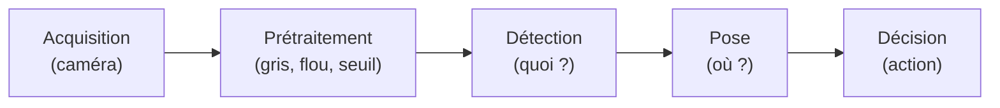
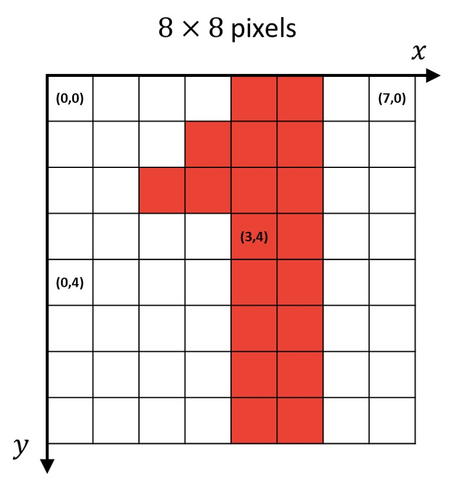
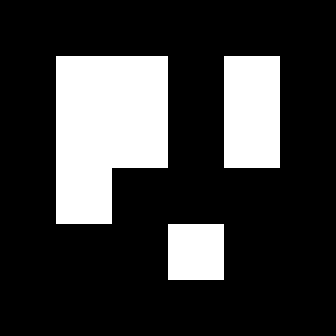
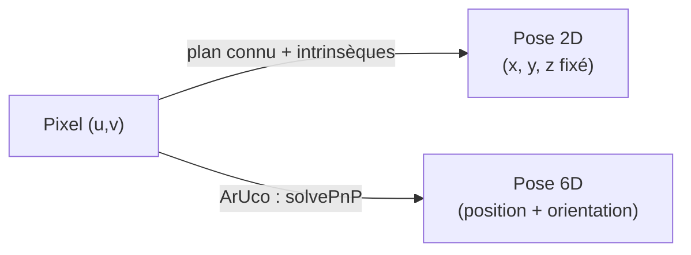
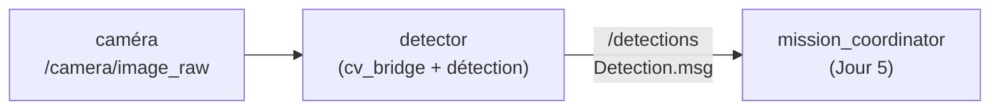

# Jour 4 — Vision

::subtitle::
Voir, pour agir · OpenCV · ArUco · YOLO · CNN

---
layout: default
---

# Au programme

<ul class="bc-agenda">
<li><span>Ce qu'est une <strong>image</strong>, le <strong>pipeline de perception</strong> et la détection par <strong>couleur</strong> (HSV)</span></li>
<li><span><strong>OpenCV</strong> : la boîte à outils de la vision classique</span></li>
<li><span>Les <strong>marqueurs fiduciaires</strong> (ArUco) et la <strong>pose 6D</strong></span></li>
<li><span>La vision par <strong>apprentissage profond</strong> : YOLO &amp; CNN</span></li>
<li><span>L'intégration en <strong>ROS 2</strong> : du flux caméra au <code>Detection.msg</code></span></li>
</ul>

---
layout: section
eyebrow: Partie 01 · Voir, de l'image à la décision
---

# Pourquoi la vision ?

::note::
La caméra est le capteur le plus riche — et le plus difficile à interpréter.

---
layout: default
---

# Que fait un robot de ses images ?

Une image brute n'est qu'un **tableau de nombres**. Tout l'enjeu : la transformer en
**action**. Trois questions, dans l'ordre :

<div class="bc-cards bc-cards--3">
<div class="bc-card" v-click><div class="bc-card__title">🔍 Détecter</div><p>Repérer un objet, une personne, un obstacle.<br/><em>« Qu'y a-t-il ? »</em></p></div>
<div class="bc-card" v-click><div class="bc-card__title">📍 Localiser</div><p>Estimer <strong>où</strong> l'objet se trouve dans l'espace.<br/><em>« Où est-il ? »</em></p></div>
<div class="bc-card" v-click><div class="bc-card__title">🧭 Décider</div><p>Choisir l'action : saisir, éviter, suivre.<br/><em>« Que faire ? »</em></p></div>
</div>

<div class="bc-callout bc-callout--warn" v-click>
<div class="bc-callout__icon">⚠️</div>
<div class="bc-callout__body">
<div class="bc-callout__title">Pourquoi c'est difficile</div>
<p>Éclairage qui change, ombres, reflets, objets <strong>partiellement cachés</strong>, bruit du capteur — et tout ça en <strong>temps réel</strong>.</p>
</div>
</div>

---
layout: default
---

# Le pipeline de perception



<v-click>

Chaque atelier parcourt ce **même pipeline** — seule la brique **Détection** change :

</v-click>

<div class="bc-cards bc-cards--2">
<div class="bc-card" v-click><div class="bc-card__title">🟦 Formes (OpenCV)</div><p>Filtres &amp; contours, détection par couleur.</p></div>
<div class="bc-card" v-click><div class="bc-card__title">🎯 ArUco</div><p>Marqueurs fiduciaires → pose 6D.</p></div>
<div class="bc-card" v-click><div class="bc-card__title">🧠 YOLO</div><p>Détection par apprentissage profond.</p></div>
<div class="bc-card" v-click><div class="bc-card__title">🔢 Chiffres (CNN)</div><p>Classification d'images (MNIST).</p></div>
</div>

---
layout: two-cols
---

# Une image = une grille de pixels

Une image est une **grille de pixels**. Chaque pixel porte une **intensité** (0–255).

<v-clicks>

- **origine** en haut à gauche : `(0, 0)`
- repère `(x, y)` → colonne, ligne
- **résolution** = `largeur × hauteur` (ex. 1280×720)
- gris : 1 valeur · couleur : **3 valeurs** par pixel

</v-clicks>

::right::

<div class="bc-media bc-media--frame">

</div>

---
layout: two-cols
---

# Une image = un tableau

En mémoire, cette grille est un **tableau NumPy** de forme `(H, W, C)`.

<v-clicks>

- on lit, découpe et modifie l'image comme un tableau
- accès à un pixel : `img[y, x]` → `[B, G, R]`
- découper une zone : `img[y1:y2, x1:x2]`

</v-clicks>

::right::

```python {1-3|4|all}
import cv2 as cv
img = cv.imread("scene.png")
print(img.shape)     # (720, 1280, 3)
print(img[360, 640]) # [B, G, R] du pixel central
```

<div class="bc-callout bc-callout--warn">
<div class="bc-callout__icon">⚠️</div>
<div class="bc-callout__body">
<div class="bc-callout__title">Piège classique</div>
<p>OpenCV charge les canaux en <strong>BGR</strong>, pas RGB.</p>
</div>
</div>

---
layout: default
---

# Espaces colorimétriques

<div class="bc-cards bc-cards--3">
<div class="bc-card" v-click><div class="bc-card__title">BGR / RGB</div><p>Les trois canaux varient <strong>ensemble</strong> avec la lumière → fragile pour la couleur.</p></div>
<div class="bc-card" v-click><div class="bc-card__title">Niveaux de gris</div><p>Une seule intensité — suffisant pour <strong>formes</strong> et <strong>contours</strong>.</p></div>
<div class="bc-card" v-click><div class="bc-card__title">HSV</div><p><strong>T</strong>einte / <strong>S</strong>aturation / <strong>V</strong>aleur — la couleur est <strong>isolée</strong> de la luminosité.</p></div>
</div>

<v-click>

**Quand utiliser quoi ?**

</v-click>

<ul class="bc-agenda">
<li v-click><span><strong>Gris</strong> → formes et contours</span></li>
<li v-click><span><strong>BGR / RGB</strong> → affichage</span></li>
<li v-click><span><strong>HSV</strong> → détecter une couleur</span></li>
</ul>

---
layout: two-cols
---

# Détecter une couleur en HSV

On bascule en **HSV**, puis on garde les pixels dont la **teinte** est dans une plage.

<v-clicks>

- la **teinte** (H) reste stable même si l'éclairage change
- `inRange` renvoie un **masque** binaire (objet = blanc)
- bien plus **robuste** que seuiller en BGR

</v-clicks>

::right::

```python {1|2-3|4|all}
hsv = cv.cvtColor(img, cv.COLOR_BGR2HSV)
lo = (35, 80, 80)    # vert : H ≈ 35–85
hi = (85, 255, 255)
masque = cv.inRange(hsv, lo, hi)
```

<div class="bc-callout bc-callout--info">
<div class="bc-callout__icon">🎯</div>
<div class="bc-callout__body">
<div class="bc-callout__title">Astuce</div>
<p>Le rouge est « à cheval » sur H = 0 → souvent <strong>deux</strong> plages à fusionner.</p>
</div>
</div>

---
layout: section
eyebrow: Partie 02 · OpenCV, la boîte à outils
---

# La vision classique, à la main

::note::
Atelier « Formes ».

---
layout: default
---

# OpenCV, c'est quoi ?

Une **bibliothèque open-source** de vision par ordinateur (C++ / **Python**), pensée pour
le **temps réel**. Le couteau suisse de l'image.

<div class="bc-cards bc-cards--3">
<div class="bc-card" v-click><div class="bc-card__title">📥 E/S</div><p>Lire / écrire images &amp; vidéos, accès caméra, affichage.</p></div>
<div class="bc-card" v-click><div class="bc-card__title">🎛️ Filtres</div><p>Flou, seuillage, morphologie, détection de bords (Canny).</p></div>
<div class="bc-card" v-click><div class="bc-card__title">📐 Géométrie</div><p>Redimensionner, tourner, recadrer, transformations de perspective.</p></div>
<div class="bc-card" v-click><div class="bc-card__title">🧩 Formes</div><p>Contours, features, mise en correspondance de motifs.</p></div>
<div class="bc-card" v-click><div class="bc-card__title">🎯 Caméra</div><p>Calibration, intrinsèques, marqueurs <strong>ArUco</strong>, <code>solvePnP</code>.</p></div>
<div class="bc-card" v-click><div class="bc-card__title">🧠 DNN</div><p>Module pour faire tourner des réseaux pré-entraînés.</p></div>
</div>

---
layout: two-cols
---

# Filtres et contours

De l'image brute à une **forme géométrique**, étape par étape.

<v-clicks>

- **gris** : on abandonne la couleur
- **flou** gaussien : réduire le bruit
- **seuillage** / **Canny** : isoler les bords
- **contours** : `findContours`
- **forme** : `approxPolyDP` → nb de sommets

</v-clicks>

::right::

```python {1|2|3-4|5-6|all}
gris = cv.cvtColor(img, cv.COLOR_BGR2GRAY)
flou = cv.GaussianBlur(gris, (5,5), 0)
_, b = cv.threshold(flou, 0, 255,
        cv.THRESH_BINARY+cv.THRESH_OTSU)
cnts,_ = cv.findContours(b,
        cv.RETR_EXTERNAL, cv.CHAIN_APPROX_SIMPLE)
```

---
layout: default
---

# OpenCV : forces et limites

<div class="bc-cards bc-cards--2">
<div class="bc-card" v-click><div class="bc-card__title">✅ Atouts</div><p>Rapide et <strong>temps réel</strong>, déterministe, <strong>aucun entraînement</strong>, explicable — on sait pourquoi ça marche (ou non).</p></div>
<div class="bc-card" v-click><div class="bc-card__title">⚠️ Limites</div><p>Sensible à l'<strong>éclairage</strong>, réglages <strong>manuels</strong> par scène, pose <strong>2D</strong> seulement, fragile dès que l'objet varie.</p></div>
</div>

<div class="bc-callout bc-callout--info" v-click>
<div class="bc-callout__icon">💡</div>
<div class="bc-callout__body">
<div class="bc-callout__title">Bon réflexe</div>
<p>Commencer <strong>simple</strong> avec OpenCV. Si l'objet est trop variable, on ajoute un <strong>repère</strong> (ArUco) ou on passe à l'<strong>apprentissage profond</strong>.</p>
</div>
</div>

---
layout: section
eyebrow: Partie 03 · Marqueurs fiduciaires
---

# Des repères conçus pour être détectés

::note::
Atelier « ArUco ».

---
layout: two-cols
---

# Les marqueurs ArUco

Un motif carré noir et blanc qui encode un **identifiant**.

<v-clicks>

- la **classe** = l'ID du marqueur (gratuit)
- les 4 **coins** se détectent de façon fiable
- appartiennent à un **dictionnaire** (ex. 4×4_50)

</v-clicks>

<div class="bc-callout bc-callout--info" v-click>
<div class="bc-callout__icon">🎯</div>
<div class="bc-callout__body">
<div class="bc-callout__title">Pose 6D gratuite</div>
<p>Avec la <strong>taille</strong> du marqueur et les <strong>intrinsèques</strong> caméra, <code>solvePnP</code> donne position <em>et</em> orientation.</p>
</div>
</div>

::right::

<div class="bc-media bc-media--frame" style="max-width: 260px; height: 100%; margin: 0 auto;">

</div>

---
layout: default
---

# Pose 2D vs pose 6D



<v-click>

> ArUco est votre détecteur **« filet de sécurité »** : robuste, déterministe, 6D.

</v-click>

---
layout: section
eyebrow: Partie 04 · Vision par apprentissage
---

# Apprendre au lieu de programmer

::note::
Ateliers « YOLO » et « Chiffres ».

---
layout: default
---

# Trois tâches de vision profonde

<div class="bc-cards bc-cards--3">
<div class="bc-card" v-click><div class="bc-card__title">🏷️ Classification</div><p>Une <strong>classe</strong> pour toute l'image.</p><p><em>« cette vignette = un 7 »</em></p><p>→ CNN · <strong>atelier Chiffres</strong></p></div>
<div class="bc-card" v-click><div class="bc-card__title">🎁 Détection</div><p>Plusieurs <strong>boîtes</strong> + classes + scores.</p><p><em>« un colis ici, une bouteille là »</em></p><p>→ YOLO · <strong>atelier YOLO</strong></p></div>
<div class="bc-card" v-click><div class="bc-card__title">🧩 Segmentation</div><p>Une classe par <strong>pixel</strong>.</p><p><em>« ces pixels = le colis »</em></p><p>→ hors-programme</p></div>
</div>

<div class="bc-callout bc-callout--info" v-click>
<div class="bc-callout__icon">🎯</div>
<div class="bc-callout__body">
<div class="bc-callout__title">Pour le robot</div>
<p>Pour <strong>saisir</strong> un objet, il faut une <strong>boîte</strong> (où ?) — donc la <strong>détection</strong>. La classification seule ne localise pas. Vos deux ateliers IA couvrent ces deux tâches ; la segmentation, on la cite pour la culture.</p>
</div>
</div>

---
layout: default
---

# Le CNN, c'est quoi ?

Un **réseau de neurones convolutif** (CNN) s'inspire du **cortex visuel** : au lieu de
programmer des filtres à la main, il **apprend tout seul** les motifs utiles (traits,
courbes, formes).

<ul class="bc-timeline">
<li><span class="bc-timeline__year">1998</span> <strong>LeNet</strong> (Yann LeCun) — lecture des chiffres postaux : le tout premier CNN utile</li>
<li><span class="bc-timeline__year">2012</span> <strong>AlexNet</strong> — victoire à <strong>ImageNet</strong>, l'essor du deep learning moderne</li>
<li><span class="bc-timeline__year">auj.</span> brique de base de toute la vision profonde — <strong>YOLO</strong> compris</li>
</ul>

<div class="bc-callout bc-callout--info" v-click>
<div class="bc-callout__icon">🔢</div>
<div class="bc-callout__body">
<div class="bc-callout__title">L'atelier « Chiffres » = un LeNet moderne</div>
<p>Vous referez, en 2026, l'expérience fondatrice de 1998 : un CNN qui lit des chiffres.</p>
</div>
</div>

---
layout: two-cols
---

# Le réseau de neurones convolutif

Un **CNN** apprend tout seul les motifs utiles (traits, courbes, textures) par
**convolutions** successives.

<v-clicks>

- couches **conv** → extraction de motifs
- **pooling** → réduction
- couches **denses** → décision

</v-clicks>

<div class="bc-callout bc-callout--info" v-click>
<div class="bc-callout__icon">🔢</div>
<div class="bc-callout__body">
<div class="bc-callout__title">C'est l'atelier « Chiffres »</div>
<p>Vous entraînerez ce réseau pour lire les <strong>chiffres</strong> de l'entrepôt. Et la même brique de convolution est le <strong>cœur de YOLO</strong>.</p>
</div>
</div>

::right::

<div class="bc-layers">
<div class="bc-layers__item"><div class="bc-layers__name">Image 28×28</div></div>
<div class="bc-layers__item"><div class="bc-layers__name">Conv + ReLU</div><div class="bc-layers__desc">extraction de motifs</div></div>
<div class="bc-layers__item"><div class="bc-layers__name">Pooling</div><div class="bc-layers__desc">réduction</div></div>
<div class="bc-layers__item"><div class="bc-layers__name">Dense</div><div class="bc-layers__desc">décision</div></div>
<div class="bc-layers__item is-active"><div class="bc-layers__name">10 classes (0–9)</div></div>
</div>

---
layout: two-cols
---

# Entraîner un modèle

L'entraînement est une **boucle** : on corrige les poids un peu à chaque passage sur les
données.

<ul class="bc-timeline">
<li><span class="bc-timeline__year">1</span> <strong>Données</strong> annotées (images + étiquettes)</li>
<li><span class="bc-timeline__year">2</span> <strong>Prédiction</strong>, puis <strong>perte</strong> (erreur)</li>
<li><span class="bc-timeline__year">3</span> <strong>Rétropropagation</strong> → màj des poids</li>
<li><span class="bc-timeline__year">4</span> On répète, <strong>epoch</strong> après epoch</li>
</ul>

::right::

<div class="bc-callout bc-callout--info">
<div class="bc-callout__icon">↻</div>
<div class="bc-callout__body">
<div class="bc-callout__title">Pourquoi plusieurs epochs ?</div>
<p>Un seul passage ne suffit pas : on <strong>repasse</strong> sur les données (étapes 2→3) jusqu'à ce que la perte se <strong>stabilise</strong>.</p>
</div>
</div>

<div class="bc-callout bc-callout--info">
<div class="bc-callout__icon">🏷️</div>
<div class="bc-callout__body">
<div class="bc-callout__title">L'annotation gratuite</div>
<p>En simulation, la pose des objets est <strong>connue</strong> → on génère <strong>et</strong> annote tout seul. C'est le <strong>dataset de l'atelier YOLO</strong>.</p>
</div>
</div>

---
layout: default
---

# YOLO, c'est quoi ?

**YOLO = *You Only Look Once*.** Un détecteur qui regarde l'image **une seule fois** et
sort **toutes** les boîtes d'un coup — d'où sa vitesse, idéale pour le **temps réel**.

<ul class="bc-timeline">
<li><span class="bc-timeline__year">avant</span> <strong>R-CNN</strong> — précis mais <strong>lent</strong> : plusieurs passes par image</li>
<li><span class="bc-timeline__year">2015</span> <strong>YOLO</strong> (Joseph Redmon) — détection <strong>temps réel</strong> en une seule passe</li>
<li><span class="bc-timeline__year">→ v11</span> versions successives, aujourd'hui maintenu par <strong>Ultralytics</strong></li>
</ul>

<div class="bc-callout bc-callout--info" v-click>
<div class="bc-callout__icon">⚡</div>
<div class="bc-callout__body">
<div class="bc-callout__title">Pourquoi ça compte pour un robot</div>
<p>« Une seule passe » = assez rapide pour tourner sur le <strong>flux caméra</strong> en direct.</p>
</div>
</div>

---
layout: two-cols
---

# YOLO — détecter en une passe

<v-clicks>

- localise **et** classe plusieurs objets d'un coup
- modèle **pré-entraîné** (COCO, 80 classes)
- **transfer learning** : ré-entraîner sur vos objets

</v-clicks>

::right::

```python {1-2|3|all}
from ultralytics import YOLO
model = YOLO("yolo11n.pt")
for b in model("scene.png")[0].boxes:
    print(model.names[int(b.cls)], float(b.conf))
```

---
layout: section
eyebrow: Partie 05 · Vision dans ROS 2
---

# Brancher la perception au robot

---
layout: default
---

# Du flux caméra à `/detections`



**`cv_bridge`** convertit l'`Image` ROS en tableau OpenCV ; on détecte, puis on **publie**.

```python
frame = CvBridge().imgmsg_to_cv2(msg, "bgr8")   # sensor_msgs/Image -> tableau BGR
```

<v-click>

> `DetectionArray` = liste de `Detection` (classe + score + boîte 2D + `pose`). **Quelle que soit la méthode**, la sortie est la même → le Jour 5 branche votre perception sans rien changer.

</v-click>

---
layout: default
---

# OpenCV vs IA — quel outil quand ?

<div class="bc-cards bc-cards--2">
<div class="bc-card" v-click><div class="bc-card__title">🟦 OpenCV / ArUco</div>
<ul>
<li><strong>Données</strong> : aucune</li>
<li><strong>Mise en place</strong> : immédiate, déterministe</li>
<li><strong>Explicabilité</strong> : totale (on sait pourquoi)</li>
<li><strong>Limite</strong> : éclairage, objets variables</li>
</ul>
<p><em>→ objet simple ou marqué</em></p></div>
<div class="bc-card" v-click><div class="bc-card__title">🧠 Apprentissage profond</div>
<ul>
<li><strong>Données</strong> : dataset annoté requis</li>
<li><strong>Mise en place</strong> : entraînement + calcul</li>
<li><strong>Explicabilité</strong> : faible (boîte noire)</li>
<li><strong>Atout</strong> : robuste à la variété</li>
</ul>
<p><em>→ objets nombreux ou variables</em></p></div>
</div>

<div class="bc-callout bc-callout--info" v-click>
<div class="bc-callout__icon">💡</div>
<div class="bc-callout__body">
<div class="bc-callout__title">Bon réflexe</div>
<p>Commencer <strong>simple</strong> (ArUco, valeur sûre), monter en gamme <strong>si nécessaire</strong>.</p>
</div>
</div>

---
layout: default
---

# À vous de jouer — lequel choisir ?

<ul class="bc-agenda">
<li v-click><span>🟦 <strong>Formes (OpenCV)</strong> — si vous voulez la <strong>vision classique</strong> sans IA : filtres, contours, couleur.</span></li>
<li v-click><span>🎯 <strong>ArUco (pose 6D)</strong> — si vous voulez la <strong>valeur sûre</strong> : robuste, déterministe, pose complète.</span></li>
<li v-click><span>🧠 <strong>YOLO (détection)</strong> — si vous voulez de l'<strong>IA appliquée</strong> : modèle pré-entraîné puis ré-entraîné sur vos objets.</span></li>
<li v-click><span>🔢 <strong>Chiffres (CNN)</strong> — si vous voulez <strong>entraîner un réseau de A à Z</strong> (MNIST).</span></li>
</ul>

---
layout: default
---

# Ce que vous repartez avec ce soir

<div class="bc-cards bc-cards--2">
<div class="bc-card" v-click><div class="bc-card__title">✅ Un nœud <code>detector</code></div><p>Qui voit la caméra et publie un <code>DetectionArray</code> sur <code>/detections</code>.</p></div>
<div class="bc-card" v-click><div class="bc-card__title">🔗 Une brique prête pour le Jour 5</div><p>Le <code>mission_coordinator</code> consomme <code>/detections</code> — il <strong>branche votre perception sans rien changer</strong>.</p></div>
</div>

<div class="bc-callout bc-callout--info" v-click>
<div class="bc-callout__icon">🚀</div>
<div class="bc-callout__body">
<div class="bc-callout__title">Demain — Jour 5 : intégration</div>
<p>Votre <code>detector</code> remplace le nœud factice du Jour 1 : voir → localiser → <strong>agir</strong> (pick &amp; place).</p>
</div>
</div>

---
layout: end
---
