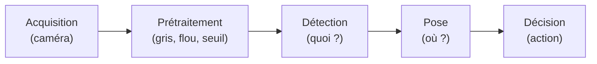
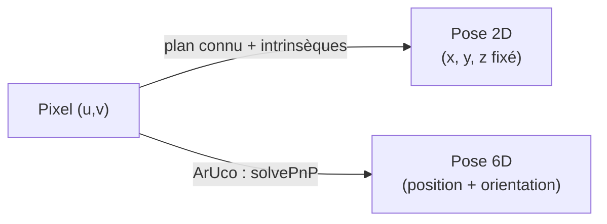
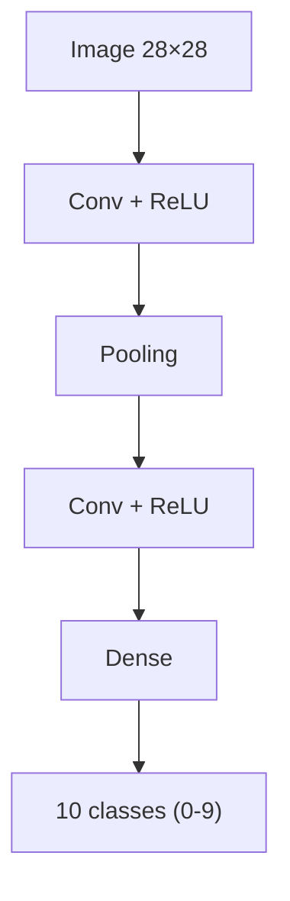
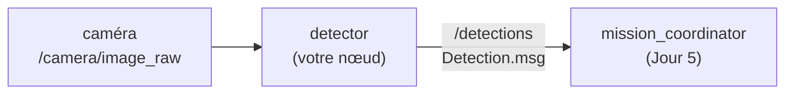

# Jour 4 — Vision

::subtitle::
Voir, pour agir · OpenCV · ArUco · YOLO · CNN

---
layout: default
---

# Au programme

<ul class="bc-agenda">
<li><span>Ce qu'est une <strong>image</strong> et le <strong>pipeline vision</strong></span></li>
<li><span>La vision <strong>classique</strong> avec OpenCV (filtres, contours, couleur)</span></li>
<li><span>Les <strong>marqueurs fiduciaires</strong> (ArUco) et la <strong>pose 6D</strong></span></li>
<li><span>La vision par <strong>apprentissage profond</strong> : YOLO & CNN</span></li>
<li><span>L'intégration en <strong>ROS 2</strong> : du flux caméra au <code>Detection.msg</code></span></li>
</ul>

---
layout: section
eyebrow: Partie 01 · Voir pour un robot
---

# Pourquoi la vision ?

::note::
La caméra est le capteur le plus riche — et le plus difficile à interpréter.

---
layout: default
---

# Que fait un robot de ses images ?

<div class="bc-cards bc-cards--3">
<div class="bc-card" v-click><div class="bc-card__title">🔍 Détecter</div><p>Repérer un objet, une personne, un obstacle.</p></div>
<div class="bc-card" v-click><div class="bc-card__title">📍 Localiser</div><p>Estimer <strong>où</strong> il se trouve dans l'espace.</p></div>
<div class="bc-card" v-click><div class="bc-card__title">🧭 Décider</div><p>Choisir l'action : saisir, éviter, suivre.</p></div>
</div>

<v-click>

> Le fil rouge du bootcamp : la **caméra détecte** → le **bras saisit** → la **base transporte**.

</v-click>

---
layout: section
eyebrow: Partie 02 · Qu'est-ce qu'une image ?
---

# Des pixels, rien que des pixels

::note::
Une image numérique est un tableau de nombres.

---
layout: two-cols
---

# Une image = un tableau

Une image est une grille de **pixels**. Chaque pixel a une **intensité** (gris) ou
**trois canaux** (couleur).

<v-clicks>

- résolution : `largeur × hauteur` (ex. 1280×720)
- couleur : 3 canaux **B, G, R** (OpenCV) ou R, G, B
- en mémoire : un tableau **NumPy** `(H, W, C)`

</v-clicks>

::right::

```python {1-3|4|all}
import cv2 as cv
img = cv.imread("scene.png")
print(img.shape)     # (720, 1280, 3)
print(img[360, 640]) # [B, G, R] du pixel central
```

<div class="bc-callout bc-callout--warn">
<div class="bc-callout__icon">⚠️</div>
<div class="bc-callout__body">
<div class="bc-callout__title">Piège classique</div>
<p>OpenCV charge les canaux en <strong>BGR</strong>, pas RGB.</p>
</div>
</div>

---
layout: default
---

# Espaces colorimétriques

<div class="bc-cards bc-cards--3">
<div class="bc-card" v-click><div class="bc-card__title">BGR / RGB</div><p>Les trois canaux varient ensemble avec la lumière → fragile.</p></div>
<div class="bc-card" v-click><div class="bc-card__title">Niveaux de gris</div><p>Une seule intensité — suffisant pour formes et contours.</p></div>
<div class="bc-card" v-click><div class="bc-card__title">HSV</div><p>Teinte / Saturation / Valeur — la couleur est <strong>isolée</strong> de la luminosité.</p></div>
</div>

<v-click>

> Pour détecter une **couleur**, on convertit en **HSV** : bien plus robuste à l'éclairage.

</v-click>

---
layout: section
eyebrow: Partie 03 · Le pipeline vision
---

# De l'image à la décision

---
layout: default
---

# Le pipeline de perception



<v-click>

Chaque atelier du jour parcourt ce pipeline — seule la brique **Détection** change.

</v-click>

---
layout: section
eyebrow: Partie 04 · Vision classique (OpenCV)
---

# Des règles écrites à la main

::note::
Atelier « Formes ».

---
layout: two-cols
---

# OpenCV : filtres & contours

<v-clicks>

- **flou** gaussien : réduire le bruit
- **seuillage** / **Canny** : isoler les bords
- **contours** : `findContours`
- **forme** : `approxPolyDP` → nb de sommets

</v-clicks>

::right::

```python {1-2|3|4-5|all}
gris = cv.cvtColor(img, cv.COLOR_BGR2GRAY)
flou = cv.GaussianBlur(gris, (5,5), 0)
_, b = cv.threshold(flou, 0, 255,
        cv.THRESH_BINARY+cv.THRESH_OTSU)
cnts,_ = cv.findContours(b,
        cv.RETR_EXTERNAL, cv.CHAIN_APPROX_SIMPLE)
```

---
layout: default
---

# OpenCV : forces et limites

<div class="bc-cards bc-cards--2">
<div class="bc-card" v-click><div class="bc-card__title">✅ Atouts</div><p>Rapide, déterministe, aucun entraînement, explicable.</p></div>
<div class="bc-card" v-click><div class="bc-card__title">⚠️ Limites</div><p>Sensible à l'éclairage, réglages manuels, pose 2D seulement.</p></div>
</div>

---
layout: section
eyebrow: Partie 05 · Marqueurs fiduciaires
---

# Tricher (un peu) pour gagner en robustesse

::note::
Atelier « ArUco ».

---
layout: two-cols
---

# Les marqueurs ArUco

Un motif carré noir et blanc qui encode un **identifiant**.

<v-clicks>

- la **classe** = l'ID du marqueur (gratuit)
- les 4 **coins** se détectent de façon fiable
- appartiennent à un **dictionnaire** (ex. 4×4_50)

</v-clicks>

::right::

<div class="bc-callout bc-callout--info">
<div class="bc-callout__icon">🎯</div>
<div class="bc-callout__body">
<div class="bc-callout__title">Pose 6D gratuite</div>
<p>Avec la <strong>taille</strong> du marqueur et les <strong>intrinsèques</strong> caméra, <code>solvePnP</code> donne position <em>et</em> orientation.</p>
</div>
</div>

---
layout: default
---

# Pose 2D vs pose 6D



<v-click>

> ArUco est votre détecteur **« filet de sécurité »** : robuste, déterministe, 6D.

</v-click>

---
layout: section
eyebrow: Partie 06 · Vision par apprentissage
---

# Apprendre au lieu de programmer

::note::
Ateliers « YOLO » et « Chiffres ».

---
layout: default
---

# Trois tâches de vision profonde

<div class="bc-cards bc-cards--3">
<div class="bc-card" v-click><div class="bc-card__title">🏷️ Classification</div><p>Une <strong>classe</strong> pour toute l'image. → CNN / MNIST</p></div>
<div class="bc-card" v-click><div class="bc-card__title">🎁 Détection</div><p>Plusieurs <strong>boîtes</strong> + classes + scores. → YOLO</p></div>
<div class="bc-card" v-click><div class="bc-card__title">🧩 Segmentation</div><p>Une classe par <strong>pixel</strong>.</p></div>
</div>

---
layout: two-cols
---

# Le réseau de neurones convolutif

Un **CNN** apprend tout seul les motifs utiles (traits, courbes, textures) par
**convolutions** successives.

<v-clicks>

- couches **conv** → extraction de motifs
- **pooling** → réduction
- couches **denses** → décision

</v-clicks>

::right::



---
layout: default
---

# Entraîner un modèle

<ul class="bc-timeline">
<li><span class="bc-timeline__year">1</span> <strong>Données</strong> annotées (images + étiquettes)</li>
<li><span class="bc-timeline__year">2</span> <strong>Prédiction</strong> du modèle, puis <strong>perte</strong> (erreur)</li>
<li><span class="bc-timeline__year">3</span> <strong>Rétropropagation</strong> → mise à jour des poids</li>
<li><span class="bc-timeline__year">4</span> Répéter sur plusieurs <strong>epochs</strong></li>
</ul>

<v-click>

> En simulation, on **génère et annote** les données automatiquement : la pose des objets est connue.

</v-click>

---
layout: two-cols
---

# YOLO — détecter en une passe

<v-clicks>

- localise **et** classe plusieurs objets d'un coup
- modèle **pré-entraîné** (COCO, 80 classes)
- **transfer learning** : ré-entraîner sur vos objets

</v-clicks>

::right::

```python {1-2|3|all}
from ultralytics import YOLO
model = YOLO("yolo11n.pt")
for b in model("scene.png")[0].boxes:
    print(model.names[int(b.cls)], float(b.conf))
```

---
layout: default
---

# OpenCV vs IA — quel outil quand ?

<div class="bc-cards bc-cards--2">
<div class="bc-card" v-click><div class="bc-card__title">OpenCV / ArUco</div><p>Rapide, sans données, explicable. Idéal si l'objet est simple ou marqué.</p></div>
<div class="bc-card" v-click><div class="bc-card__title">Apprentissage profond</div><p>Robuste à la variété, mais demande <strong>données</strong> + <strong>calcul</strong>.</p></div>
</div>

<v-click>

> Bon réflexe : commencer **simple** (ArUco), monter en gamme **si nécessaire**.

</v-click>

---
layout: section
eyebrow: Partie 07 · Vision dans ROS 2
---

# Brancher la perception au robot

---
layout: two-cols
---

# Le flux caméra et `cv_bridge`

<v-clicks>

- la caméra publie un `sensor_msgs/Image`
- **`cv_bridge`** convertit Image ⇄ tableau OpenCV
- on traite, on détecte, on publie

</v-clicks>

::right::

```python {1-2|3|all}
from cv_bridge import CvBridge
bridge = CvBridge()
frame = bridge.imgmsg_to_cv2(msg, "bgr8")
```

---
layout: default
---

# Le contrat `/detections`



<v-click>

`Detection.msg` = `string class_id` + `geometry_msgs/Pose pose`. **Quelle que soit la
méthode**, la sortie est la même → le Jour 5 branche votre perception sans rien changer.

</v-click>

---
layout: default
---

# À vous de jouer — quatre ateliers, un seul choix

<div class="bc-cards bc-cards--2">
<div class="bc-card" v-click><div class="bc-card__title">🟦 Formes (OpenCV)</div><p>Filtres, contours, couleur. Aucun entraînement.</p></div>
<div class="bc-card" v-click><div class="bc-card__title">🎯 ArUco (pose 6D)</div><p>Marqueurs robustes, pose complète.</p></div>
<div class="bc-card" v-click><div class="bc-card__title">🧠 YOLO (détection)</div><p>IA pré-entraînée puis entraînée sur vos objets.</p></div>
<div class="bc-card" v-click><div class="bc-card__title">🔢 Chiffres (CNN)</div><p>Entraînez vous-même un réseau (MNIST).</p></div>
</div>

<v-click>

> Tous aboutissent à un nœud qui publie `/detections`. Choisissez selon votre envie !

</v-click>

---
layout: end
---
