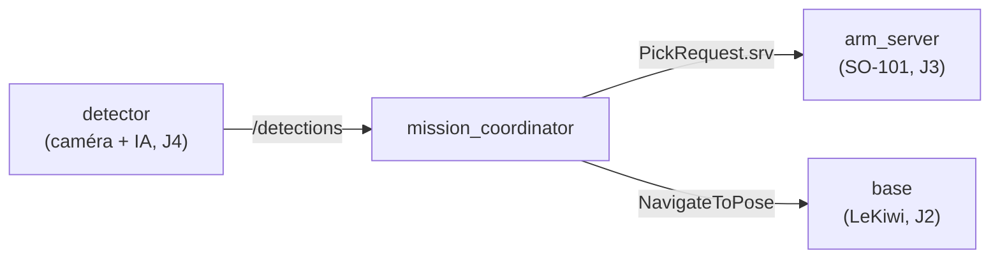

# Jour 5 — Intégration

::subtitle::
Projet final · perception → décision → action

---
layout: section
eyebrow: Le projet · 01
---

# Système robotique complet

---
layout: default
---

# Objectif

Concevoir un **système autonome complet** intégrant les trois sous-systèmes de la semaine :

<v-clicks>

- 🔍 **Perception** par caméra (Jour 4)
- 🤖 **Manipulation** par le SO-101 (Jour 3)
- 🚗 **Navigation** mobile avec le LeKiwi (Jour 2)

</v-clicks>

<v-click>

> Chaque sous-système collabore pour **détecter, saisir et transporter** un objet.

</v-click>

---
layout: two-cols
---

# Perception & manipulation

### 🔍 Analyse visuelle

- Détection d'un **objet** (couleur, label, forme)
- IA de vision (PyTorch, YOLO…)
- **3 à 6 classes** à distinguer

::right::

### 🤖 Bras SO-101

- Saisie de l'objet identifié
- Dépôt sur le robot mobile ou une position connue

---
layout: default
---

# Navigation autonome — LeKiwi

<v-clicks>

- Déplacement jusqu'à l'objet
- Prise en charge de l'objet
- Transport jusqu'au **point de dépôt lié à sa classe**

</v-clicks>

<v-click>

> Pipeline complet ROS 2 : **perception → décision → action**.

</v-click>

---
layout: section
eyebrow: Architecture · 02
---

# Le graphe à assembler

---
layout: default
---

# Architecture cible

Vous avez monté **ce graphe en factice au Jour 1**. Le projet : remplacer chaque nœud
factice par le vrai sous-système, **sans changer les interfaces**.

---
layout: section
eyebrow: Livrables · 03
---

# Soutenance & rapport

---
layout: two-cols
---

# 📢 Soutenance

- **20 min** de présentation (démo de **5 min** incluse)
- **10 min** de questions
- **Vidéo de démo** requise (filet de sécurité)
- **Diaporama** obligatoire

::right::

# 📝 Rapport

À rendre **une semaine après** :

- Graphe des nœuds ROS 2
- Topics / services / actions justifiés
- Répartition des tâches
- Améliorations envisagées

---
layout: default
---

# 🎯 Prenez du plaisir et visez l'excellence

<v-clicks>

- Soyez **créatifs, curieux, ambitieux**
- Une fonctionnalité bonus bien pensée vaut mieux qu'un pipeline minimal
- Et surtout, **amusez-vous** 😊

</v-clicks>

---
layout: end
---
