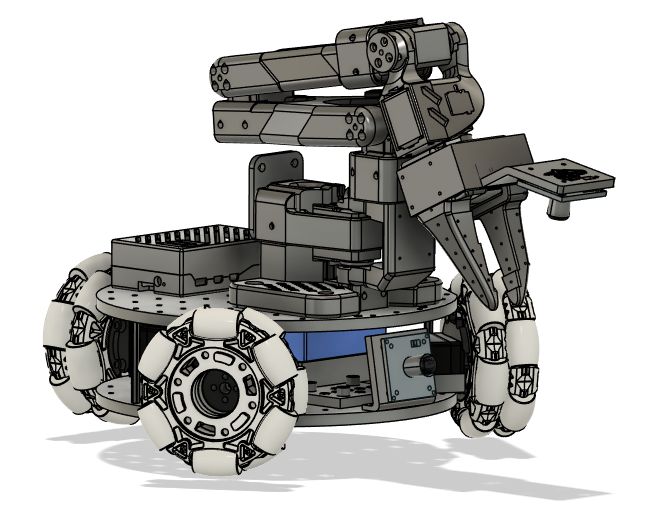
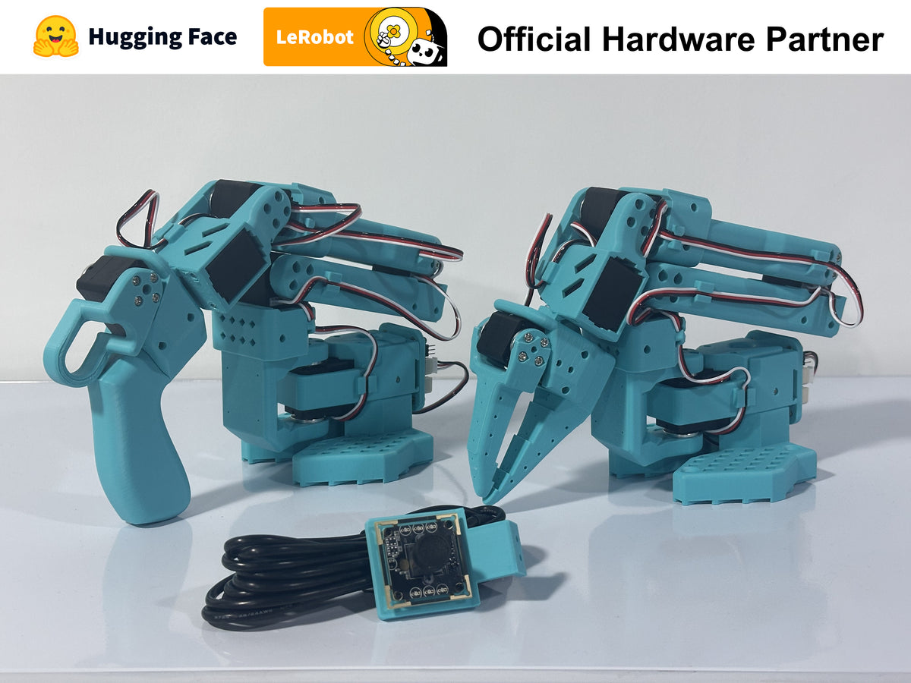

# ROS 2 — Bootcamp

::subtitle::
Présentation · l'intervenant · les projets du cours

---
layout: default
---

# Qui suis-je ?

**Etienne SCHMITZ** — votre formateur ROS 2.

<v-clicks>

- 🎓 **Ingénieur** en informatique spécialisé en robotique (ENSEIRB-MATMECA, 2021)
- 👨‍🏫 **Enseignant** permanent en informatique & responsable du **E-Smart Lab** (ESME Bordeaux)
- 🤖 J'**encadre des stages** autour de la **robotique**
- 🏆 Ancien chef d'équipe **NAMeC SSL** (RoboCup Small Size League)
- 🖨️ **Maker dans l'âme** — possesseur d'imprimante 3D
- 📱 **Concepteur d'applications** mobile et web

</v-clicks>

---
layout: default
---

# L'esprit du bootcamp

🛠️ Pratique d'abord

Théorie courte, puis on code. On apprend ROS 2 en <strong>construisant</strong> de vrais robots.

🔁 Itératif

On essaie, on casse, on corrige. <strong>L'erreur fait partie du jeu</strong> — c'est comme ça qu'on progresse.

🤝 Collaboratif

On avance <strong>en équipe</strong> : questions bienvenues, entraide encouragée, on partage ce qu'on découvre.

👋

Le fil conducteur

<strong>On construit, on simule, on déploie</strong> — comme en vrai projet robotique. Visez l'excellence et, surtout, prenez du plaisir !

---
layout: section
eyebrow: Le fil rouge
---

# Les projets du cours

::note::
Un parcours progressif : de l'introduction au système robotique complet.

---
layout: default
---

# Le parcours en un coup d'œil

<ul class="bc-agenda">
<li><strong>Jour 1</strong> — Introduction à ROS 2 : écosystème, concepts, CLI</li>
<li><strong>Jour 2</strong> — Navigation : base mobile <strong>LeKiwi</strong>, SLAM, Nav2</li>
<li><strong>Jour 3</strong> — Manipulation : bras <strong>SO-101</strong>, MoveIt 2, pick &amp; place</li>
<li><strong>Jour 4</strong> — Vision &amp; <strong>Intelligence Artificielle</strong></li>
<li><strong>Jours 5-6</strong> — Intégration : le <strong>projet final</strong> de bout en bout</li>
</ul>

---
layout: default
---

# Les briques à construire

🧩 Fondations

Nodes, topics, services, actions, packages & workspace — le langage commun de ROS 2

🛞 Navigation

Base holonome LeKiwi : téléop, cartographie SLAM (<code>slam_toolbox</code>) et navigation autonome avec Nav2

🦾 Manipulation

Bras SO-101 6 DoF : <code>ros2_control</code>, MoveIt 2, cinématique directe/inverse et pick &amp; place

🎯 Intégration

Pipeline complet perception → manipulation → navigation, conclu par une soutenance + rapport

---
layout: section
eyebrow: Le cours
---

# Les robots du cours

::subtitle::
Tout le cours se déroule **en simulation** \*

::note::
Deux robots open-source, imprimables en 3D, pilotés sous ROS 2. Tout se fait en simulation (Gazebo / RViz) — aucun matériel requis.

---
layout: default
---

# Tout en simulation *

L'**ensemble du cours et du projet** se déroule **en simulation** (Gazebo / RViz) — sur votre machine, sans robot physique.

💻 Chacun sa machine

Personne n'attend son tour : tout le monde avance en parallèle, à son rythme.

🔁 Sans risque

On teste, on casse, on relance. Aucun robot abîmé, on recommence à l'infini.

🎯 Concentré sur ROS 2

Pas de soucis matériel : on se focalise sur le code et l'architecture.

* un passage sur robot réel reste possible en démo, selon la disponibilité du matériel.

---
layout: two-cols
---

# 🛞 La base mobile LeKiwi

Une base **holonome** (roues kiwi à 120°) : elle se déplace dans **toutes les directions** sans tourner sur elle-même.

<v-clicks>

- 🗺️ Cartographie de l'environnement (**SLAM**)
- 🧭 Navigation autonome vers un point cible (**Nav2**)
- 📦 Rôle dans le projet : **transporter** l'objet

</v-clicks>

::right::

---
layout: two-cols
---

# 🦾 Le bras SO-101

Un bras manipulateur **6 DoF** open-source, piloté via `ros2_control` et **MoveIt 2**.

<v-clicks>

- 🎯 Planification de trajectoire (cinématique inverse)
- ✊ Préhension : **pick & place**
- 🤖 Rôle dans le projet : **saisir et déposer** l'objet

</v-clicks>

::right::

---
layout: section
eyebrow: Le fil rouge
---

# Le projet final

::note::
Le but de la semaine : un système robotique complet, de la perception à la navigation.

---
layout: default
---

# La séquence

Assembler un **système robotique complet** : des robots qui coopèrent sous ROS 2.

<ul class="bc-agenda">
<li>👁️ <strong>Perception</strong> — analyser l'objet (couleur, forme, IA…)</li>
<li>🦾 <strong>Manipulation</strong> — le <strong>saisir</strong> et le déposer à une position cible</li>
<li>🛞 <strong>Navigation</strong> — le <strong>transporter</strong> de façon autonome jusqu'au point voulu</li>
</ul>

🎯

Objectif

Enchaîner perception → manipulation → navigation de bout en bout, puis le défendre en soutenance.

---
layout: default
---

# Et si vous aviez d'autres idées ?

Le scénario perception → manipulation → navigation est la **trame proposée**… mais ce n'est pas la seule !

🔄 Adaptez le scénario

Autre séquence d'actions, autre mission, autres objets : tant que ça raconte une histoire robotique cohérente.

🤖 Autres robots / capteurs

Un autre robot, un drone, un autre bras, un capteur différent… en simulation ou en réel.

✅

La seule règle

Votre projet doit être construit <strong>avec ROS 2</strong>. Le reste, c'est votre terrain de jeu — venez en discuter !

---
layout: section
eyebrow: Organisation
---

# Les modalités

::note::
Déroulé d'une séance et système de notation.

---
layout: default
---

# Organisation d'une séance

<ul class="bc-agenda">
<li>🧠 <strong>Quiz</strong> en début de séance sur la journée précédente</li>
<li>📊 <strong>Présentation théorique</strong> (30 min à 1 h) par l'enseignant</li>
<li>🛠️ <strong>Travail libre</strong> sur l'activité du jour, le projet et/ou les activités précédentes</li>
</ul>

🕗

Horaires

<strong>9h00 – 12h30</strong> · pause déjeuner · <strong>13h30 – 17h00</strong>.

---
layout: default
---

# Système de notation

🎯 Individuel

<strong>Quiz</strong> (QCM/QCU) · <strong>assiduité &amp; participation</strong> : implication, questions, entraide

👥 En groupe

<strong>Objectifs techniques</strong> Navigation (J2) &amp; Manipulation (J3) · <strong>oral</strong> (J6) · <strong>rapport PDF</strong> du projet

🗣️

L'oral (J6) — les règles

<strong>Tous les membres</strong> du groupe doivent <strong>prendre la parole</strong> · démonstration en direct · chacun doit savoir expliquer <strong>n'importe quelle partie</strong> du projet.

---
layout: default
---

# Et l'IA dans tout ça ?

🤖

Autorisée — sans modération

Copilot, ChatGPT, Claude… utilisez les outils que vous voulez pour avancer plus vite.

✅ La condition

Vous devez <strong>comprendre ce que vous écrivez</strong>. Si vous ne savez pas l'expliquer, ne le collez pas.

🎤 Le test

À l'oral, on peut vous demander de <strong>justifier n'importe quelle ligne</strong> — l'IA ne passera pas la soutenance à votre place.

---
layout: end
---

# Prêts à démarrer ?
