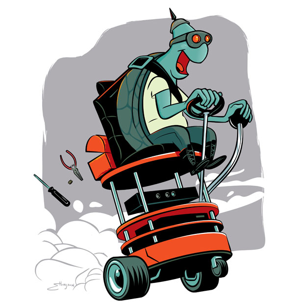

<!-- _class: lead -->
<!-- _paginate: false -->
<!-- _footer: "" -->
 
# Workshop ROS 2  
## Intégration

Etienne SCHMITZ

---

## 🛠️ Projet final  

### Système robotique intelligent sous ROS 2

L’objectif est de concevoir un **système autonome complet** intégrant :

- 🔍 **Perception** par caméra
- 🤖 **Manipulation** par bras robotisé
- 🚗 **Navigation** mobile

Chaque sous-système collabore pour détecter, saisir et transporter un objet.

--- 

## 🔍 Perception & 🤖 Manipulation

### 🔍 1. Analyse visuelle

- Détection d’un **objet coloré** ou identification d’un **label numérique**  
- Utilisation d’une **IA de vision** (PyTorch, YOLO, etc.)
- Minimum **3 classes distinctes**, maximum **6 classes distinctes** à différencier (ex. : couleurs, chiffres, formes)

### 🤖 2. Bras manipulateur (simulation OpenManipulator-X)

- Saisie de l’objet identifié  
- Dépôt sur une position cible connue

---

## 🚗 Navigation autonome

### 3. TurtleBot 3 (simulation ou réel)

- Déplacement jusqu’à l’objet
- Prise en charge de l’objet
- Transport jusqu’au **point de dépôt** liés à la <u>classe</u>.

> 🧠 Ce projet met en œuvre un pipeline complet ROS 2 : perception → décision → action

---

## 📢 Soutenance orale

- ⏱️ **20 minutes** de présentation (incluant une **démonstration de 5 minutes**)
- ❓ **10 minutes de questions** par les encadrants
- 🕙 **Créneaux disponibles** :  
  - Matin : 10h00, 10h30, 11h00, 11h30  
  - Après-midi : 13h30, 14h00, 14h30, 15h00
- 🎲 **Répartition des créneaux** : par volontariat puis par **tirage au sort**
- 📽️ **Vidéo de démonstration requise**
- 📊 **Diaporama obligatoire** pendant l’oral

---

## 📝 Rapport de projet

- 📅 **À rendre une semaine après la soutenance** → **27 juin à 23h59**
- Contenu attendu :
  - 🌐 Schéma global : **graphe des nœuds ROS 2**
  - 🔄 Explication des **topics, services, actions** utilisés et justifications techniques
  - 👥 Répartition des **tâches individuelles**
  - 🚀 Propositions d’**améliorations** si plus de temps disponible

--- 

# 🎯 Objectif : prendre du plaisir et viser l’excellence !

## 💡 Soyez créatifs, curieux, ambitieux…  
## 🚀 Et surtout, amusez-vous bien 😊
