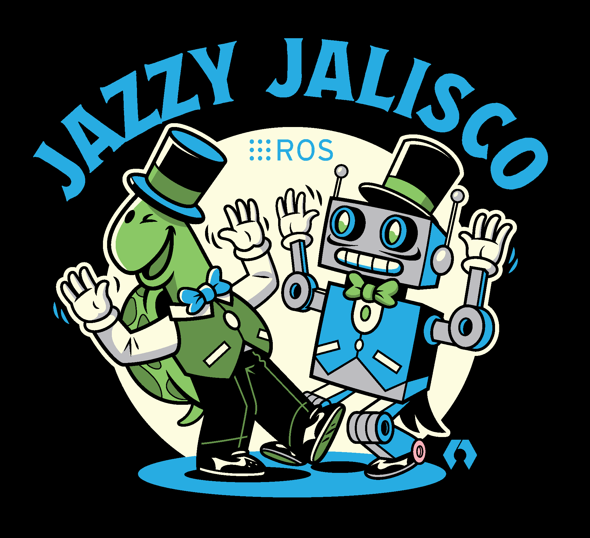
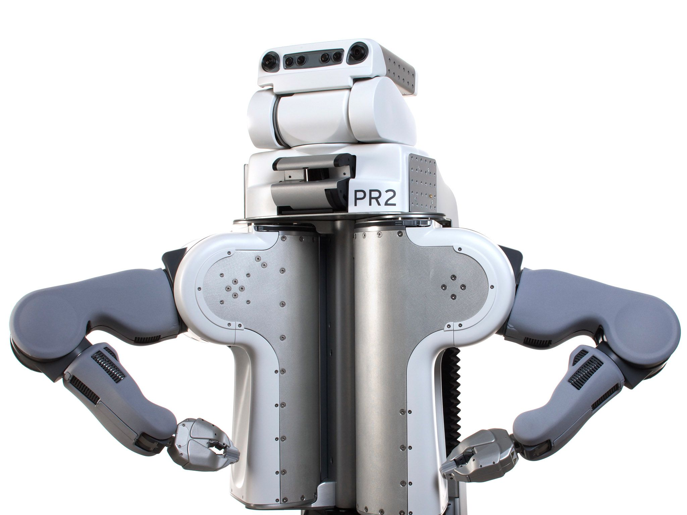
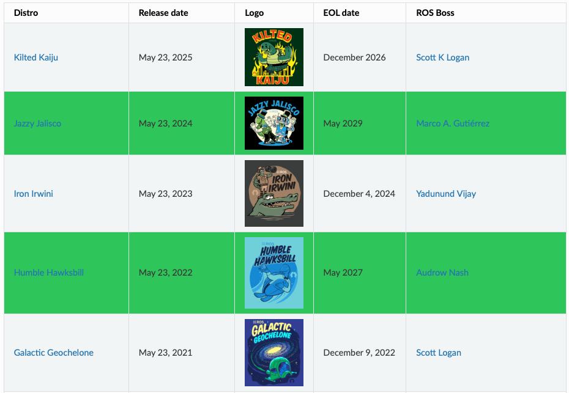
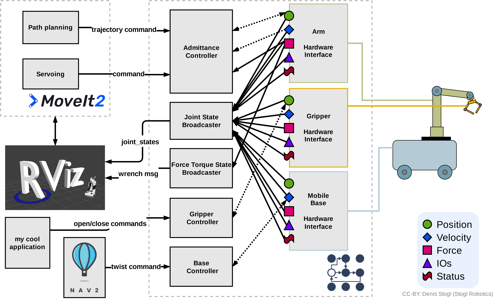
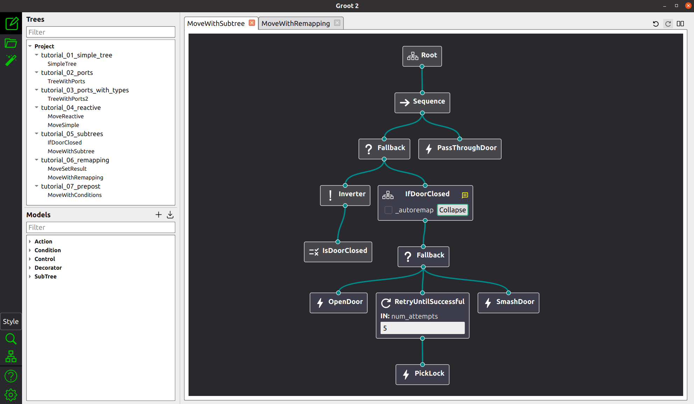

<style>
    footer {
        text-align: right;
        margin-right : 50px;
    }
    

</style>

<!-- _class: lead -->
<!-- _paginate: false -->
<!-- _footer: "" -->
 

# Workshop ROS 2  

## Introduction à l’écosystème

Etienne Schmitz



---

## 📄 Table des matières

1. [🌐 ROS 2 : un écosystème open-source pour la robotique](#3)
2. [🕸️ Ecosystème de ROS 2](#18)
3. [🧠 Concepts de base ROS 2](#30)
4. [🗂️ Organisation d’un projet ROS 2](#40)
5. [🔧 TP - Journée 1](#50)

---

<!-- _class: lead -->

# 🌐 ROS 2 : un écosystème open-source pour la robotique

---
## 🤖 Qu’est-ce que ROS 2 ?

**ROS 2 (Robot Operating System 2)** est un **middleware open-source** conçu pour **accélérer** et **simplifier** le développement de systèmes robotiques complexes.

🔧 Au lieu de créer un SDK spécifique pour chaque robot, ROS 2 propose une **infrastructure modulaire, unifiée et réutilisable**, adaptée à une grande variété de projets.
Il est utilisé dans de nombreux domaines :
- 🧪 **Recherche** et prototypage rapide  
- 🏭 **Industrie** (robotique collaborative, automatisation)  
- 🚗 **Véhicules autonomes**, drones, AMR  
- 🦾 **Bras manipulateurs** et robots de service

> ROS 2 est un **socle logiciel commun** pour concevoir, tester et déployer des systèmes robotiques avancés.

--- 

## Les principales fonctionnalités de ROS 2

- 🧰 **Bibliothèques** : communication inter-processus, calcul de trajectoires, asservissement moteur, gestion des capteurs, etc.  
- 🖥️ **Applications** : simulation physique (*Gazebo, Ignition*), visualisation de données (*RViz*), enregistrement et rejeu de données (*rosbag*), outils de débogage, etc.  
- 📐 **Conventions** : standardisation des formats de représentation des robots (*URDF, SDF*), des capteurs, des actionneurs, des messages et des services.  
- 🌍 **Communauté** : large base de composants open-source, documentation abondante, forums d'entraide, tutoriels et vidéos pédagogiques.

---
## 📜 Historique de ROS



- 🛠️ **2010** : Lancement de **ROS 1** par *Willow Garage*, initialement conçu pour le robot **PR2**.  
- 🏭 **2012** : Lancement de **ROS-Industrial** : adaptation de ROS aux besoins de l’**industrie**.
- 🏛️ **2012** : Création de la **OSRF (Open Source Robotics Foundation)** — aujourd’hui **Open Robotics**, organisme gérant le développement de ROS.
- 🚀 **2017** : Lancement de **ROS 2**, une réécriture complète pour répondre aux **limitations de ROS 1** (temps réel, sécurité, fiabilité, middleware DDS...).


---

## De ROS 1 à ROS 2 : une nouvelle architecture

**ROS 2** est une **réécriture complète** de ROS 1, conçue pour répondre aux besoins modernes de la robotique :

- ⏱️ **Temps réel** mieux géré grâce au middleware **DDS**
- 🔐 **Sécurité** renforcée
- 🧩 **Modularité** accrue, architecture plus propre
- ⚙️ **Performance** optimisée pour les systèmes distribués
- ↔️ Architecture passée de **centralisée (ROS 1)** à **distribuée (ROS 2)**

> ⚠️ **Compatibilité limitée** : ROS 2 n’est **pas rétrocompatible** avec ROS 1.  
Des *bridges* existent, mais un package ROS 2 **ne peut interagir qu’avec ROS 2**.


---

## 🧱 Distributions - ROS 2

ROS 2 évolue par **distributions annuelles**, nommées comme Ubuntu :  
➡️ **Adjectif + nom propre**, dans l’ordre alphabétique (ex. *Iron Irwini*, *Jazzy Jalisco*).

📆 Tous les **2 ans**, une version **LTS (Long Term Support)** est publiée, avec un support de 5 ans.

📦 La plupart des packages ROS 2 sont nommés comme ceux de ROS 1, avec le suffixe **2** :  
→ `MoveIt` devient [**MoveIt 2**](https://moveit.ai)
→ `move_base` devient [**Nav2**](https://nav2.org),  

⚠️ **ROS 1 est en fin de vie** : sa dernière version, [**Noetic Ninjemys**](https://wiki.ros.org/noetic), est maintenue jusqu’en **mai 2025**.

--- 

## Distributions - ROS 2

- **Lyrical Luth** *(prévue pour 2026 – LTS)* : prochaine version à support long terme  
- [Rolling Ridley](https://docs.ros.org/en/rolling/Releases/Release-Rolling-Ridley.html) : version à **développement continu**, toujours à jour, mais non stable ([REP 2002](https://www.ros.org/reps/rep-2002.html)).



---

## ROS Enhancement Proposals (REP)

Les **REP** sont des documents qui définissent les standards, conventions et évolutions de ROS (inspirés des **PEP** de Python). Ils sont utilisés pour :
- 📦 l’organisation des distributions et des packages  
- 📨 les formats de messages, fichiers et conventions de nommage  
- 🔧 les évolutions du middleware (DDS, RMW, etc.)

📄 Exemples :
- [REP 2000](https://www.ros.org/reps/rep-2000.html) : politique de publication  
- [REP 2002](https://www.ros.org/reps/rep-2002.html) : distribution *rolling*  
- [REP 2011](https://www.ros.org/reps/rep-2011.html) : format des messages ROS 2

> 🧠 Les REPs assurent une **gouvernance ouverte** et une **cohérence technique**.

---

## ✅ Avantages de ROS 2

- ⏱️ **Gain de temps d’ingénierie** grâce à des briques logicielles existantes et éprouvées  
- 🧰 **Écosystème riche** : outils compatibles, bibliothèques, standards reconnus  
- 🧩 **Architecture modulaire** : composants interchangeables, dette technique réduite  
- 🔗 **Interopérabilité** : intégration facilitée via des formats standardisés (URDF, messages, etc.)  
- 🚀 **Facilité d’extension** : matériel ou logiciel, pour intégrateurs ou chercheurs  
- 🔓 **Liberté vis-à-vis des fournisseurs** : pas de **vendor lock-in**  
- 🤝 **Support communautaire** (forums, GitHub) et **support professionnel** (Open Robotics, intégrateurs)

---

## ⚠️ Limites et inconvénients de ROS 2

- 🧱 **Standards parfois trop rigides** pour des cas spécifiques ou atypiques (ex : Robocup SSL)  
- 📘 **Courbe d’apprentissage** non négligeable, surtout pour les débutants  
- 🐧 **Compatibilité limitée hors Linux** : Docker, Windows, macOS partiellement pris en charge  
- 🔄 **Évolution rapide** : certaines APIs deviennent vite obsolètes → veille technique nécessaire

---

## 💬 Langages supportés par ROS 2

ROS 2 prend en charge plusieurs langages, avec deux **langages officiels** (les plus documentés dans l’écosystème ROS 2):

- 🐍 **Python** (`rclpy`)  
  → Simple, rapide à écrire, idéal pour les **scripts**, le **prototypage**, et les **démos pédagogiques**
- ⚙️ **C++** (`rclcpp`)  
  → Plus performant, utilisé pour les **drivers**, **nœuds critiques** et les applications industrielles

> D’autres langages sont disponibles via des **bindings** tels que 🦀 **Rust** (`rclrs`), ☕ **Java**, ⚙️ **Ada**, et autres langages spécialisés.

--- 

## 🤖 Types de robots compatibles avec ROS 2

ROS 2 est conçu pour une **grande variété de plateformes robotiques** :

- 🚗 **Robots à roues** : AGV, AMR, véhicules autonomes
- 🚁 **Robots volants** : drones, UAV
- 🤖 **Cobots** et **bras manipulateurs** industriels
- 🦿 **Robots à pattes** et humanoïdes
- 📡 **Capteurs ou actionneurs autonomes** intégrés à un réseau ROS


Pour qu’un robot fonctionne avec ROS, il doit disposer d’un **driver ROS**  développé par le **constructeur**, un **laboratoire** ou la **communauté open-source**.

🔗 Découvrez les robots compatibles ROS : [robots.ros.org](https://robots.ros.org)

---

## RMW : le cœur des communications ROS 2

ROS 2 repose sur une couche appelée **RMW (ROS Middleware Interface)**, qui agit comme un **traducteur universel** entre ROS 2 et le réseau.

- 📡 Gère la **communication entre les nœuds**, même sur plusieurs machines (Ethernet, Wi-Fi...)
- 🔁 Sert d’interface entre ROS 2 et un **middleware de transport** (DDS)

> 🧩 Grâce à RMW, ROS 2 est **modulaire**, **distribué** et prêt pour le **temps réel**.


---

## Les trois modes de communication ROS 2

Le middleware ROS 2 permet plusieurs types d’échange entre les nœuds :

- 📬 **Topics** : messages en mode **asynchrone** (publish/subscribe)  
  > Ex : `/scan` (LiDAR), `/cmd_vel` (commande moteur)

- 🔁 **Services** : **appel direct** avec réponse immédiate (requête / réponse)  
  > Ex : demander la position actuelle du robot

- 🎯 **Actions** : pour les **tâches longues** avec retour d’état régulier  
  > Ex : envoyer un robot à une position

> Ces mécanismes sont essentiels pour créer des systèmes robotiques interactifs.

---

## DDS : le moteur réseau de ROS 2

Sous RMW, ROS 2 utilise un middleware nommé **DDS (Data Distribution Service)**.
**DDS** est un **middleware réseau standardisé** qui permet à plusieurs programmes de **s’échanger des données en temps réel**.
Il est défini par l’**OMG** (Object Management Group) — l’organisme qui maintient aussi **UML** (Unified Model Language).


DDS apporte :
- 🛠️ **Qualité de service (QoS)** : fiabilité, fréquence, persistance…
- 🔒 **Sécurité** (`sros2`) : chiffrement, authentification, contrôle d’accès
- 🔄 **Interopérabilité** : choix entre plusieurs moteurs DDS (Fast DDS, Cyclone DDS…)

> ✅ Ces options font de ROS 2 une solution robuste, adaptée à la **robotique industrielle critique**.

---

# 🕸️ Ecosystème de ROS 2

---

## Gazebo – Simulation robotique

- Environnement de **simulation physique 3D** pour tester les robots virtuellement
- Supporte les capteurs (LiDAR, caméra, IMU…), moteurs, obstacles...

> 🎯 Permet de tester les algorithmes de navigation, contrôle et SLAM **sans robot physique**


--- 

## Visualisation – RViz et rqt*

- 🧭 **RViz** : visualiseur 3D interactif des données ROS (lidar, caméra, trajectoire, etc.)
- 🧩 **rqt*** : suite d’outils graphiques modulaires (rqt_graph, rqt_console, rqt_plot...)

🎯 Utile pour :
- Visualiser les capteurs en temps réel
- Comprendre les interactions entre nœuds
- Debuguer facilement son système ROS

--- 

## Foxglove Studio (Optionnel)

**Foxglove** est un outil moderne de visualisation de données ROS, alternatif ou complémentaire à RViz.

- Visualisation graphique de topics, logs, et messages en temps réel ou enregistrés
- Compatible ROS 2, WebSocket, rosbag2, JSON...
- Interface web ou application de bureau

🔗 [https://foxglove.dev](https://foxglove.dev)

---

## NAV2 – Navigation autonome

NAV2 (Navigation 2) est le système de navigation ROS 2, successeur de **move_base** (ROS 1).

- Construction de carte, localisation (AMCL), planification globale et locale
- Évitement d'obstacles
- Suivi de trajectoire jusqu'à une cible

> Utilisé pour les robots mobiles autonomes (AGV, AMR, drones au sol)

🔗 [https://nav2.org](https://nav2.org)

---
## MoveIt 2 – Manipulation robotique

- Planification de mouvement pour **bras manipulateurs** (cobots, robots industriels)
- Résolution de la cinématique inverse et collision checking
- Intégration avec perception (capteurs) et navigation

> Utilisé avec des robots comme UR, Franka Emika, Kinova, etc.

🔗 [https://moveit.ai](https://moveit.ai)


--- 

## ROS 2 Control – Boucles de contrôle temps réel

- Interface d'abstraction pour le **contrôle bas niveau** (moteurs, joints, capteurs)
- Séparation entre contrôleurs et interfaces matériel (hardware abstraction layer)
- Compatible avec MoveIt2, NAV2, etc.

> 🎯 Rendre le logiciel indépendant du modèle hardware du robot.

---



---

## Arbres de comportement (Behavior Trees)

- Modèle de décision basé sur une **arborescence d'actions**
- Remplace les machines à états (FSM) dans la navigation ou la manipulation
- Utilisé par **NAV2**, **MoveIt Task Constructor**, et d'autres projets
- Possibilité d'utiliser une UI (Groot 2)

🔗 [ROS2 Integration | Behavior Tree](https://www.behaviortree.dev/docs/ros2_integration/)



--- 

## 🌐 Projets connexes à ROS 2

ROS 2 est utilisé comme **socle logiciel** dans de nombreux projets spécialisés :

- 🚗 **Autoware** : middleware open-source pour la **conduite autonome** (voitures, navettes...)  
- 🏭 **ROS-Industrial** : adaptation de ROS aux besoins de la **robotique industrielle** (ABB, Fanuc, UR...)

> 🧩 ROS 2 alimente une **écosystème en pleine expansion** de projets open-source dans la robotique moderne.

---

## Des conventions partagées

ROS définit des **conventions communes** pour garantir l’interopérabilité :

- 📏 **Unités physiques** : mètre, seconde, radian, newton, etc. (SI)
- 📨 **Messages standardisés** : `geometry_msgs`, `sensor_msgs`, `std_msgs`, ...
- 🧩 **Nommage des topics/services** : `/joint_states`, `/scan`, `/cmd_vel`, ...
- 📂 **Formats descriptifs** : `URDF`, `SRDF`, `YAML` pour les paramètres

> Cela permet à tous les développeurs de "parler le même langage"

--- 

## Une boîte à outils du roboticien

Parmi les outils clés ROS :

- 🧩 **URDF** : description du robot (géométrie, liens, articulations)
- 🔄 **tf2** : transformations entre repères datées
- 🎥 **rosbag2** : enregistrement / rejeu de données
- 📈 **rqt_plot**, **PlotJuggler** : affichage temps réel de courbes
- 📊 **rqt_graph** : vue des nœuds et communications
- 🧭 **view_frames** : représentation des repères

> Outils légers, activables à la demande selon les besoins

--- 

# 🧠 Concepts de base ROS 2

---

## Nœuds

- Un **nœud** est une unité de calcul, typiquement un exécutable (C++, Python...)
- Chaque nœud exécute une tâche précise 
- Les nœuds communiquent entre eux via des **topics,** des **services** ou des **actions**

##### Exemple de système à 3 nœuds

- 🧠 **Nœud 1 (Python)** : Analyse de l’image de la caméra (OpenCV)
- 📍 **Nœud 2 (Python)** : Calcul de la trajectoire pour aller à l'objectif
- ⚙️ **Nœud 3 (C++)** : Pilotage des moteurs du robot

> Un système ROS 2 est composé de **plusieurs nœuds coopérants**

---


---

## 📨 Topics & Messages

Les **topics** sont des **canaux de communication asynchrones** entre les nœuds ROS.

🧭 Modèle **Publish / Subscribe** :
- 📨 Un ou plusieurs nœuds **publient** des messages sur un topic
- 📥 Un ou plusieurs nœuds peuvent **s’abonner** pour les recevoir


📷 **Exemple** :  
Le topic `/camera/image_raw` transporte des images au format :  
→ `sensor_msgs/msg/Image`

> ✅ Idéal pour les flux de données continus : capteurs, commandes, états du robot...

---


---

## 🔁 Services

Les **services** permettent une **communication synchrone** entre deux nœuds :  
📤 Une **requête** est envoyée → 📥 Une **réponse** est retournée.

🧭 Modèle **Client / Serveur** :
- Le **client** envoie une requête
- Le **serveur** traite et renvoie une réponse

📍 **Exemple** :  
Demander la **position actuelle** du robot ou changer un paramètre à la volée.

> ⚠️ Un service ne peut avoir **qu’un seul serveur**, mais **plusieurs clients** peuvent l’appeler.

---


---

## Actions

- Pour les **tâches longues** : navigation, manipulation...
- Basé sur 3 éléments :
  - 🎯 Un objectif
  - 🔄 Un retour intermédiaire (feedback)
  - ✅ Un résultat

📍 **Exemple** :  
Atteindre une destination en renvoyant l’avancement à chaque étape

---


---

## ⚙️ Paramètres

Les **paramètres** sont des **variables dynamiques** associées à un nœud ROS 2.

🔧 Ils permettent de **modifier le comportement** d’un nœud **sans changer le code**  
➡️ Accessibles via le code **ou** en ligne de commande (`ros2 param`)

📌 **Exemples de paramètres** :
- 🚀 Vitesse maximale autorisée
- 🤖 Nom du robot
- 🎮 Type de contrôleur utilisé

> ✅ Très utiles pour tester, ajuster ou déployer un système de manière flexible.

---

# 🗂️ Organisation d’un projet ROS 2

---

## 🗂️ Structure d’un projet ROS 2

Un projet ROS 2 est organisé de manière **modulaire et hiérarchique**, pour faciliter le développement collaboratif.

- 📦 Chaque **fonctionnalité** est placée dans un **package** ROS 2
- 📁 Ces packages sont regroupés dans un **workspace**
- 🧰 Le workspace permet de compiler, tester et lancer tous les packages ensemble

> 🔧 Cette structure encourage la **réutilisabilité**, la **clarté** et la **maintenance à long terme**.

---

## 📦 Packages ROS 2

Un **package** est l’**unité de base** d’un projet dans ROS 2.  
Il regroupe **tout ce qui est nécessaire** à une fonctionnalité robotique.

📁 Un package contient généralement :
- 🧠 Le **code source** des nœuds (Python ou C++)
- ⚙️ Les **fichiers de configuration** : `YAML`, fichiers `launch`, paramètres...
- 🧩 Les **ressources** : `URDF`, images, `rosbag`, scripts, etc.

> ✅ Un package ROS 2 est un **dossier structuré**, **versionnable**, et **réutilisable** dans d'autres projets.

---

## 🧱 Workspace ROS 2

Un **workspace** est un dossier qui regroupe vos **packages en développement**.  
C’est l’environnement dans lequel vous développez, compilez et testez vos fonctionnalités ROS 2.

📁 Un workspace typique contient :
- 📂 `src/` → vos **packages sources**
- ⚙️ `build/` → fichiers de **compilation**
- 📦 `install/` → **binaries** et exécutables
- 📝 `log/` → journaux de compilation et exécution

> ✅ Le workspace permet de **compiler, exécuter, tester** tous vos packages localement avec `colcon build` et `source install/setup.bash`.

---

## 🚀 Fichiers de lancement (launch files)

Les **fichiers launch** permettent de **lancer plusieurs nœuds ROS 2 à la fois**, avec leurs paramètres et configurations.

🧭 Ils sont écrits en **Python** (`.py`) et permettent :
- de démarrer plusieurs nœuds simultanément
- de charger des paramètres depuis des fichiers `YAML`
- de définir des arguments (nom de robot, namespace, etc.)

--- 

## 🚀 Fichiers de lancement (launch files)

📄 Exemple :
```python
from launch import LaunchDescription
from launch_ros.actions import Node

def generate_launch_description():
    return LaunchDescription([
        Node(
            package='my_robot',
            executable='controller_node',
            name='controller',
            parameters=['config/params.yaml']
        )
    ])
```

---

## 🌐 ROS_DOMAIN_ID — Isolation réseau des robots

ROS 2 utilise **DDS**, qui fonctionne par **multidiffusion** sur le réseau local.  
Pour éviter que plusieurs robots ou groupes se perturbent mutuellement, on utilise :

### 🔐 `ROS_DOMAIN_ID`

- C’est un **identifiant numérique** (entre `0` et `232`)  
- Il permet d’**isoler les communications DDS** sur un même réseau Wi-Fi
- Deux systèmes avec des `ROS_DOMAIN_ID` différents **ne communiquent pas entre eux**

---

### ✅ Bonnes pratiques

- Chaque groupe de travail ou robot doit avoir un **ROS_DOMAIN_ID unique** 
- Le même `ROS_DOMAIN_ID` doit être défini sur **le robot et le PC**

🔧 Exemple à ajouter dans `~/.bashrc` :

```bash
export ROS_DOMAIN_ID=12
```

> 🛑 Ne pas utiliser le même numéro que les autres groupes dans la salle (si réseau commun)

---

## 🖥️ La CLI ROS 2 (`ros2`)

ROS 2 fournit une **interface en ligne de commande (CLI)** puissante pour interagir avec l’écosystème :

🧰 Commande principale :  
```bash
ros2 <commande> [options]
```

> ✅ Idéal pour **inspecter**, **tester**, **lancer** ou **déboguer** des éléments ROS 2 directement en terminal.

---

## 🔧 Commandes courantes

| Catégorie     | Exemple                              | Description                                 |
|---------------|--------------------------------------|---------------------------------------------|
| 📦 Packages    | `ros2 pkg list`                     | Liste tous les packages installés           |
| 🧠 Nœuds       | `ros2 node list`                    | Liste les nœuds actifs                      |
| 📨 Topics      | `ros2 topic echo /scan`             | Affiche les messages publiés sur un topic   |
| ⚙️ Paramètres  | `ros2 param list`                   | Liste les paramètres d’un nœud              |
| 🔁 Services    | `ros2 service list`                 | Liste les services disponibles              |
| 🎯 Actions     | `ros2 action list`                  | Liste les actions disponibles               |
| 🧪 Diagnostic  | `ros2 doctor`                       | Diagnostique l’installation ROS 2           |

---

## 🔧 Travaux pratiques

- [Installation ROS 2 - Jazzy (PC)](https://ros2.etienne-schmitz.com/docs/install/pc)
- [TP 1 - Introduction ROS 2](https://ros2.etienne-schmitz.com/docs/introduction/tp)
- Si vous avez le temps, débuter la deuxième journée par l'installation du robot [TurtleBot 3](https://ros2.etienne-schmitz.com/docs/install/turtlebot).

---

# Liens utilisés

- Image RVIZ : Pütz, Sebastian & Wiemann, Thomas & Hertzberg, Joachim. (2019). Tools for Visualizing, Annotating and Storing Triangle Meshes in ROS and RViz. 1-6. 10.1109/ECMR.2019.8870953. 
- [ROS 2 Architecture Overview](https://automaticaddison.com/ros-2-architecture-overview/)