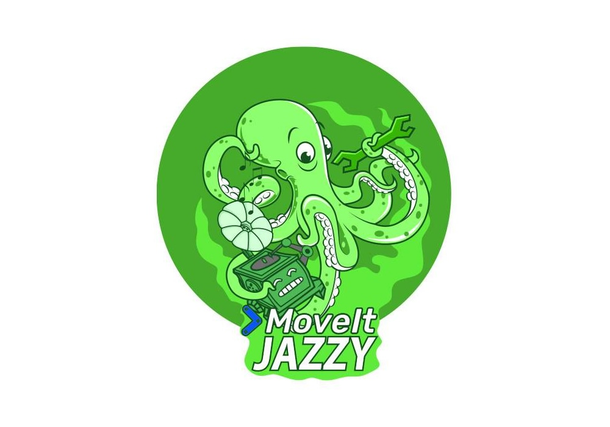
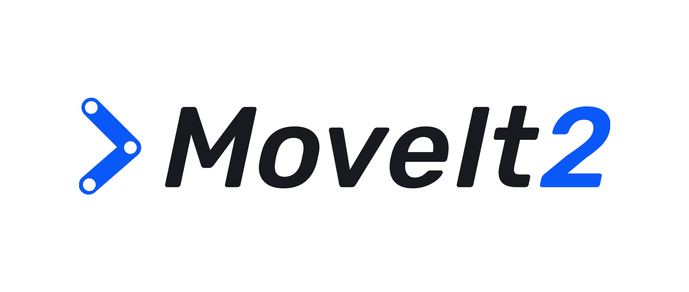
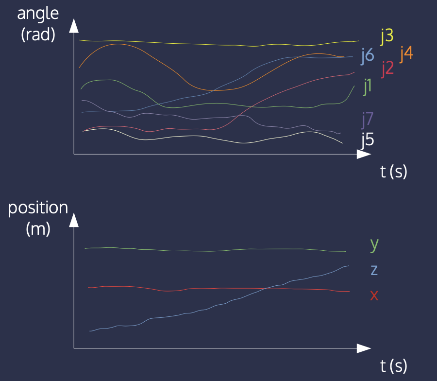
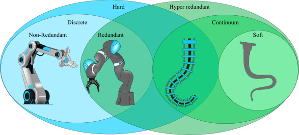
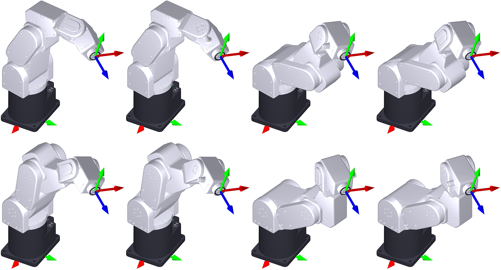
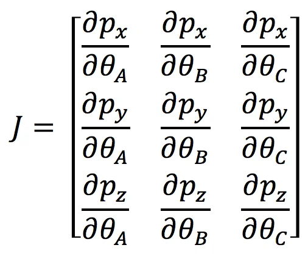
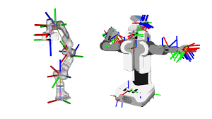
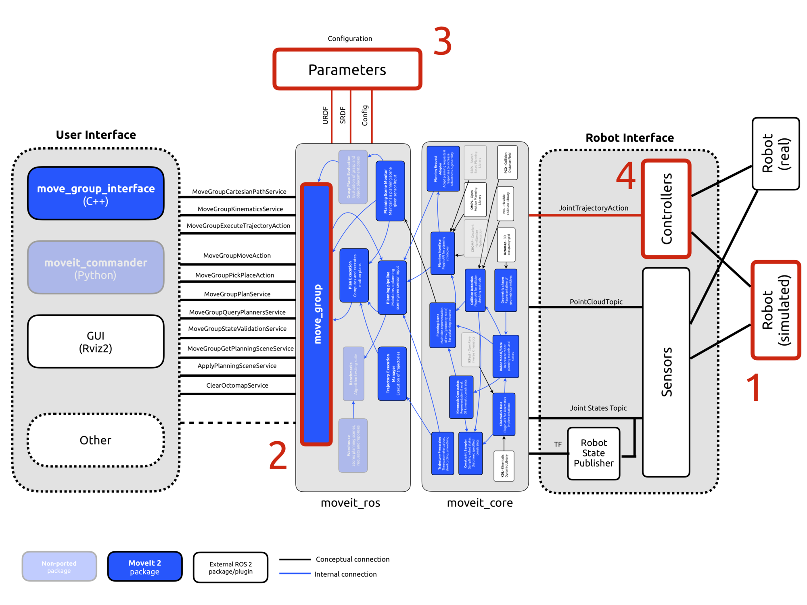

<!-- _class: lead -->
<!-- _paginate: false -->
<!-- _footer: "" -->
 
# Workshop ROS 2  
## Manipulation

Etienne SCHMITZ

---

## Qu'est-ce que MoveIt 2 ?

MoveIt 2 est une **boîte à outils ROS 2** pour :
- La **cinématique** (directe et inverse)
- La **planification de trajectoire**
- L’**évitement d’obstacles**
- Le **contrôle de bras robotisés**
- L’**interface avec des capteurs** (vision, feedback)

---

## Pourquoi MoveIt 2 pour la manipulation ?

- Centralise tous les outils nécessaires pour manipuler un robot articulé
- Intègre des solveurs puissants : FK, IK, OMPL
- Facilement utilisable avec RViz et Gazebo
- Compatible avec plusieurs robots : bras, humanoïdes, AMR...

---

# 🦾 Bras robotique : DDL, joints, espace des joints

---

## 🔧 Définition d’un joint

Un **joint** (ou **axe**) permet un mouvement **angulaire** (rotation) ou **linéaire** (translation).

Il peut être commandé :
- en **position** :  
  $\theta = \frac{\pi}{2}$ rad
- en **vitesse (vélocité)** :  
  $\omega = \frac{\pi}{4}$ rad/s
- en **couple (torque)** :  
  $\tau = 2$ Nm

Chaque joint apporte un **Degré De Liberté** (DDL)

---

## 🌐 Espace des joints vs espace cartésien

- **Espace des joints** = angles ou positions des axes (variables internes)
- **Espace cartésien** = position et orientation de l’effecteur (sortie)

---

## 🤖 Redondance d’un robot

Un bras est **redondant** s’il possède **plus de degrés de liberté (DDL)** que nécessaire pour atteindre une position + orientation dans l’espace.

🧭 En 3D :
- 3 DDL pour la position (x, y, z)
- 3 DDL pour l’orientation (roll, pitch, yaw)
→ **6 DDL requis**

🔧 Donc :
- Bras à **6 DDL** = juste ce qu’il faut de DDL
- Bras à **7+ DDL** = **redondant**

---

## ✅ Avantages des bras redondants

- Génèrent **une infinité de solutions IK**
- Permettent de **choisir** une configuration optimale selon :
  - 🛑 Évitement d’obstacles  
  - 💪 Minimisation des efforts  
  - ⚙️ Contraintes mécaniques (souplesse, amplitude)

 

---

## ⚠️ Singularités d’un bras robotique

🗨️ **Définition** :  
Une **singularité** est une **configuration particulière** du robot où l’on **perd un degré de liberté** pour contrôler l’effecteur dans l’espace cartésien.

### 🧭 Types de singularités

- 🔹 **Singularité de position** : Impossible de déplacer l’effecteur selon une certaine **translation**
- 🔹 **Singularité d’orientation** : Impossible de faire tourner l’effecteur autour d’un axe donné
- 🔹 **Singularité cinématique** :  Le robot devrait bouger un joint à **vitesse infinie** pour maintenir la trajectoire.
⚠️ La **matrice jacobienne n’est plus inversible**

---

# 🔁 Cinématique directe (FK) vs inverse (IK)

---

## 🧭 Cinématique directe (FK)

**FK (Forward Kinematics)** :  
On connaît les angles des joints → on calcule la position et l’orientation de l’effecteur.

✅ **Unique** solution

Exemple :  
- $\theta_1$, ..., $\theta_7$ → position cartésienne $(x, y, z, \alpha, \beta, \gamma)$

---

## 🎯 Cinématique inverse (IK)

**IK (Inverse Kinematics)** :  
On connaît la position cible de l’effecteur → on cherche les angles des joints.

⚠️ **Résolution complexe :**

- Il peut y avoir **plusieurs solutions** valides
- Il peut **ne pas y avoir de solution** si :
  - 🔸 la cible est **en dehors de l’espace de travail** du robot
  - 🔸 la **forme du robot** ne permet pas d’atteindre la cible
  - 🔸 la **configuration actuelle** mène à une **singularité**

---

 

---

## 🧠 Choix d'une solution d'IK

Quand plusieurs solutions existent, on choisit celle qui :

- Respecte des contraintes secondaires (évitement d’obstacles, effort minimal)
- Fait partie de l’**espace nul** : l’ensemble **des configurations de joints** possibles permettant d’atteindre **le même point cartésien**.

---

# 🧠 Résolution de l’IK : méthodes

---

## 🔬 Méthode analytique

- Résolution exacte par équations trigonométriques
- Rapide et précise
- ⚠️ Difficile à généraliser sur les robots complexes

---

## 🧮 Méthode numérique

- Utilise la **matrice jacobienne**
- Trouve une solution approchée
- Par optimisation (descente de gradient, moindres carrés...)
- ⚠️ Peut échouer près des **singularités**

---

## 🤖 Par apprentissage et IA

- Réseaux de neurones entraînés à résoudre l’IK
- Potentiellement rapide et généralisable
- ⚠️ Nécessite beaucoup de données d’entraînement

---

# Modélisation et représentation du robot dans ROS 2

---

## 🧾 URDF : Description structurelle du robot

Le fichier **URDF** (*Unified Robot Description Format*) est un fichier **XML** qui décrit un robot :

- 🔗 Liste des **liens** (segments) et **joints** (articulations)
- 📦 Formes géométriques (box, cylinder, sphere) ou **meshes**
- 🧱 Modèle **visuel** et **collision**
- 🔄 Compatible avec les simulateurs (RViz, Gazebo, MoveIt…)

### 🔧 Extensions

- **Xacro** : version paramétrée de l’URDF (génère du XML)
  - Permet les **variantes**, **boucles**, **inclusions**
- Publié sur le topic :  `/robot_description`

---

## 🧠 SRDF : Description sémantique

Le fichier **SRDF** (*Semantic Robot Description Format*) complète l’URDF avec des informations **utiles à la planification** :

### 📚 Contenu du SRDF

- 🤖 **Groupes de joints**  (ex : bras droit, base mobile, pince…)
- 🧍‍♂️ **États prédéfinis**  (ex : bras replié, pince ouverte…)
- 🎯 **Effecteurs finaux**  (gripper, ventouse, outil...)
- 🌍 **Joints virtuels**  (connexion entre le robot et le monde)
- 🚫 **Collisions désactivées**  
  - Liens **toujours en contact**
  - Collisions **géométriquement impossibles**

---

## 🧭 L’arbre de transformations `tf2`

Le module `tf2` permet de gérer dynamiquement les **relations spatiales** (position + orientation) entre tous les objets et parties d’un robot.

---
## 🔁 Ce que fait `tf2`

- Gère les **changements de repère** :
  - entre les **liens du robot** (épaule, coude, pince…)
  - entre le robot et les **objets de la scène** (table, cible, capteur…)

- Garde un **petit historique dans le temps** :
  - pour savoir **où était un objet il y a quelques secondes**
  - ou pour **compenser un décalage temporel** (ex. avec un capteur)

---

# Planification de trajectoires : OMPL 

---

## 🧭 OMPL : Open Motion Planning Library

OMPL est une **bibliothèque d’algorithmes de planification de trajectoires**.

Elle est utilisée pour trouver un **chemin valide** entre deux positions d’un robot, en **évitant les obstacles**.

➡️ OMPL est intégrée directement dans **MoveIt 2**

---

## ⚙️ Que fait OMPL ?

- Cherche une **trajectoire réalisable** entre une position de départ et une cible
- Respecte les **limitations du robot** (longueur, collisions, etc.)
- Utilise des **algorithmes de planification** :

🧠 Exemples :
- RRT (Rapidly-exploring Random Trees)
- PRM (Probabilistic Roadmap)
- KPIECE, LBTRRT, EST...

Certains sont **aléatoires** → ils ne donnent pas toujours le même résultat.

---

## 🤖 MoveIt 2 : planification de mouvement

MoveIt 2 est une boîte à outils complète pour la **manipulation robotique**.

Il s’appuie sur :
- l’URDF + SRDF du robot
- `tf2` pour connaître les positions
- **OMPL** pour planifier les trajectoires
- RViz pour visualiser et interagir
- ROS 2 pour exécuter les mouvements

---

---

## 🔁 Le pipeline de MoveIt 2

1. 🔢 L’utilisateur donne un objectif (pose cible)
2. 🧠 MoveIt utilise **OMPL** pour trouver un chemin
3. ✅ Le chemin est **validé** (sans collision)
4. ⚙️ Il est **converti en commandes**
5. 🤖 Le robot **exécute** le mouvement

---

## 🤖 `move_group` : le cœur de MoveIt 2

`move_group` est le **nœud principal** de MoveIt 2.  
Il agit comme un **chef d’orchestre** qui coordonne tous les composants de la planification et du mouvement du robot.

### 🧠 Que fait `move_group` ?

- Reçoit les **objectifs** de mouvement (position, orientation, état cible…)
- Utilise **OMPL** pour planifier une trajectoire
- Vérifie la **validité** du chemin (collisions, limites…)
- Envoie les **commandes de mouvement** au robot

---

## 🛰️ Interfaces exposées (MoveIt! 2)

- **Topics** : pour écouter ou publier des infos (états, plans…)
- **Services** : pour des actions ponctuelles (planifier, arrêter, etc.)
- **Actions** : pour exécuter des trajectoires de manière asynchrone

---

## 🔧 Travaux pratiques

- [TP 3 - Manipulation ROS 2](https://ros2.etienne-schmitz.com/docs/manipulation/tp)
- Continuer la journée [Navigation](https://ros2.etienne-schmitz.com/docs/navigation) s'il y a eu des problèmes.

---- 

## Ressources 

- [https://mecademic.com/fr/connaissance/tutoriels-academiques/quelles-sont-les-singularites-dans-un-bras-robotique-a-six-axes/](https://mecademic.com/fr/connaissance/tutoriels-academiques/quelles-sont-les-singularites-dans-un-bras-robotique-a-six-axes/)