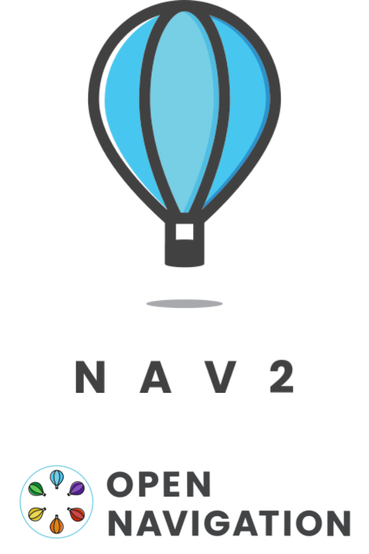
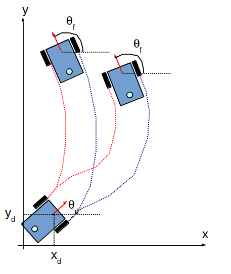
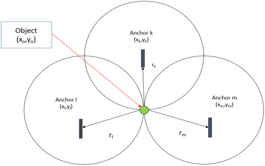
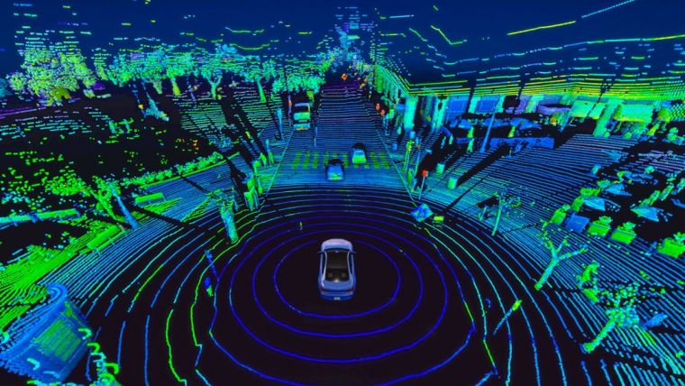
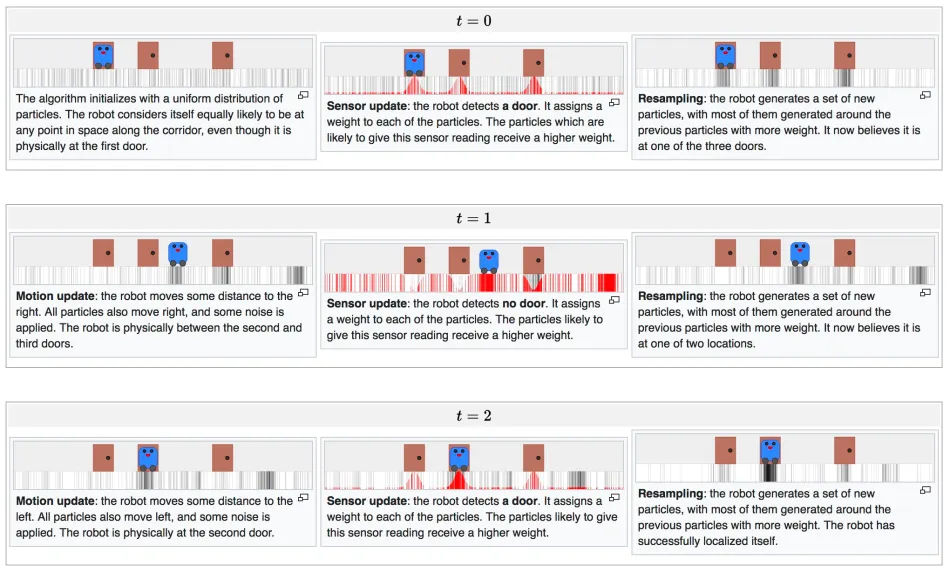
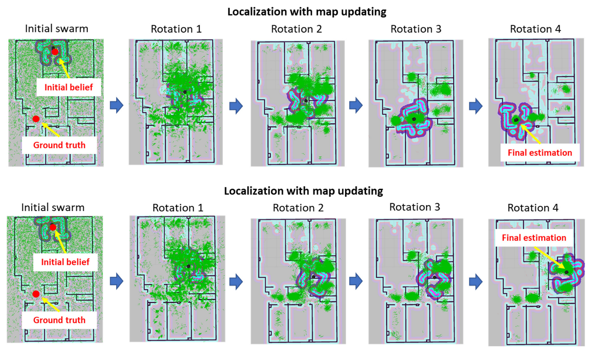
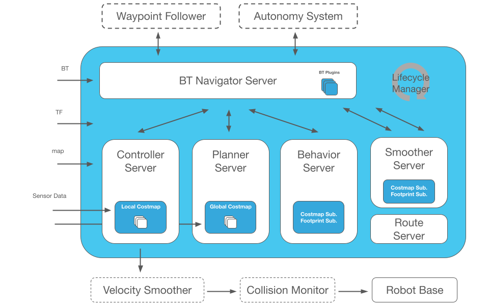
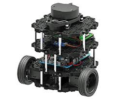

<!-- _class: lead -->
<!-- _paginate: false -->
<!-- _footer: "" -->
 
# Workshop ROS 2  
## Navigation

Etienne SCHMITZ

---

## 🚶‍♂️ Pourquoi un robot doit-il savoir naviguer ?

🎯 Pour **accomplir une mission** dans un environnement réel :

- Livrer un colis 🧺  
- Nettoyer une pièce 🧹  
- Explorer un lieu inconnu 🗺️  
- Suivre une personne 👣

### 🚧 Problème à résoudre

- Où suis-je ? (**localisation**)
- Où aller ? (**planification**)
- Comment y aller sans heurter d’obstacles ? (**contrôle et perception**)

---

## ✅ Solution : Nav2 - La stack de navigation ROS 2

- 🧠 Se localiser (SLAM / AMCL)
- 🗺️ Créer ou utiliser une carte
- 📦 Planifier un chemin (global & local planner)
- 🤝 Utiliser les capteurs (LIDAR, IMU, odométrie, etc…)

--- 

# 🔍 Localisation : capteurs et principes

---

## 🧭 IMU (Inertial Measurement Unit)

- Mesure les **vitesses angulaires** (gyroscope)
- Mesure les **accélérations linéaires** (accéléromètre)
- Peut inclure un **magnétomètre** (champ magnétique)

> ⚠️ L’IMU dérive rapidement : elle est utile pour des mouvements courts ou pour stabiliser des fusions de capteurs.

### 🎛️ Dans une IMU numérique typique :
- 1x Gyroscope
- 3x Accéléromètres linéaires
- 3x Magnétomètres

---

## ⚙️ Odométrie

- Combine les données de l’**IMU** et des **encodeurs de roues**
- Fournit une estimation **continue** de la position du robot
- ⚠️ **Erreur cumulative** : la position devient de moins en moins fiable avec le temps

> Utilisée seule, l’odométrie ne suffit pas pour naviguer précisément à long terme. Elle doit être **fusionnée avec d'autres capteurs** (GPS, LIDAR, etc.)

---

## 🧭 Multilatération (2D / 3D)

- Estime la position en mesurant les **distances** entre le robot et plusieurs **stations fixes** (3 pour une localisation 2D, 4 pour une localisation 3D)
- 🎯 Plus les distances sont précises, plus la position estimée est fiable

> ⚠️ Ne pas confondre avec la **triangulation**, qui utilise des **angles** plutôt que des distances  
> ⚠️ Méthode sensible aux **réflexions de signal** (rebonds, interférences)

---

## 📍 GPS-RTK — Real Time Kinematic

- Améliore le GPS classique en combinant les données avec une **station de référence au sol**
- Fournit une localisation **absolue avec précision centimétrique**
- Fonctionne en **temps réel** via un lien de communication (radio, 4G, etc.)
- ❗ Nécessite une zone **dégagée extérieure**, sans obstacle

> ✅ Très utilisé en **robotique agricole**, en **topographie**, et sur les **véhicules autonomes**

---

## 📶 Multilatération UWB (Ultra Wide Band)

- Principe similaire au GPS-RTK, mais en **intérieur**
- Utilise plusieurs **ancres UWB fixes** dans l’environnement
- Le robot mesure les **temps de vol** du signal pour estimer sa position

> 📏 Précision : ±10 à 30 cm

### ⚠️ Limites
- Sensible aux **réflexions du signal**
- Moins fiable dans des environnements métalliques ou encombrés

> ✅ Idéal pour les **usines**, **entrepôts** et **espaces indoor contrôlés**

---

## 🔦 LIDAR — Light Detection and Ranging

- Utilise un **laser** pour mesurer des **distances** à l’environnement
- Retourne une carte de **profondeur** (2D ou 3D selon le modèle)

### 🧰 Types de LIDAR
- 📍 Fixe
- 🔁 Rotatif à 360° (mono-faisceau)
- 🌐 Multi-beam rotatif (3D)

### 🛠️ Usages typiques
- Détection d’obstacles
- Cartographie (SLAM)
- Suivi de murs ou de personnes

--- 
## 🌐 LIDAR multi-beam

### 🔍 Fonctionnement
- Superpose plusieurs **faisceaux verticaux et horizontaux**
- Fournit une **perception 3D dense** de l’environnement

### ✅ Avantages
- Très précis pour l’**évitement d’obstacles 3D**
- Permet une compréhension fine de la **scène autour du robot**

--- 

# 🧭 Techniques de localisation en ROS 2

---

## 🗺️ SLAM — Simultaneous Localization and Mapping

- Permet à un robot de :
  - 📍 Se **localiser**
  - 🗺️ **Construire une carte** de l’environnement inconnu
- Utilisé lors de la **première exploration**
- Fonctionne avec :
  - 🔦 LIDAR (2D ou 3D)
  - 📷 Caméras (RGB-D, stéréo)
  - ⚙️ Odométrie (IMU, encodeurs)

> 📌 SLAM = **Localisation + Cartographie simultanées**  

--- 

## 📍 AMCL — Adaptive Monte Carlo Localization

- Permet de se **localiser dans une carte existante**
- Utilise un **filtre à particules** :
  - Estime la position à partir de plusieurs hypothèses
- Combine :
  - 🔦 LIDAR
  - ⚙️ Odométrie
  - 🧭 IMU

> 📌 Nécessite une **carte déjà construite** (ex : par SLAM)  
> 🔗 [Ressource : Méthode de Monte Carlo – Wikipédia](https://fr.wikipedia.org/wiki/Méthode_de_Monte-Carlo)

---

## 📍 AMCL - Exemples (robot 1-D)

---

## 📍 AMCL - Exemples (robot 2-D)

---

# 🗺️ NAV 2 - Framework de navigation de ROS 2

---

## 🚀 Navigation ROS 2 — Présentation de la stack Nav2

La stack **Nav2** est un composant **essentiel** de ROS 2 pour permettre à un robot de **naviguer de manière autonome** dans un environnement **inconnu ou non structuré**.

Elle fournit une **boîte à outils complète** combinant :

- 🗺️ **Planification de chemin** (global et local)
- 🛑 **Évitement d’obstacles dynamiques et statiques**
- 📡 **Traitement des données de capteurs** (LIDAR, odométrie, IMU...)
- 🧭 **Localisation et suivi de position** (SLAM, AMCL)
- ⚙️ **Exécution des mouvements** avec feedback

> Nav2 orchestre ces éléments pour permettre un comportement de **navigation intelligent et adaptable**.

--- 

##  📦 Structure interne de Nav2

---

## 🧠 Le BT Navigator Server

- Le **cœur** de la stack Nav2 : il orchestre les composants
- Utilise un **Behavior Tree (BT)** pour organiser les décisions
- Reçoit une cible → planifie, contrôle, adapte la trajectoire

> Il guide le robot du début à la fin de sa mission

---

## 🗺️ Le Planner Server

- Reçoit :
  - 📍 Position actuelle
  - 🎯 Objectif (destination)
- Calcule un **itinéraire optimal** :
  - Le plus court
  - En évitant les obstacles
  - Selon des critères spécifiques (couverture, sécurité…)

> 🔁 Envoie un **chemin global** à suivre

---

## ⚙️ Le Controller Server

- Transforme le **chemin global** en **mouvements précis**
- Contrôle les roues/moteurs
- Adapte les commandes en temps réel :
  - Obstacles imprévus
  - Glissements ou erreurs de trajectoire

> 🧭 Il garde le robot sur la bonne voie, même dans un environnement changeant

---

## 🔄 Comportements et ajustements

### 🎭 Behavior Server
- Réagit aux imprévus :
  - Robot bloqué ?
  - Obstacle soudain ?
- Lance des **comportements de récupération**
  - Reculer, changer de voie, réessayer

### ✨ Smoother Server
- Améliore le chemin reçu :
  - Courbes plus douces
  - Vitesse et direction réalistes

> Le robot se déplace de manière **fluide et intelligente**

---

## 🗺️ Global CostMap vs Local CostMap

### 🌍 Global CostMap
- Vue **globale** de l’environnement
- Générée à partir de la **carte statique** + obstacles connus
- Utilisée par le **Planner Server** pour calculer un chemin

### 🚧 Local CostMap
- Vue **locale**, autour du robot (ex : quelques mètres)
- Met à jour les **obstacles dynamiques** en temps réel (personnes, objets...)
- Utilisée par le **Controller Server** pour suivre et ajuster le chemin

> 📌 Les deux cartes sont complémentaires :  
> Le robot **planifie globalement** et **réagit localement**

---

## 🤖 TurtleBot3

- Plateforme mobile open-source compatible ROS 2
- Capteurs :
  - 🔦 LIDAR 2D pour la détection d’obstacles
  - ⚙️ Encodeurs pour l’odométrie
  - 🧭 IMU pour orientation et stabilisation

---

## 🔧 Travaux pratiques

- [Installation ROS 2 - Turtlebot](https://ros2.etienne-schmitz.com/docs/install/turtlebot)
- [TP 2 - Navigation ROS 2](https://ros2.etienne-schmitz.com/docs/navigation/tp)
