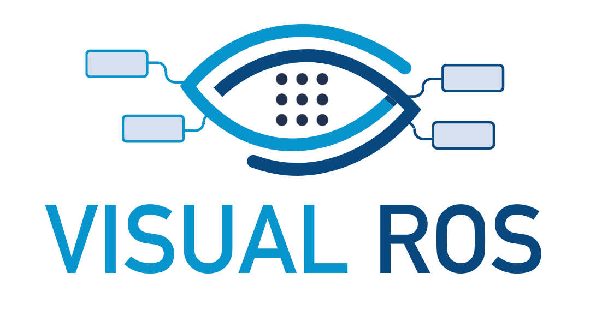
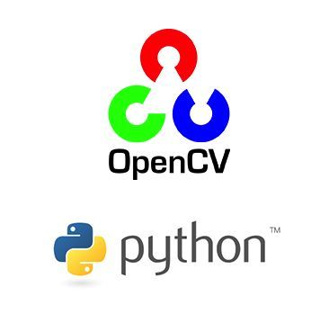

<style>
    footer {
        text-align: right;
        margin-right : 50px;
    }
    
    img[alt~="center"] {
        display: block;
        margin: 0 auto;
    }

    div.twocols {
        margin-top: 35px;
        column-count: 2;
    }
    
    div.twocols p:first-child,
    div.twocols h1:first-child,
    div.twocols h2:first-child,
    div.twocols ul:first-child,
    div.twocols ul li:first-child,
    div.twocols ul li p:first-child {
        margin-top: 0 !important;
    }
    
    div.twocols p.break {
        break-before: column;
        margin-top: 0;
    }
    div.center {
        display: block;
        margin: 0 auto;
    }
</style>

<!-- _class: lead -->
<!-- _paginate: false -->
<!-- _footer: "" -->
 
# Workshop ROS 2  
## Vision par Ordinateur et Apprentissage Profond

Etienne SCHMITZ



--- 

## 👁️ Qu’est-ce que la vision par ordinateur ?

La vision par ordinateur est une branche de l’intelligence artificielle qui permet à une machine de voir, analyser et comprendre le contenu d’une image ou d’une vidéo.

- 🔍 Analyse d’images et de vidéos pour en extraire des informations pertinentes
- 🤖 Applications variées : reconnaissance faciale, tri automatisé d’objets, conduite autonome, inspection industrielle
- 🧠 S’appuie sur :
    - Le traitement d’image (filtres, détection de contours...)
    - Les statistiques et l’apprentissage automatique
    - Les réseaux de neurones convolutifs (CNN) pour la reconnaissance de motifs

---

# OpenCV - Open Source Computer Vision

--- 

## Une boîte à outils pour voir le monde numérique

- 📷 Chargement, affichage et manipulation d’images et de vidéos
- 🎨 Traitement de couleurs, conversions d’espaces colorimétriques, filtres classiques
- 🔍 Détection de contours, formes, visages, mouvements
- 🧠 Intégration directe avec des modèles de Machine Learning et Deep Learning

> ⚙️ Multiplateforme : Python, C++, Java, compatible ROS / ROS 2
> Créé par Intel en 2000, aujourd’hui open-source sous licence Apache 2.0



--- 

## 🎨 OpenCV – Exemples d’usages concrets

- 🎯 Détection de couleur : BGR → HSV → masquage → seuil
- 🔲 Extraction de ROI : découpe dynamique dans l’image
- 🕵️ Détection de mouvement : cv.createBackgroundSubtractorMOG2()
- 🧭 Suivi d’objets : cv.calcOpticalFlowPyrLK() (optical flow)
- 🤖 ROS 2 : traitement en temps réel des flux caméra, intégration dans la stack robotique

> 🧪 OpenCV est la boîte à outils standard de vision pour les robots

--- 

## 🧱 OpenCV – Architecture & Modules principaux

- cv2.imgproc : traitements d’images (filtres, contours, morpho)
- cv2.highgui : affichage interactif, gestion des fenêtres
- cv2.video : traitement vidéo, optical flow, background subtraction
- cv2.dnn : importation de modèles IA (ONNX, Caffe, TensorFlow…)
- cv2.calib3d : vision 3D, stéréoscopie, calibrage de caméras
- cv2.aruco : détection de marqueurs fiduciaires
- ....

---
## 🧭 OpenCV – Origine et coordonnées de l’image

- 📍 L’origine des coordonnées est en **haut à gauche** : `(0, 0)`
- ↔️ L’axe **x** augmente vers la droite  
- ↕️ L’axe **y** augmente vers le bas  
- 🧮 L’image est stockée sous forme de **matrice NumPy** : chaque pixel est repéré par `(y, x)`

```bash
┌ x ─────────────┐
y 
│ 
│ 
│
│
│ 
└
```

--- 

## 🎨 OpenCV – Espaces de couleurs

<div style="text-align: center;">

  <table align="center">
    <tr>
      <th>Espace</th>
      <th>Description</th>
      <th>Usage</th>
    </tr>
    <tr>
      <td><strong>BGR</strong></td>
      <td>Format par défaut d’OpenCV</td>
      <td>À convertir pour affichage</td>
    </tr>
    <tr>
      <td><strong>RGB</strong></td>
      <td>Format classique (matplotlib)</td>
      <td>Affichage</td>
    </tr>
    <tr>
      <td><strong>HSV</strong></td>
      <td>Teinte, saturation, valeur</td>
      <td>Détection de couleur</td>
    </tr>
  </table>
</div>


```python
img_rgb = cv2.cvtColor(img_bgr, cv2.COLOR_BGR2RGB)
img_hsv = cv2.cvtColor(img_bgr, cv2.COLOR_BGR2HSV)
```

> 🎯 HSV facilite la segmentation de couleurs indépendamment de l’éclairage

---

# 🧠 PyTorch – Apprentissage profond

--- 

## 🔥 PyTorch – Réseaux de neurones en Python

- 🐍 Bibliothèque Python pour construire et entraîner des **réseaux de neurones**
- 🔬 Basée sur **Torch**, développée par Facebook AI Research (FAIR)
- 💡 Très utilisée en **recherche** et **production**
- 📦 Intègre un système de **tensors** dynamique (comme NumPy)
- ⚙️ Compatible CPU, GPU (CUDA) et TPUs

---

## 🏗️ Exemple : classification d’images (MNIST)

- 🖼️ Base MNIST : 70 000 images de chiffres manuscrits 28×28
- 🧠 Utilisation d’un **réseau convolutif (CNN)** pour extraire les motifs visuels
- 🎯 Objectif : prédire le bon chiffre (0–9)

```python
class CNN(nn.Module):
    def __init__(self):
        super().__init__()
        self.conv1 = nn.Conv2d(1, 10, 5)
        self.conv2 = nn.Conv2d(10, 20, 5)
        self.fc1 = nn.Linear(320, 50)
        self.fc2 = nn.Linear(50, 10)
```

---

## 🧠 Apprentissage supervisé – Étapes clés

- 📥 **Entrée** : `X` = images  
- 🎯 **Vérité terrain** : `Y` = classes connues (0 à 9 pour MNIST)
- 🤖 **Prédiction** du réseau : `Ŷ` = sortie du modèle (probabilités pour chaque classe)
- 📉 **Calcul de la perte** `Loss(Ŷ, Y)`  
  > mesure **à quel point le modèle se trompe**  (ex. : `CrossEntropyLoss` pour la classification)
- 🔁 **Rétropropagation** (*backpropagation*)  
  > calcul automatique du **gradient de l’erreur** pour chaque poids du réseau
- 🛠️ **Mise à jour des poids**  
  > par descente de gradient, l’optimiseur (Adam, SGD...) ajuste les paramètres

---

### 🔁 Qu’est-ce qu’une *epoch* ?

Une **epoch** = une **passation complète** sur **tout l'ensemble d'entraînement**

- ⚠️ Un seul passage n'est **pas suffisant** pour bien apprendre
- ✅ Le modèle est entraîné sur plusieurs **epochs** pour converger

> 💡 Exemple : 60 000 images → 10 epochs = 600 000 images vues au total

---

## 🔁 Résumé – Pipeline PyTorch (MNIST)

- 📥 Charger les données (images + labels)
- 🔧 Créer le modèle (réseau CNN)
- 📉 Définir la fonction de perte + optimiseur
- 🔁 Entraîner : boucle forward → loss → backward → step
- ✅ Évaluer le modèle sur de nouvelles images

---

## 🎯 YOLO – You Only Look Once

### Détection d’objets en **temps réel**

- 🧠 Réseau de neurones qui **prédit en une seule passe** :
  - ✅ Les **positions** (bounding boxes)
  - ✅ Les **classes** (personne, voiture, etc.)
  - ✅ La **confiance** (score de certitude)
- ⚡ Très rapide et précis : idéal pour la **robotique**, la **vidéosurveillance**, la **conduite autonome**

> 📦 YOLO peut être intégré dans OpenCV avec cv2.dnn ou utilisé via la bibliothèque ultralytics

--- 

# 🧪 Travaux Pratiques – Vision par Ordinateur

##### 🛠️ Option 1 — Activités guidées

- 🔍 [OpenCV](https://ros2.etienne-schmitz.com/docs/vision/tp/opencv) : traitement et extraction d’images de couleur
- 🧠 [PyTorch](https://ros2.etienne-schmitz.com/docs/vision/tp/ai) : entraînement d’un réseau pour classifier des chiffres

##### 🚀 Option 2 — Projet libre (créatif)

- 🎯 Détection d’objets avec **YOLO**
- 🖐️ Reconnaissance de gestes simples
- 🤖 Reconnaissance de symboles sur un plateau

> ✨ **Soyez curieux, testez vos idées, explorez des cas concrets !**
