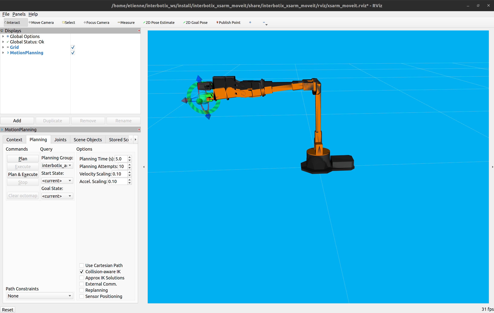

# Atelier - Manipulation avec ROS 2

Le bras robotisé WidowX-250 6DOF appartient à la famille des bras de la série X d'Interbotix, équipée des actionneurs DYNAMIXEL de la série X de Robotis.  
Les servomoteurs DYNAMIXEL XM430-W350 et DYNAMIXEL XL430-W250 offrent une haute résolution de 4096 positions et des paramètres PID définissables par l'utilisateur, ainsi que la surveillance de la température, le retour de position, les niveaux de tension, la charge et les paramètres de conformité accessibles à l'utilisateur. Au cœur du WidowX-250 6DOF se trouve le Robotis DYNAMIXEL U2D2 qui permet un accès facile au logiciel DYNAMIXEL Wizard ainsi qu'à ROS. Le WidowX-250 6DOF offre 6 degrés de liberté et une rotation complète de 360 degrés.

## 1. Comprendre la représentation d’un robot ROS

Un robot intégré à ROS est composé d’au minimum :
- un descripteur URDF
- un contrôleur qui gère les E/S avec le robot

#### 1.1. Comprendre le descripteur URDF

Pour visualiser l'URDF du robot `wx250s`, lancer la commande suivante : 
```bash
ros2 launch urdf_tutorial display.launch.py model:=/home/$USER/interbotix_ws/src/interbotix_ros_manipulators/interbotix_ros_xsarms/interbotix_xsarm_descriptions/urdf/wx250s.urdf.xacro
``` 

⚠️ Dans `Global Options`, mettez la valeur de fixed frame à `wx250s/base_link` au lieu de `base_link`.

Vous pouvez aussi visualiser l'arbre du robot URDF : 
```bash
cd /home/$USER/interbotix_ws/src/interbotix_ros_manipulators/interbotix_ros_xsarms/interbotix_xsarm_descriptions/urdf/
ros2 run xacro xacro -o wx250s.urdf wx250s.urdf.xacro
urdf_to_graphviz wx250s.urdf
``` 

Ouvrez le PDF obtenu dans le dossier des descriptions du robot (`wx250s.pdf`) puis déterminez :
* Que représentent les rectangles ?
* Que représentent les bulles ?
* Que représentent les flèches et surtout les valeurs `xyz` et `rpy` associées ?

#### 1.2 Comprendre les E/S du contrôleur

Lancer le robot avec la commande suivante : 
```bash
LC_NUMERIC=en_US.UTF-8 ros2 launch interbotix_xsarm_descriptions xsarm_description.launch.py robot_model:=wx250s
```

##### 1.2.a. Topics du robot

✍ Avec l’utilitaire `ros2 topic`, lister les topics disponibles puis consultez celui qui décrit l’état courant des joints, en particulier :
* Quel est son nom ?
* Quel est le type de message qu'il transmet ?
* A quelle fréquence (en Hertz) est-ce qu'il met à jour l'état des joints ?

##### 1.2.b. Services du robot

✍ Avec les utilitaires `ros2 service`, listez les services disponibles puis consultez celui qui met le robot en mode **compliant** (TorqueEnable). En particulier :

* Quel est le nom de topic du service mettant le robot en compliant ?
* Quel est le type de ce service ?
* Consultez le détail des champs. Quels sont les champs de la **requête** de ce service ?
* Consultez le détail des champs. Quels sont les champs de la **réponse** de ce service ?
* Appelez ce service pour activer et désactiver le mode compliant et essayez de faire bouger votre robot à la main à chaque fois. Que déduisez-vous de la signification du **mode compliant** ? *Conseil :* aidez-vous de l'autocomplétion avec la touche `TAB`.

#### 1.3 Tracer la courbe des positions des moteurs en temps réel

Lancer le robot avec la commande suivante :
```bash
LC_NUMERIC=en_US.UTF-8 ros2 launch interbotix_xsarm_descriptions xsarm_description.launch.py robot_model:=wx250s use_joint_pub_gui:=true
```

✍  Mettez votre robot en mode compliant. Démarrez `ros2 run rqt_graph rqt_graph`, démarrez le streaming `ROS Topic Subscriber`, et sélectionnez `/wx250s/joint_states`. Sélectionnez la position et la vitesse angulaire du moteur `m6` puis faîtes-les glisser sur le graphe. Bougez les moteurs à la main et vérifiez que les valeurs sont tracées en temps réel.


### 2. Cinématique, et planification avec MoveIt dans RViz

#### 2.1. Démarrer avec MoveIt avec un robot réel

Démarrez MoveIt et Gazebo avec la commande suivante :

```bash
LC_NUMERIC=en_EN.UTF-8 ros2 launch interbotix_xsarm_moveit xsarm_moveit.launch.py robot_model:=wx250s hardware_type:=gz_classic
```

Rviz doit démarrer avec un WidowX-250 6DOF en simulation gazebo.
.

#### 2.1.1. Planification

💻 Dans l'onglet Planning, section **Query** puis **Planning group**, sélectionnez le groupe `interbotix_arm`, bougez le goal (la sphère 3D bleue) en position et en orientation puis cliquez sur **Plan**.

✍ Une représentation orange 3D de robots se superposent avec le robot, déterminez son rôle de celui-ci eux en testant également la fonctionnalité **Plan and Execute**.

#### 2.1.2. Planning groups

💻✍ Testez également le groupe `interbotix_arm` en plus du premier `interbotix_gripper` et lancez des planifications de mouvement pour tester :

* Quelle est la différence entre ces 2 groupes ?
* Quel est le groupe pour lequel le goal est le plus facilement manipulable ?
* Pourquoi ce groupe est-il plus facilement manipulable que l'autre ?
* Déduisez-en ce que désigne exactement un `planning group`

#### 2.1.3. Interroger l'arbre des transformations `tf` en ligne de commande

Nous allons visualiser et interroger l'arbre des transformations nommé `tf`.

💻✍ Démarrer MoveIt puis dans un autre terminal lancer `ros2 run tf2_tools view_frames`. Un fichier PDF nommé `frames.pdf` a été créé : les `frames` (repères géométriques) qu'ils contient sont les mêmes que ceux dessinés par Rviz en rouge-vert-bleu.

* Comment est nommé le repère de base ?
* Comment sont nommés les deux effecteurs finaux possibles ?
* La commande `ros2 run tf2_ros tf2_echo frameA frameB` renvoie la transformation actuelle de frameB dans frameA. Modifiez cette commande pour déterminer quelle est la position actuelle d'un des effecteurs dans le repère de base. Ses coordonnées peuvent vous servir par la suite, pour les définir comme cible à atteindre.

### 2.3. Ecrire un noeud Python ROS 

Avec la documentation suivante : [https://docs.trossenrobotics.com/interbotix_xsarms_docs/ros2_packages/python_demos.html](https://docs.trossenrobotics.com/interbotix_xsarms_docs/ros2_packages/python_demos.html),
créer un monde gazebo où vous allez attraper un objet avec le robot WidowX-250.
