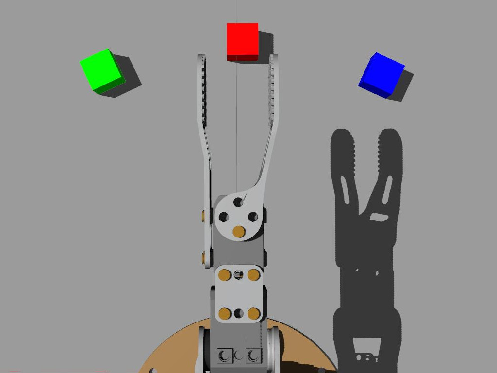
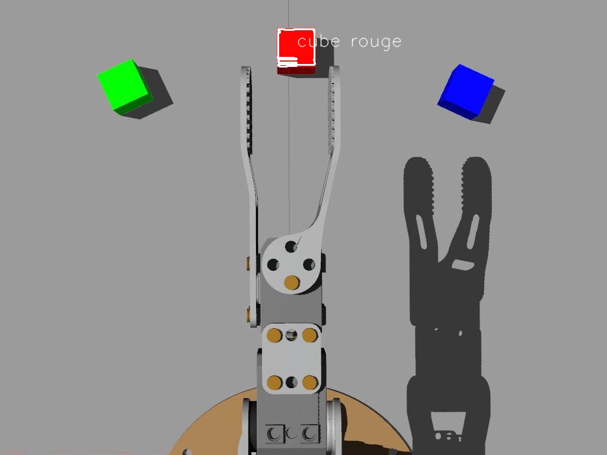

# Ateliers - Perceptions avec OpenCV

Le domaine de "Computer Vision" (CV, ou vision par ordinateur) est une branche de l'intelligence artificielle, qui traite des techniques permettant d'extraire des informations de "haut niveau" utiles à partir d'images. Donc ce domaine développé depuis les années 60, on retrouve généralement des techniques provenant des mathématiques, du traitement d'images, des neurosciences, de l'apprentissage artificiel&#x2026; Nous allons ici effleurer ce domaine en nous familiarisant avec [OpenCV](https://opencv-python-tutroals.readthedocs.io/en/latest/py_tutorials/py_tutorials.html).

## 1. Introduction à OpenCV

OpenCV est une bibliothèque logicielle qui est devenue le "standard" du domaine. Cette bibliothèque fournit un énorme ensemble de fonctionnalités et d'algorithmes à la pointe de l'état de l'art. Entre autres sont disponibles :

- Des mécanismes d'entrées/sorties des images et flux vidéos (caméras, fichiers&#x2026;)
- Des mécanismes de traitement d'images (gestion des formats, couleurs, déformations&#x2026; )
- Des milliers d'algorithmes développés par la communauté et les industriels (reconnaissance d'image, suivi d'objet, vision 3D, apprentissage&#x2026;)

## 2. Ouverture d'une image

- Téléchargez l'image :   


- Créez un fichier `couleurs.py`

    ```python
    import numpy as np
    import cv2 as cv
    img = cv.imread('ergo_cubes.jpg')
    ```

- Quelle information nous donne `print(img.shape)` ?


- On peut accéder à chaque pixel par indexation du tableau `img` avec `img[LIGNE, COLONNE]` (ce qui est très inefficace), que représente la valeurs données par `img[170,255]` ?
- Pour accéder au différents canaux de couleur on peut de même utiliser: `img[:,:,CANAL]` avec `CANAL` la couleur voulue.
- On peut facilement créer des régions d'intérêt (ROI) en utilisant les mécanismes disponibles dans python :

```python
roi=img[140:225, 210:310]
```

- OpenCV offre également quelques fonctionnalités pratiques d'interface utilisateur (GUI). Pour afficher une image :

```python
cv.imshow("Mon image", roi) #on donne un nom unique à chaque fenêtre
cv.waitKey(0) #permet d'attendre à a l'infini
```

- Enfin, on peut écrire les images dans des fichiers :

```python
cv.imwrite("roi.png", roi)
```

- Affichez les trois canaux de couleur dans des fenêtres différentes

## 3. Seuil sur la couleur

Nous avons vu que les images sont généralement représentés dans l'espace `BGR`, ce qui est cohérent avec le fonctionnement du pixel de l'écran (et du capteur), mais moins évidant lorsque l'on souhaite travailler sur les couleurs. Comment par exemple définir le volume 3D dans l'espace BGR représentant le "rose"? C'est pourquoi pour traiter la couleur, il est recommandé de convertir l'encodage de l'image dans un autre espace. L'espace le plus couramment utilisé est le [HSV](https://fr.wikipedia.org/wiki/Teinte_Saturation_Valeur) (Hue, Saturation, Value ou Teinte, Saturation, Valeur).

- Pour convertir une image de BGR vers HSV il suffit d'utiliser :

```python
img_HSV = cv.cvtColor(img, cv.COLOR_BGR2HSV)
```

On notera que l'espace HSV est encodé avec H dans [0, 179], S dans [0,255] et V dans [0,255]

- On peut ensuite appliquer un seuil avec :

```python
img_seuil = cv.inRange(img_HSV, (MIN_H, MIN_S, MIN_V), (MAX_H, MAX_S, MAX_V)
```

Le résultat de la fonction de seuil `inRange` est une image binaire

- Expérimentez avec les valeurs de seuil pour ne faire apparaître que le cube rouge. Note : il est facile de créer des "trackbars" pour changer en temps réel les valeurs, voir le [tutoriel](https://docs.opencv.org/master/d9/dc8/tutorial_py_trackbar.html)

## 4. Détection des cubes

Nous sommes maintenant capable de sélectionner des pixels en fonction de leur couleur, il nous faut encore "regrouper" ces informations afin de détecter et reconnaître les cubes.

- Une méthode simple consiste à considérer que les pixels d'une couleur choisie font partie d'un "blob" (une région de pixels voisins) représentant le même objet. Dans l'image binaire résultat du seuil, il nous suffit de chercher le `contour` des zones blanches. Pour cela nous allons utiliser la fonction `findContours()` (voir le [tutoriel](https://docs.opencv.org/master/d4/d73/tutorial_py_contours_begin.html))

```python
contours, hierarchy = cv.findContours(
   img_seuil, cv.RETR_EXTERNAL, cv.CHAIN_APPROX_SIMPLE)
```

`contours` est une liste contenant tous les contours trouvés `hierarchy` contient les informations sur la hiérarchie des contours (les contours à l'intérieur des contours)

- Sur une image "naturelle" (avec du bruit) les contours trouvés seront rarement parfaits. Il est possible de "filtrer" ces contours en ne considérant par exemple que ceux dons la surface est cohérente avec les objets recherchés (voir le [tutoriel](https://docs.opencv.org/3.4/dd/d49/tutorial_py_contour_features.html))
- Parcourez la liste des contours et dessinez les contours dont la surface est comprise entre 2500 et 3700 On utilisera une boucle sur `contours`, la fonction `contourArea()` retournant la surface d'un contour, ainsi que la fonction de dessin `drawContours()` (dessinez sur l'image d'origine)
- Une fois le contour du cube trouvé, nous pouvons chercher son centre avec la fonction `moments()` avec une fonction telle que:

```python
def trouver_centroid(cnt):
    M = cv.moments(cnt)
    if M['m00'] > 0.0:
       cx = int(M['m10']/M['m00'])
       cy = int(M['m01']/M['m00'])
       return (x, y)
    else:
       return (0, 0)
```

Nous pouvons ensuite utiliser la position obtenue pour écrire un texte :

```python
cv.putText(img, 'cube', (x, y), cv.FONT_HERSHEY_SIMPLEX, 1,(255, 255, 255),1, cv.LINE_AA)
```



- Maintenant que nous sommes capable de détecter un cube d'une couleur, étendez le programme pour détecter la présence et la position des 3 cubes

## 5. Intégration avec ROS

Pour intégrer la détection de cube coloré à ROS 2 en utilisant l'image de la caméra de votre ordinateur ou une image statique, vous pouvez créer un nœud ROS qui offre un service. Ce service prendra en entrée un string indiquant la source de l'image (caméra ou image statique) et renverra la position et le label du cube détecté. Voici comment vous pouvez le faire :

1. Créez un nouveau package ROS nommé color_cube_detection. Vous pouvez le faire en utilisant la commande suivante dans le terminal :

```bash
cd ~/workshop_ws/src
ros2 pkg create --build-type ament_python color_cube_detection --node-name color_cube_detector
```

2. Ouvrez le fichier color_cube_detector.py dans un éditeur de texte et ajoutez le code pour créer un nœud ROS qui offre un service. Le service doit prendre en entrée un string indiquant la source de l'image (caméra ou image statique) et renvoyer la position et le label du cube détecté.

3. Une fois que vous avez terminé, n'oubliez pas de reconstruire votre espace de travail ROS en utilisant la commande suivante dans le terminal :

```bash
cd ~/workshop_ws/
colcon build --symlink-install
```

Maintenant, vous devriez être prêt à lancer votre nœud color_cube_detector et à voir votre robot détecter des cubes colorés.